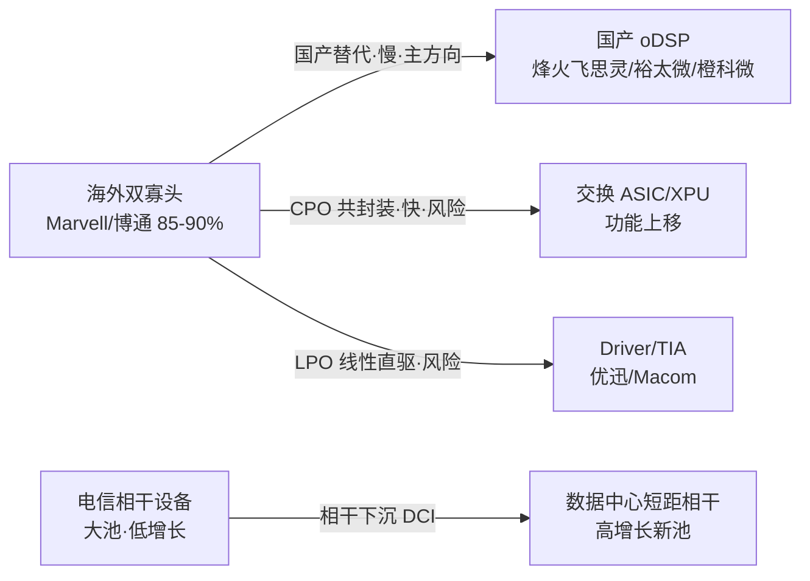

# NODE-005 oDSP 光数字信号处理芯片

> 研究日期：2026-08-22 ｜ 路由方式：宫主点名"新 Node：oDSP" = 批准（部分命中 → 登记，第 4 次复用）
> 父链：NODE-003 华为超节点（光互联需求） → NODE-004 OCS（切自 REL-007） → NODE-005 oDSP（切自 REL-010 光模块/光引擎）
> 定位：光模块电端核心芯片——AI 光互联"最贵的脑"

---

## 术语表

### 行业术语

| 术语 | 英文/全称 | 释义 |
| --- | --- | --- |
| oDSP | Optical DSP | 光数字信号处理芯片：光模块电端"大脑"，负责信号均衡、ADC/DAC 采样、FEC 纠错、时钟恢复 |
| PAM4 DSP | 4-level Pulse Amplitude Modulation DSP | 数通短距路线：AI 数据中心 800G/1.6T 光模块标配 |
| 相干 DSP | Coherent DSP | 电信长距路线：骨干网/DCI 跨城传输，单价约为 PAM4 的 10 倍 |
| FEC | Forward Error Correction | 前向纠错：高速 DSP 的"灵魂"，自研迭代需 5-8 年算法积累 |
| SerDes | Serializer/Deserializer | 串行器/解串器：高速接口核心 IP，单通道 100G+/200G+ 海外垄断 |
| ADC/DAC | 模数/数模转换器 | DSP 采样核心 IP，与 SerDes 同为两大自研壁垒 |
| TIA | Transimpedance Amplifier | 跨阻放大器：接收端模拟前端（非 DSP，配套环节） |
| Driver | Laser Driver | 激光驱动器：发射端模拟前端，正被 DSP 厂商集成吸收 |
| CDR | Clock Data Recovery | 时钟数据恢复，LPO 架构中被移除的组件之一 |
| LPO | Linear Pluggable Optics | 线性直驱可插拔：**移除 DSP**，用线性 Driver/TIA 直接驱动——本 Node 最大替代威胁 |
| LRO/RTLR | Linear Receive Optics | 半重定时折中：TX 端保留 DSP、RX 端线性化 |
| NPO | Near-Packaged Optics | 近封装光学：光引擎贴近 ASIC（2-5cm），无需 DSP；英伟达 Rubin 官方路线 |
| CPO | Co-Packaged Optics | 共封装光学：光引擎与交换 ASIC 同封装，DSP 功能上移至 ASIC 内 SerDes |
| OIO | In-Package Optical I/O | 封装内光 I/O：终点形态，光进入计算芯片封装 |
| Inphi | — | 相干 DSP 先驱，2021 年被 Marvell 收购——海外垄断格局的起点 |
| 飞思灵 | — | 烽火通信全资子公司，国内相干 DSP 龙头 |
| 橙科微 | — | 未上市 PAM4 DSP 公司，前博通团队，国内 DSP 对外出货量第一（KOL 口径） |
| 海思 | HiSilicon | 华为自研 oDSP（7nm 量产、仅自用不外售）——与 NODE-003 直接关联 |

### 技术指标

| 指标 | 数值/口径 | 说明 |
| --- | --- | --- |
| DSP 成本占比 | 25-35%（KOL）vs 40-50%（同花顺）vs ~30%（华福证券） | 三套口径并存，本报告取 25-40% 区间 |
| DSP 功耗占比 | 模块功耗 40-50% | LPO/CPO 替代逻辑的物理根源 |
| 制程映射 | 400G→7nm、800G→5nm、1.6T→3/5nm | 全部台积电流片，先进产能被 GPU 挤占 |
| 交期 | 12-16 周（持续涨价） | 海外 DSP 紧平衡信号 |
| 单价 | 800G PAM4 25-60 美元；800G 相干 300-600 美元 | 相干约为 PAM4 的 10 倍 |
| 国产化率 | 低速 ~40%；400G ~10%；800G/1.6T <5%；相干 <8%（KOL）vs 电信侧 70%+（KOL） | 两套口径冲突——见暗线 4 |

---

## Node 档案

| 字段 | 内容 |
| --- | --- |
| 资产编号 | NODE-005 |
| 名称 | oDSP（光数字信号处理芯片） |
| 别名 | Optical DSP; 光DSP; PAM4 DSP; 相干DSP |
| 状态 | active |
| 父节点 | NODE-003（华为超节点，经候选 REL-012）；自 NODE-004 候选 REL-010"光模块/光引擎"切出 |
| 子节点 | 待定（候选 REL-013 CPO/NPO/LPO 去 DSP 化、REL-014 相干下沉 DCI） |
| 关键词 | oDSP, 光DSP, PAM4, 相干DSP, FEC, SerDes, Marvell, 博通, Inphi, 裕太微, 烽火通信, 飞思灵, 橙科微, 光迅科技, LPO, CPO, NPO |
| 登记日期 | 2026-08-22 |
| 证据数 | 15（EVD-065 ~ EVD-079） |

## Step 0 路由记录

宫主点名"新 Node：oDSP"——路由表分诊：无既有 Node 直接命中（NODE-004 报告 REL-010 建议目标为"光模块/光引擎"，粒度过大）；与 NODE-003/NODE-004 存在依赖关系（光互联三兄弟：光模块电芯片/OCS 交换/超节点系统）。按 NODE-002 确立协议，**宫主点名 = 批准**，登记为 NODE-005（第 4 次复用：002 前驱体 → 003 超节点 → 004 OCS → 005 oDSP）。

**REL-010 切出说明**：oDSP 是光模块 BOM 中单一价值最大的芯片（25-40%），且技术壁垒、竞争格局、替代风险（LPO/CPO）均自成体系——继 REL-007 切出 NODE-004 之后，**第二个"候选 REL 粒度过大、按子环节切出"的路由案例**。REL-010 剩余部分（光引擎/激光器/TIA 配套）继续留作候选。

---

## 十三步（原九问扩展）

### Step 1 范围与市场规模（多口径并存）

市场：A 股光通信 oDSP 产业链（PAM4 数通 + 相干电信双路线）。

| 口径 | 数据 | 来源 |
| --- | --- | --- |
| KOL 口径 | 2026 全球光 DSP ≈ 220 亿元，AI 数据中心占 65% | 雪球（C 级） |
| DataIntelo | PAM4 DSP 2025 年 42 亿美元 → 2034 年 148 亿美元，CAGR 15%，数据中心占 44.7% | 券商研报转引（B 级） |
| 配套口径 | TIA/Driver/PD 2024 年 12.5/14.5/8.2 亿美元 → 2033 年 26.5/31.6/15.4 亿美元 | Growth Market Report（B 级） |
| 需求侧锚 | AI 光模块市场 2025 年 180 亿美元 → 2028 年 500 亿美元（摩根士丹利） | 权威转引（B 级） |

三套直接口径 + 一套间接口径并存——延续"给区间、标来源"原则：**PAM4 DSP 当前约 300 亿元/年量级，2026-2028 年随 1.6T 放量翻倍以上**。

**暗线 3 检查点**：速率迭代（800G→1.6T→3.2T）+ 国产替代（<5% 渗透率）双轮驱动，判定为**结构性为主**——Alpha 应持有而非收割，但需按 Step 12 的替代风险做仓位折减。

**Scope 边界（技术大类 ≠ 价值链 Node）——DSP 与 oDSP 的关系**：

DSP 是**技术大类**（凡做数字信号处理的芯片：音频 DSP、雷达/ISP、基带、电机控制、光互连 DSP 等），oDSP 只是其中一个子类。二者名字共享"数字信号处理"，但按框架第四节 Supply Chain 七问逐项检验，**六项答案不同 → 不是同一个 Node**：

| 检验项 | 通用 DSP（本 Node Scope 外） | oDSP（本 Node） |
| --- | --- | --- |
| 供应链位置 | 各类电子系统的信号处理单元（跨行业） | 光模块电端核心芯片，BOM 占比 25-40% |
| 它依赖谁（上游） | EDA/IP 核、成熟制程为主（28-14nm 够用）、算法工具链 | 5/3nm 先进制程、高速 ADC/DAC 与 SerDes IP |
| 谁依赖它（下游） | 消费电子 / 汽车 / 工业 / 军工（极度分散） | 光模块厂（旭创、新易盛、烽火）+ 云厂商直采（极窄） |
| 出问题传导到哪里 | 单个终端产品缺料，可替换方案多 | AI 集群互联带宽受限，直接卡算力释放 |
| 瓶颈 / 稀缺层 | 算法生态与工具链粘性（TI、ADI） | 高速模拟前端 + 先进制程 + 客户认证周期 |
| 利润池 | 分散、稳定、低增长 | AI 光互联高增长，Marvell + 博通双寡头 85-90% |
| 失败条件 | 功能被 MCU / FPGA / ASIC 逐步吸收 | 被 LPO / CPO 直接移除（本 Node 第一反证） |

判定依据：**Node 是具体的价值链位置，不是技术分类**。DSP 比"行业"更粗——它横跨多个互不相干的价值链，因此不构成一个 Node。若未来信息命中通用 DSP，按分诊协议走"部分命中 → 宫主批准"流程单独立项，**不并入本 Node**。

> 已知合流点（未来观察，非当前）：CPO 时代 DSP 功能上移至交换 ASIC / XPU（见 REL-018 姊妹层互补），届时 oDSP 与计算芯片的功能边界会模糊——那属于 CPO Node 的范畴，不改变本 Node 的当前边界。

### Step 2 系统变化：电信号的物理墙

AI 集群把电信号逼到三重极限，DSP 是"数字修图师"：

1. **带宽墙**：单通道速率 100G→200G→400G lane，电信号过主板/连接器后失真加剧，没有 DSP 均衡则 0/1 不可辨；
2. **功耗墙**：DSP 占光模块功耗 40-50%，1.6T 模块整机 22-28W、3.2T 走向 30W+——**这是 LPO/CPO 替代逻辑的物理根源**；
3. **供给墙**：先进制程（5nm/3nm）产能被 GPU 优先挤占，DSP 交期拉长至 12-16 周且持续涨价，800G DSP 全年缺口 30%+（KOL 口径）——**供给紧张倒逼光模块厂（旭创/新易盛）加速导入国产 DSP 做供应链安全**。

**暗线 1（受损方）**：①海外 DSP 双寡头客户结构受冲击（国产替代）；②LPO 放量则 DSP 厂受损（见 Step 12）；③Driver 独立厂商被 DSP 厂商集成吸收（Broadcom/MaxLinear 已在做）；④**最大受损方是"买 DSP 的人"**——光模块厂毛利被 DSP 挤压，自研 DSP 降本是旭创/新易盛的共同动作。

### Step 3 Supply Chain（产业关系地图）

按框架第四节 Supply Chain 七问定位本 Node：

| 七问 | 答案 |
| --- | --- |
| 处于什么位置 | 光模块 BOM 的电端核心环节——介于「光器件（激光器 / TIA / 光学件）」与「交换机 / 云厂商」之间，是光模块里唯一的"大脑" |
| 它依赖谁（上游） | 高速 SerDes + ADC/DAC IP（海外垄断）→ 先进制程代工（台积电 5/3nm）→ EDA / IP → 封测 |
| 谁依赖它（下游） | 光模块厂（旭创 / 新易盛 / 光迅 / 华工）→ 交换机设备商（Arista / 思科 / 华为 / 新华三）→ 云厂商 AI 集群（谷歌 / Meta / 字节 / 阿里） |
| 出问题传导到哪里 | oDSP 缺货 → 光模块交付受限 → 集群互联带宽不足 → **GPU 有效算力闲置**（本 Node 是算力的放行者，不是算力的提供者） |
| 它替代谁 | 本 Node 不是替代别人的一方，而是**被吸收方**：LPO 线性直驱移除 DSP、CPO 把 DSP 功能上移到交换 ASIC / XPU |
| 它属于谁 | 价值链归属光互联；技术归属 DSP 大类（技术大类不构成 Node，见 Step 1 Scope 边界） |
| 下一步研究谁 | REL-013 CPO/NPO/LPO（替代者所在）、REL-014 相干下沉 / DCI、REL-010 剩余范畴（光引擎 / 激光器 / TIA） |

**双向传导特征**：本 Node 的传导是双向的——缺货时向上卡住算力释放（利多路径），去 DSP 化时向下消失需求（利空路径）。两条路径共用同一批下游客户，因此**下游景气度无法单向验证本 Node**，必须同时看替代技术进度（见 Step 12）。

### Step 4 BOM（产品构成与价值量地图）

光模块 BOM 价值分级（800G 非硅光口径，暗线 5）：

| 层级 | 环节 | BOM 占比 | 分级 | 可投性 |
| --- | --- | --- | --- | --- |
| 1 | oDSP | 25-40%（口径分歧） | **超重要** | A 股稀缺，本 Node 核心 |
| 2 | 激光器（EML/VCSEL） | 15-20% | 重要 | 源杰/仕佳等（另有 Node 候选） |
| 3 | TIA/Driver 模拟前端 | ~10% | 重要 | 优迅股份（配套标的） |
| 4 | 光学件/结构件/PCB | 余量 | 配套 | 天孚/太辰光（NODE-004 已覆盖 MT 插芯） |

**价值量变化（BOM 层的动态视角：哪些部分正在变）**：

- 速率每翻倍（800G → 1.6T → 3.2T），oDSP 单颗价值量与 BOM 占比**同步上升**——本 Node 是速率升级的价值量受益方，不是被摊薄方
- 硅光 / CPO 路线下，光学件占比下降、电芯片占比相对上升
- LPO 场景下 DSP 归零，价值量转移到 Driver / TIA（优迅受益）——同一张 BOM 表内部的**零和迁移**
- 相干下沉 DCI 后，相干 DSP 从「电信设备内部件」变为「独立可统计芯片市场」，价值量口径本身发生改变

**BOM 判断**：DSP 是光模块里单一价值最大、壁垒最高的芯片——"光互联最贵的脑"。但注意：**价值最大 ≠ 可投性最好**（见 Step 6/7 的分离）。

### Step 5 Value Chain（价值创造与获取地图）

- **价值创造**：oDSP 承担信号补偿、FEC 纠错、PAM4 / 相干调制解调——光模块从 100G 走到 1.6T，可用性的大部分由这一颗芯片创造
- **价值获取**：Marvell + 博通 85-90% 份额 + 专利封锁（FEC 算法积累需 5-8 年）→ 获取能力极强，是光模块 BOM 中毛利最高的一环
- **议价权（双向受挤）**：对上游（台积电先进制程）议价权弱——产能被 GPU 挤占、交期 12-16 周；对下游（光模块厂）议价权强——验证周期 6-18 个月锁定、切换成本极高
- **结论**：oDSP **创造了价值，但没有独占价值**——超额利润被上游先进制程与最下游 AI 算力租金两头抽取，属于「强壁垒但非最强利润」的中间层
- **跨 Node 对照**：与 NODE-007 InP 衬底同构（衬底市场小却握分配权 / oDSP 市场大却被上下游夹住）、与 NODE-004 赛微、NODE-006 中芯同型——三者共同指向：**卡位权重 ≠ 市值权重 ≠ 议价权**

### Step 6 稀缺层排序（先排层，再排公司）

| 层级 | 稀缺约束 | 壁垒强度 | 说明 |
| --- | --- | --- | --- |
| 1 | FEC 算法积累 | ★★★★★ | 自研迭代需 5-8 年，Marvell/博通专利封锁 |
| 2 | 高速 SerDes + ADC/DAC IP | ★★★★★ | 单通道 100G+/200G+ 商用 IP 海外垄断 |
| 3 | 先进制程流片产能 | ★★★★ | 台积电 5nm/3nm，被 GPU 挤占、交期 12-16 周 |
| 4 | 三层验证生态 | ★★★★ | 模块厂→交换机→云厂商验证周期 6-18 个月，海外生态锁定 |

**全球格局**：Marvell（并购 Inphi）+ 博通双寡头垄断高端 85-90%；Credo/MaxLinear 合计 <10%；400G 及以上全球仅 4 家可量产。份额口径分歧：Marvell 单家 70%（雪球）vs 40%+（新浪清单）——**采信 40-50% 区间，"单家 70%"标注 KOL 口径**。

**国产梯队**（多口径交叉，进度按保守口径取值）：

| 梯队 | 主体 | 路线 | 进度（保守口径） |
| --- | --- | --- | --- |
| 自研不外售 | 华为海思 | 双线 | 400G/800G 批量自用，技术天花板 |
| 相干龙头 | 烽火通信（飞思灵） | 相干 | 100G-800G 全系列量产，1.6T 相干 2026Q3 量产（口径：已完成验证） |
| 数通纯标的 | 裕太微 | PAM4 | 100G/200G 量产；7nm 800G 送样旭创/新易盛；1.6T 在研 |
| 一级市场 | 橙科微 | PAM4 | 50G 大批量；400G 规模外供（KOL 称国产第一）；800G 通过头部验证 |
| 光模块自研 | 光迅/华工/旭创/新易盛 | 双线 | 自用为主，光迅双线规模商用最早 |
| 配套 | 优迅股份 | TIA/Driver | 10G 及以下世界前二；100G TIA 送样 |

**暗线 4 大爆发（本 Node 口径冲突密度为五 Node 之最）**：
1. Marvell 份额 70% vs 40%+；
2. DSP 成本占比 25-35% vs 40-50% vs ~30%（三套）；
3. 相干国产化率 <8% vs 70%+（前者指全口径、后者指电信侧设备商自用——口径基期不同，均标 KOL）；
4. 裕太微梯队归属：第一梯队（多数口径）vs 第二梯队"尚未大规模商用"（头条口径）——**按保守口径归"送样验证期"**；
5. 橙科微主力：50G 大批量 vs 400G 规模外供（不同文章强调不同代际）；
6. 优迅股份归属：一张 KOL 表称"800G 全套电芯片（DSP+TIA）批量供货"vs 券商研报明确"无自研 DSP"——**采券商口径：优迅是模拟前端非 DSP 厂商**；
7. 中际旭创自研 DSP："1.6T 大批量自用"（KOL）vs "800G 送样验证、战略投资 DSP 公司"（更细口径）——按后者；
8. "DSP 全球仅 2 家" vs "400G+ 4 家可量产"——后者准确（Marvell/博通/Credo/MaxLinear）。

### Step 7 Profit Pool（利润集中区域）

| 环节 | 当前利润集中度 | 代表 | 毛利 / 净利特征 | 是否在本 Node 可投范围 |
| --- | --- | --- | --- | --- |
| 光 DSP 芯片设计 | 极高（Marvell + 博通 85-90%） | Marvell、博通、Credo、MaxLinear | 高毛利、专利封锁 | **池的本体，但几乎不在 A 股** |
| 先进制程代工 | 极高（台积电） | 台积电 | 抽取 oDSP 的一部分价值 | 不在本 Node（REL-017 候选） |
| 光模块组装 | 中（旭创 / 新易盛规模大） | 中际旭创、新易盛、光迅、华工 | 规模大、净利率 10-15% | 受益层，非本 Node 稀缺层 |
| IP / EDA | 高但无 AI 弹性 | Synopsys、Cadence | 稳定高毛利 | 不在 A 股 |
| 国产替代厂商 | 极低（国产化率 <5%） | 烽火飞思灵、裕太微、橙科微 | 尚未稳定盈利 | **A 股可投标的，但全部在池外** |

**关键判断**：本 Node 的利润池高度集中在两家海外公司，A 股几乎不在池中。因此 A 股买的不是"池本身"，而是**进入池的期权**——这直接决定了 Step 11 的排序原则（稀缺层排序 ≠ 公司排序）与 Step 12 的仓位折减（期权会归零，池不会）。

### Step 8 Profit Migration（利润迁移方向）

三条迁移路径：

1. **国产替代（主方向·慢）**：海外双寡头 → 国产 oDSP。触发：供应链安全 + 云厂商二供 + 信创；约束：FEC 算法积累 5-8 年 + 验证周期 6-18 个月 → **迁移速率慢于股价定价速率**，这是"结构性 Alpha 成立但当前不追高"的根因
2. **架构性流出（反方向·快）**：oDSP → 交换 ASIC / XPU（CPO 共封装）或 → Driver / TIA（LPO 移除 DSP）。这是利润**流出本 Node** 的路径，也是 Step 12 第一反证的利润侧表达——需求不是消失，是换个环节存在
3. **相干下沉（新池·中速）**：电信相干设备（大池·低增长）→ 数据中心短距相干（新池·高增长）。利润从"设备商系统集成"迁移到"芯片"，对烽火飞思灵结构性有利，对传统电信设备商不利

**净判断**：迁移 1 与 3 把利润**搬进**本 Node 的 A 股可投范围，迁移 2 把利润**搬出**本 Node，三者同时发生。因此本 Node 的 Alpha 不是"买入并持有"，而是**跟踪三条路径的相对速率**——迁移 2 一旦快过迁移 1，本 Node 逻辑即证伪（见 Step 12）。

### Step 9 公司宇宙（15 家）

| 公司 | 代码 | 定位 | 稀缺层距离 |
| --- | --- | --- | --- |
| 裕太微-U | 688515 | A 股唯一纯数通 PAM4 DSP 标的，哈勃入股 | 控制层（送样期） |
| 烽火通信 | 600498 | 飞思灵=国内相干 DSP 绝对龙头 | 控制层（相干量产） |
| 光迅科技 | 002281 | 双线自研+规模商用最早 | 供给他层 |
| 中际旭创 | 300308 | 全球光模块龙头+自研 DSP 降本 | 受益层+自研 |
| 新易盛 | 300502 | 800G LPO 主导者+自研 DSP 小批量 | 受益层（注意 LPO 与 DSP 对冲） |
| 华工科技 | 000988 | 硅光配套自研 DSP，1.6T 搭载自研方案 | 供给他层 |
| 剑桥科技 | 603083 | 采购国产橙科微/集益威 DSP 做 800G 模块 | 受益层 |
| 德科立 | 688205 | 相干模块厂，自研 DPD/FEC 算法基于外购 DSP | 配套层 |
| 优迅股份 | 688807 | TIA/Driver 模拟前端（非 DSP） | 配套层 |
| 新朋股份 | 002328 | 创投基金参股橙科微（KOL 口径） | 期权型间接 |
| 澜起科技 | 688008 | SerDes/Retimer 平台能力延伸 | 能力相邻 |
| 天孚通信 | 300394 | 光引擎（DSP 价值迁移受益方向） | 受益层（对冲标的） |
| 圣邦股份 | 300661 | DSP 配套电源/AFE 模拟芯片 | 配套层 |
| 思瑞浦 | 688536 | 同上 | 配套层 |
| 华金资本 | 000532 | KOL 称 5nm 双模 DSP 完成流片（证据极弱） | 待证 |

### Step 10 证据分级

见文末证据索引（EVD-065~079，15 条）。本 Node 证据结构特点：**叙事密度高、官方密度低**——核心进度（裕太微送样、橙科微外供、飞思灵 1.6T）几乎全部来自 KOL/研报转引，公告级证据缺位（未做逐家互动易核验，列为 Next Step）。

### Step 11 排序（稀缺层排序 ≠ 公司排序，第二个实质案例）

**稀缺层排序**：FEC 算法+IP（裕太微/海思/橙科微）> 先进制程产能（台积电，不可投）> 验证生态（旭创/新易盛导入）。

**公司排序（考虑兑现度与估值）**：

| 排名 | 公司 | 排序理由 | 主要风险 |
| --- | --- | --- | --- |
| 1 | 烽火通信 | 相干 DSP 唯一量产（稀缺层 1/4 同时满足）；PB 3.17 板块最低 | 2025 净利 -38%、2026Q1 -30%——**又一个"最稀缺层标的财务最差"**（NODE-004 赛微同款）；PE 132 |
| 2 | 裕太微-U | 最纯 PAM4 标的+哈勃绑定+送样旭创/新易盛（导入信号最硬） | 仍亏损（2025 -1.34 亿、Q1 -4326 万），PE 为负纯预期定价，市值 126 亿 |
| 3 | 光迅科技 | 双线商用最早+2026Q1 净利 +59.8%（稀缺层标的中唯一正增长） | PE 128、YTD +155% 板块最高，预期打满 |
| 4 | 华工科技 | PE 63 全组最低+Q1 +55.8%，估值能被业绩解释 | DSP 只是其一环，弹性稀释 |
| 5 | 新朋股份 | 橙科微参股期权，PE 27/市值 55 亿，赔率结构 | "创投基金重仓橙科微"证据链极弱，纯 KOL 口径 |
| 6 | 中际旭创/新易盛 | 兑现度之王（Q1 +262%/+76.8%） | 属 NODE-005 受益层非控制层；新易盛 LPO 主导=与 DSP 主题部分对冲 |
| 7 | 优迅/德科立/剑桥 | 配套/模块层 | 估值高、稀缺层远 |

**与 NODE-004 的镜像结构**：OCS Node 里"最稀缺层（MEMS 代工）= 赛微财务最差"；本 Node 里"最稀缺层（相干量产）= 烽火利润连降"。**两个器件级 Node 连续验证：A 股稀缺层标的常处于"技术稀缺、财务左侧"状态——稀缺层排序直接映射公司排序会系统性高估前者的当期可投性。**

**暗线 2（新旧龙头交替）**：Marvell/博通（旧王） vs 国产 DSP（挑战者）；交换信号=旭创/新易盛导入国产 DSP 的公告、运营商相干集采份额、云厂商供应链安全政策。尚未看到导入完成信号，处于"验证期前段"。

### Step 12 失败条件（本 Node 最重要的一问：要不要 DSP？）

**LPO/CPO 去 DSP 化是五 Node 以来最锋利的内生反证**：

| 替代路线 | 对 DSP 的冲击 | 权威口径 |
| --- | --- | --- |
| LPO | 直接移除 DSP，功耗省 ~50%、成本省 ~25-30% | LightCounting（2026-04）：**2027-2031 年 PAM4 DSP 增长将因 LPO/CPO 部署显著放缓** |
| NPO | 无需 DSP；英伟达 Rubin 官方路线；谷歌 2026-04 订 1200 万只 NPO 模块 | TrendForce：阿里/腾讯视 NPO 为近中期主轴 |
| CPO | DSP 功能上移至交换 ASIC 内 SerDes，"终结外置 DSP 刚需" | 英伟达 Vera Rubin 2026 部分交换机先行，Rubin Ultra NVL576 2027 全面 CPO+3.2T |

**对冲证据（DSP 不死的理由）**：
1. 摩根士丹利：CPO 对可插拔需求稀释 2026 年仅 3%、2028 年 16%——放在光模块 180→500 亿美元的增长里微不足道；
2. 黄仁勋 GTC 2026：未来 5-7 年可插拔光模块仍主导 Scale-out；
3. 应用错位：LPO 限短距（机架内），**长距/跨 DC/ZR 相干传输依旧离不开 DSP**；相干 DSP 还有"从骨干网下沉数据中心 DCI"的增量（短距相干化）；
4. 速率升级对冲：800G→1.6T→3.2T 每一代都在推高单颗 DSP 价值与门槛。

**平衡判断**：PAM4 DSP 的"黄金期"在 2026-2028（800G 放量+1.6T 起量+供给缺口），2027 年起 LPO/CPO 开始结构性削增速（不是削存量）；**相干 DSP 的长逻辑反而更稳**（不可被 LPO 替代+国产化率提升空间大）。这直接影响排序权重：烽火（相干）> 裕太微（PAM4）的排序里已含此判断。

其他失败条件：①国产 800G DSP 验证失败/性能差距 1-1.5 代无法收敛；②台积电对中资设计公司断供先进制程（地缘尾部风险，直接掐死 5nm 以下流片）；③云厂商自研 DSP（谷歌/亚马逊有能力内化）；④估值风险——板块 YTD 普遍 +30-155%，任何业绩不及预期都是双杀。

### Step 13 下一步研究动作

1. **公告级核验**（补本 Node 最大短板）：裕太微互动易/年报中 800G DSP 送样与定增投向表述；烽火 2026 中报里飞思灵收入拆分；光迅 DSP 外供客户；
2. **橙科微穿透**（快查）：股权结构、融资轮次、新朋股份参股比例——验证"期权型"标的的成色；
3. **跟踪信号清单**：①旭创/新易盛公告导入国产 DSP；②运营商 400G/800G OTN 集采中飞思灵份额；③LightCounting 季度报告对 LPO 渗透率修正；④1.6T 模块量产时点（2026Q4-2027）；
4. **关联 Node 候选**：激光器 EML/源杰科技（BOM 第二层）、CPO/NPO（REL-013 目标）。

---

## 六暗线检查点汇总

| 暗线 | 触发 | 结论 |
| --- | --- | --- |
| 1 受损方 | 触发 | 光模块厂毛利被 DSP 挤压（自研降本是对策）；Driver 独立厂商被 DSP 集成吸收；LPO 放量则 DSP 厂受损 |
| 2 新旧龙头 | 触发 | Marvell/博通 vs 国产挑战者；导入信号未完成，验证期前段 |
| 3 周期 vs 结构 | 触发 | 结构性为主（速率迭代+国产替代双轮），但 LPO/CPO 是结构性减法——需仓位折减 |
| 4 绝对化纠偏 | **大爆发** | 8 项纠偏（五 Node 之最）：份额/成本占比/国产化率/梯队归属/优迅归属/旭创自研/全球家数/橙科主力全有口径冲突 |
| 5 BOM 分级 | 触发 | DSP 25-40% 为光模块第一价值层；但"价值最大≠可投性最好"（Step 3/7 分离） |
| 6 研究路由 | 触发 | REL-010 切出案例 2——光互联三步切分定型（超节点→OCS→oDSP） |

## Alpha 映射链

稀缺层（FEC 算法+先进制程+验证生态） → 价值池（2026 全球光 DSP ~220-300 亿元 + 国产化率 <5% 的替代空间） → A 股映射（15 家，纯度分层明显） → Alpha：

- **Tier-1**：烽火通信（相干唯一量产+PB 3.17，但财务左侧）、裕太微-U（PAM4 最纯+哈勃+送样信号，但亏损纯预期定价）
- **Tier-2**：光迅科技（双线+唯一正增长，但 YTD +155% 预期打满）、华工科技（估值最可解释）、新朋股份（橙科微期权，证据弱赔率高）
- **受益层**：中际旭创/新易盛/天孚通信（兑现度之王，但属光模块主题，非本 Node 稀缺层）
- **Trading OS 交接**：烽火 PE 132/裕太微 PE 为负/光迅 YTD +155%/优迅 PE 276 且流通盘仅 51 亿——**结构性 Alpha 成立（国产化率 <5% 是硬空间），但板块估值已计入大量预期，当前不追高**；等待 8 月中报验证或回调，优先财务可解释的光迅/华工；裕太微/烽火属左侧品种，需要导入公告级证据再加仓。

## 证据索引

| 编号 | Node | 等级 | 内容 | 来源 |
| --- | --- | --- | --- | --- |
| EVD-065 | NODE-005 | C（KOL） | 国内光 DSP 格局、国产化率分级、三大壁垒、220 亿元市场规模 | 雪球《国内光通信DSP分析》 |
| EVD-066 | NODE-005 | B | PAM4 DSP 市场规模（DataIntelo 42→148 亿美元）、Driver/TIA 分化、优迅"无自研 DSP"口径 | 券商研报（新浪财经研报库） |
| EVD-067 | NODE-005 | B/C | 双寡头 90%+、DSP 成本 40-50%、国内三类玩家区分 | 同花顺投顾 |
| EVD-068 | NODE-005 | C | 国产 DSP 完整梯队（PAM4/相干双路线）、单价、路线对比表 | KOL 梳理（新浪） |
| EVD-069 | NODE-005 | C | 海外四家格局（Marvell 40%+ 口径）、A股清单 | 新浪清单 |
| EVD-070 | NODE-005 | C | 各家工艺/进度对比表（含华金资本 5nm 流片说法，证据极弱） | ima KOL 表 |
| EVD-071 | NODE-005 | B（权威转引） | LightCounting 2026-04：2027-2031 PAM4 DSP 增长因 LPO/CPO 显著放缓 | 转引自头条分析 |
| EVD-072 | NODE-005 | B（权威转引） | 摩根士丹利：CPO 稀释 2026 年 3%/2028 年 16%；光模块 180→500 亿美元 | 转引 |
| EVD-073 | NODE-005 | B（权威转引） | 黄仁勋 GTC 2026：可插拔光模块未来 5-7 年主导 Scale-out | 转引 |
| EVD-074 | NODE-005 | B | 英伟达 CPO 路线图（Vera Rubin→NVL576）、华福证券 LPO 功耗/成本口径、NPO 生态 | 证券时报 |
| EVD-075 | NODE-005 | C | Quantum-X CPO 交换机拆解：DSP 功能上移 ASIC SerDes、模拟芯片称王逻辑 | 头条产业分析 |
| EVD-076 | NODE-005 | B | 七种光互联架构迁移图（XPO/LPO/LRO/OBO/NPO/CPO/OIO）与 DSP 位置演进 | Photonstek 技术科普 |
| EVD-077 | NODE-005 | A | 15 家公司行情快照（2026-08-21 收盘：PE/PB/市值/YTD/换手） | westock |
| EVD-078 | NODE-005 | A | 10 家公司 2025 年报+2026Q1 归母净利及同比 | 妙想（东财） |
| EVD-079 | NODE-005 | B | 中际旭创 2026Q1 营收 194.96 亿 +192%、净利 57.35 亿 +262%（光模块兑现度锚） | 转引财报 |
| EVD-126 | NODE-005 | A | 裕太微 交易所互动回复 | 2026-09-21 | 公司明确：目前无面向数据中心的 oDSP 电芯片产品（与本 Node「数通纯标的」定性冲突，待宫主裁决） |
| EVD-132 | NODE-005 | B | 野村证券AI基础设施专家电话会(2026-09-22，追风交易台纪要) | 2026-09-23 | 1.6T DSP结构性缺口：2026需求超2000万颗/实际出货1600-1700万颗(缺口300-400万)，2027需求6000-7000万/供给4000-5000万(缺口逾2000万)；瓶颈在3nm产能不足与良率偏低，产能实质释放需待2027H2 **9/25 补充**：同源二次传播补充 800G 口径——800G DSP 多用 7nm/5nm，2026 年出货近 5000 万颗、2027 年 1.2 亿-1.5 亿颗，供给相对宽松，与 1.6T（3nm 紧缺）形成冷热分明；产能实质释放仍待 2027H2。来源升级不新建。 |
| EVD-133 | NODE-005 | B | 野村证券AI基础设施专家电话会(2026-09-22，同源) | 2026-09-23 | NPO/CPO路线演进将移除DSP，均衡与纠错功能向TIA与驱动芯片转移——命中本Node Step12预埋的架构替代失败条件，需求侧存疑 |
| EVD-139 | NODE-005 | C | 今日头条自媒体《国产DSP研发全景》(2026-09，需核验) | 2026-09-23 | 国内DSP版图补充：中兴微800G相干DSP已商用、国内相干DSP市占超50%而数通PAM4-DSP仍在推进；华为海思400G/800G PAM4-DSP已量产但仅内部供应；光迅1.6T模块采用外购3nm DSP——与EVD-126裕太微口径互证，A股纯数通DSP标的定性进一步存疑 |
| EVD-148 | NODE-005 | B | 摩根士丹利ECOC 2026一线纪要(9/21-22马拉加，第52届) | 2026-09-24 | NPO从『抵制』转向『共识』：Open CPX MSA建立光引擎通用参数打破厂商锁定，业界一致预期2028年在scale-up网络首批试用；光通信供应链全线售罄12-18个月；Coherent PhotonLink已签LTA 2027爬坡、Lumentum预计数月内宣布NPO LTA；第一代NPO非终局形态 **9/25 补充**：产业综述（9/25）给出更细节奏口径——NPO『2027 年小规模起量、2028 年大规模放量』，与本文『2028 年在 scale-up 网络首批试用』一致；并称华为已联合中国移动研究院、百度等 20 余家发起国内首个 NPO 光互连 MSA（OPEN NPO，见 NODE-003 EVD-164）。同源，来源升级不新建。 |
| EVD-166 | NODE-005 | C | 今日头条产业拆解(2026-09-25，无原始机构署名，C/D级) | 2026-09-25 | 裕太微与华为联合研发的800G光模块用7nm DSP芯片项目推进中，预计2026年底首次流片；澜起科技在内存接口芯片积累的112G/224G PAM4 SerDes能力与高速光DSP高度相关，理论上可平移至800G/1.6T光模块DSP设计；华工科技3.2T NPO已进入客户测试。注：'联合研发+年底流片'为市场口径侧新证据，与C-01说法B同向，按'已有并列项追加进展行'处理，不改C-01原行、不改结论句 |
| EVD-189 | NODE-005 | B/C | Credo CIOE 媒体交流会（cordacord/与非网 2026-09-24 转载，原始发布 2026-09-08）+ TradingView 周报 | 2026-09-26 | Credo 发布 2.0 系统级战略，由芯片供应商升级为系统级互联方案商。oDSP 侧：已迭代七代，覆盖 50G/100G/200G per lane；Robin 800 系列以架构优化配合成熟工艺实现与上代 Lark 相当的功耗性能，内置 EML 激光驱动、缩小封装，同时支持 Full DSP 与 LRO 两种架构，用于缓解上游供给约束并保障长期供货连续性；1.6T 世代推出 Cardinal 系列，区别于业界常见 8 通道单 die 方案，提供 4 通道与 8 通道两种 die（Cardinal 802 = 4×200G，同时覆盖 800G 与 1.6T 场景）。整合：近 12 个月收购 Hyperlume（Micro-LED 下一代光源）与以色列硅光公司 DustPhotonics，形成 SerDes IP→DSP 芯片→硅光 PIC→AEC→ZeroFlap 光模块→PILOT 软件全栈垂直整合。经营：FY2027 Q1 营收 4.79 亿美元 +114.7% YoY，Q2 指引 5.25-5.35 亿美元，服务 24 家以上 tier-1 客户，全球员工近 1000 人（大中华区约占一半）。→ 强化稀缺层（垂直整合抬高壁垒）；同时支持 LRO 架构列为待观察项 |

## 路由反馈（沉淀给路由表）

1. **REL-010 切出案例 2**：光互联"三步切分"定型——REL-007 切出 OCS（NODE-004）、REL-010 切出 oDSP（NODE-005）。经验：候选 REL 目标粒度过大时，按"单一价值最大+壁垒自成体系+替代风险独立"三判据切分子环节。
2. **稀缺层≠公司排序再现**：烽火（相干最稀缺）利润连降、裕太微（PAM4 最纯）亏损——与 NODE-004 赛微构成双案例，建议升格为路由表常设提醒。
3. **口径冲突密度五 Node 之最（8 项）**：oDSP 属"叙事密度高、官方密度低"主题——进度类结论（送样/量产/份额）必须标口径，公告级核验列为必做 Next Step 而非可选项。
4. **替代威胁首次成为主线反证**：LPO/CPO 去 DSP 化 vs 三条对冲证据——Step 12 的价值从"风险清单"升级为"排序权重输入"（相干>PAM4 的判断直接源于此）。
5. **配套与核心的归属陷阱**：优迅股份被一张 KOL 表归入"DSP+TIA 全套"，券商口径明确为模拟前端——KOL 表格的"品类归属"字段不可直接采信。
6. **对冲型标的入宇宙**：新易盛（LPO 主导）与天孚（光引擎）对 DSP 主题构成部分对冲，公司宇宙应包含对冲标的以完整呈现价值迁移方向。

## 关系表

| REL | 源 → 目标 | 类型 | 说明 | 状态 |
| --- | --- | --- | --- | --- |
| REL-012（建议） | NODE-003（华为超节点） → NODE-005（oDSP） | 依赖 | 灵衢/超节点光互联拉动光模块与 oDSP 需求；海思自研 oDSP 仅自用 | 待宫主确认 |
| REL-013（建议） | NODE-005（oDSP） → CPO/NPO/LPO（未登记） | 竞争 | "去 DSP 化"路线与本 Node 构成替代关系；与 REL-011 同目标，或合并登记 | 待宫主确认 |
| REL-014（建议） | NODE-005（oDSP） → 相干下沉/DCI（未登记） | 受益 | 相干 DSP 从骨干网下沉数据中心，短距相干化为下一代趋势 | 待宫主确认 |

关联既有：REL-010（NODE-004→光模块/光引擎）之 oDSP 部分切出为本 Node；REL-007（光互联）剩余部分继续留作候选池。

---

## 更新日志（Changelog）

> 每次信息更新在此登记一行（由每日行研扫描自动追加）。字段口径见 `行业地图更新记录.md`。
> 类型：新闻 / 研报 / 公告 / 数据 / 产品 / 技术 / 关系 / 证伪
> 影响判定：确认 / 强化 / 削弱 / 证伪 / 待观察 / 无实质影响

| 日期 | 类型 | 触发信息 | 变更位置 | 影响判定 | 证据 |
|---|---|---|---|---|---|
| 2026-09-23 | 机制 | 建立每日行研扫描机制（宫主指令），本节随之为 NODE-005 建立 | 新增本节 | — | — |
| 2026-09-23 | 公告 | 裕太微互动回复：目前无面向数据中心的 oDSP 电芯片产品 | 证据索引；Step 9 公司宇宙「数通纯标的」定性存疑 | 削弱 | EVD-126 |
| 2026-09-23 | 数据 | 野村专家会：1.6T DSP结构性缺口，2026缺口300-400万颗、2027缺口逾2000万颗，瓶颈在3nm产能与良率，释放待2027H2 | 第五节证据索引；Step 6 稀缺层 | 强化 | EVD-132 |
| 2026-09-23 | 技术 | 野村专家会：NPO/CPO路线演进将移除DSP，均衡与纠错功能向TIA与驱动芯片转移 | 证据索引；Step 12 架构替代失败条件命中 | 削弱 | EVD-133 |
| 2026-09-23 | 关系 | 国内DSP产业版图补充：中兴微相干DSP已商用(市占>50%)、海思PAM4-DSP仅内部供应、光迅1.6T用外购3nm DSP | 第五节证据索引 | 待观察 | EVD-139 |
| 2026-09-23 | 重估 | C-01 裕太微定性互斥：公司口径(无面向数据中心oDSP产品、无800G/1.6T送样量产、未立项相干DSP、定增投向SerDes且距产品化尚远) ⟷ 市场口径(7nm 800G送样验证中、1.6T在研、200G已批量供货、A股唯一纯数通PAM4 DSP标的) → 并列不裁决，正文第186/235/264行不动 | 《重估与并列存疑清单》C-01；新增 EVD-140/EVD-141 | 并列存疑 | EVD-140 / EVD-141 |
| 2026-09-23 | 重估 | C-04 需求侧方向相反：1.6T DSP缺口扩大(2027逾2000万颗) ⟷ NPO/CPO将移除DSP、功能向TIA与驱动芯片转移 → 同批专家会材料并存，均不并入Step 12结论句 | 《重估与并列存疑清单》C-04 | 并列存疑 | EVD-132 / EVD-133 |
| 2026-09-24 | 研报 | 大摩 ECOC：NPO 从抵制转向共识，Open CPX MSA 打破厂商锁定，业界一致预期 2028 年在 scale-up 网络首批试用；光通信供应链全线售罄 12-18 个月 | 第五节证据索引 | 强化 | EVD-148 |
| 2026-09-24 | 重估 | NPO 落地时点被锚定为 2028 年 → 为并列项 C-04（NPO/CPO 将移除 DSP）追加时间锚进展行，不修改原行 | 无改动（正文结论句不动） | 并列存疑 | EVD-148；并列清单 C-04 进展 |
| 2026-09-25 | 关系 | 裕太微 × 华为联合研发 7nm 800G 光模块 DSP，项目推进中、预计 2026 年底首次流片；澜起科技 112G/224G PAM4 SerDes 理论上可平移至光 DSP；华工科技 3.2T NPO 已进入客户测试 | 第五节证据索引；并列清单 C-01 追加进展行 | 并列存疑 | EVD-166 |
| 2026-09-25 | 数据 | 800G DSP 多用 7nm/5nm，2026 年出货近 5000 万颗、2027 年 1.2 亿-1.5 亿颗，供给相对宽松，与 1.6T（3nm 紧缺）冷热分明；产能实质释放仍待 2027H2（同源二次传播） | 第五节证据索引（EVD-132 来源升级） | 确认 | EVD-132 |
| 2026-09-26 | 产品 | Credo 2.0 战略转向系统级互联：oDSP 七代迭代、1.6T Cardinal 提供 4/8 通道双 die、同时支持 Full DSP 与 LRO；收购 Hyperlume 与 DustPhotonics 完成全栈整合 | 第五节证据索引（竞争格局） | 强化 | EVD-189 |
