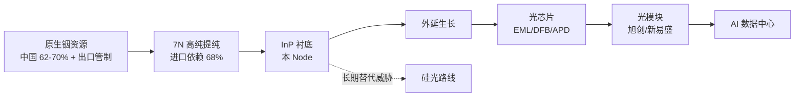
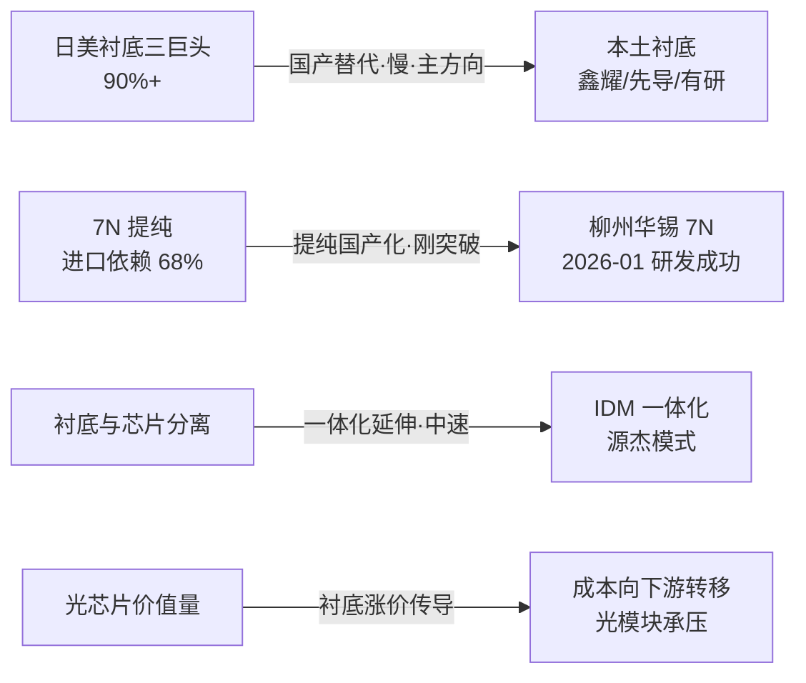

# NODE-007 InP（磷化铟）

> 研究日期：2026-09-01 ｜ 路由方式：宫主问答预研（"磷化铟算是我们卡其他国家脖子的品类吗"）→ 宫主点名"好，建立InP（磷化铟）的Node" = 批准（第 6 次复用）
> 父链：NODE-004 OCS / NODE-005 oDSP（光互联层）的上游**材料层**——自候选 REL-010 剩余范畴（光引擎/激光器的衬底材料）切出；需求侧承接 NODE-006 AI芯片（英伟达预测 InP 需求 2026-2030 增 20 倍）
> 定位：AI 光互联最上游的"粮食"——所有 EML/DFB/PIN/APD 光芯片的衬底，全球缺口 70% 的硬瓶颈；**本宫 Node 网络首个"中国握有反向筹码"的 Node**（原料层铟占全球 62-70% + 出口管制）

---

## 术语表

### 行业术语

| 术语 | 英文/全称 | 释义 |
| --- | --- | --- |
| InP | Indium Phosphide 磷化铟 | III-V 族化合物半导体，直接带隙 1.34eV，发光波长 1310/1550nm 恰匹配光纤低损耗窗口——光通信不可替代的衬底材料 |
| 衬底 | Substrate | 单晶生长后切割/研磨/抛光成的薄片，外延生长的基板；"衬底的分配权实质上决定了芯片产能的分配权" |
| EML | Electro-absorption Modulated Laser | 电吸收调制激光器，800G/1.6T/3.2T 光模块发光主力，全部生长在 InP 衬底上 |
| DFB | Distributed Feedback Laser | 分布式反馈激光器，中短距光模块光源，InP 基 |
| PIN / APD | — | 光电探测器两类结构，InP 基（APD 需更高外延精度） |
| VGF / VB / LEC | — | 单晶生长三法：垂直梯度凝固 / 垂直布里奇曼 / 液封直拉；VGF/VB 为主流（位错密度低、成本低） |
| 直收率 | — | 衬底厂原料利用效率指标：鑫耀 7-8% vs 北京通美约 25%——差 3 倍，国产衬底成本劣势的根源 |
| 原生铟 / 再生铟 | Primary / Secondary Indium | 前者 = 铅锌锡矿冶炼副产（供给弹性零）；后者 = 靶材/尾料回收（占供给 ~15%）；无独立经济开采矿床 |
| 7N 高纯铟 | 99.99999% Indium | 半导体级超高纯铟；中国 7N 进口依赖度 68%，法/美/日垄断提纯技术 |
| 2 英寸当量 | 2-inch equivalent | 产能/需求折算口径（4 英寸 1 片 ≈ 2 英寸 4 片）——**InP 数据必须先问尺寸当量，口径差 4 倍** |
| 出口管制 | — | 商务部海关总署 2025 年第 10 号公告（2025-02-04）：铟相关物项（磷化铟 3C004.a / 三甲基铟 / 三乙基铟 / 生产技术）列入出口管制 |
| 三家垄断 | — | 住友电工（日，42-43%）/ AXT-北京通美（美，35-36%）/ JX 金属（日，13%）合计 90%+ |
| 哈勃入股 | Hubble Investment | 华为哈勃持有鑫耀半导体 23.91%——国产衬底链的华为系绑定 |

### 技术指标

| 指标 | 数值/口径 | 说明 |
| --- | --- | --- |
| 2026 全球供需 | 需求 260-300 万片（2" 当量）vs 有效产能约 75 万片，缺口 70%+ | Yole；2025 年缺口同为 70%+（需求 210 万 vs 产能 60-70 万） |
| 衬底价格 | 2"：800 美元/片（2025 初）→ 2300-2500 美元（2026-04），急单 3000+；6" 射频级约 1.8 万元/片 | 涨幅约 187.5%；全行业交期 24 周，6" 超 40 周 |
| 全球份额 | 住友 42-43% / AXT-通美 35-36% / JX 13%，合计 90%+；中国本土厂商合计仅约 10% | "中国境内产能"（含通美）约 46% vs "中国本土厂商"约 10%——股权归属口径必须分清 |
| 中国铟地位 | 原生铟 712 吨占全球 62%（2025）；储量占 72.7%；2027E 精铟占比 70%+；美国无原生铟产能 | 安泰科口径；伴生矿属性 → 供给弹性零 |
| 7N 高纯铟 | 中国进口依赖度 68%；2026-01 柳州华锡（华锡有色）7N 级突破、待量产验证 | 提纯层反被欧美日卡的证据 |
| 鑫耀半导体（云南锗业 55.83%） | 产能 15 万片/年（2-4"）；2025 产出 10.01 万片；2026 计划 18 万片；2026-04 投 1.89 亿扩至 45 万片（4" 折算，含 6000 片 6"），建设期 18 个月 | 国内 InP 衬底最大厂商；2026-07 签 5.7-8.55 亿供货协议 |
| 6 英寸国产化率 | 不足 5%（高端）；先导微电子为国内首家 6" 量产（24 万片/年，规划百万片） | Coherent 2024 年已建成全球首个 6" InP 晶圆厂 |
| 需求侧 | 英伟达预测 2026-2030 InP 晶圆需求增约 20 倍；1.6T 对衬底面积需求较 800G +300% | 扩产周期 3-5 年、单条产线投资超 12 亿元——供给远追不上 |
| 三家扩产 | 住友投 180 亿日元（FY2029 产能 3.1x）；JX 投 1200 亿日元（FY2030 产能 7-10x）；AXT 增发 6.325 亿美元（2027 +50% 至 90 万片） | 供需失衡预计持续至 2027+ |

---

## Node 档案

| 字段 | 内容 |
| --- | --- |
| 资产编号 | NODE-007 |
| 名称 | InP（磷化铟） |
| 别名 | Indium Phosphide; 磷化铟衬底; InP substrate; III-V 化合物半导体 |
| 状态 | active |
| 父节点 | NODE-004/NODE-005（光互联，经候选 REL-019；自候选 REL-010 剩余范畴"光引擎/激光器的衬底材料"切出） |
| 子节点 | 待定（候选 REL-020 铟/稀散金属资源） |
| 关键词 | InP, 磷化铟, 衬底, EML, DFB, APD, 直收率, VGF, 铟, 原生铟, 7N高纯铟, 出口管制, 住友, AXT, 北京通美, JX, 鑫耀, 云南锗业, 先导, 有研新材, 株冶, 源杰, 九峰山 |
| 登记日期 | 2026-09-01 |
| 证据数 | 15（EVD-095 ~ EVD-109） |

## Step 0 路由记录

宫主先以问答形式提出"磷化铟算是我们卡其他国家脖子的品类吗"，巴蒂完成供应链三层分析（原料层中国有牌 / 制造层日美有牌 / 提纯层欧美日有牌）；随后宫主点名"好，建立InP（磷化铟）的Node"——路由表分诊：**部分命中**。NODE-004/005（光互联）报告涉及光芯片但衬底材料从未展开，NODE-006（AI芯片）仅触及需求侧传导。按 NODE-002 确立协议，**宫主点名 = 批准**，登记为 NODE-007（第 6 次复用：002 前驱体 → 003 超节点 → 004 OCS → 005 oDSP → 006 AI芯片 → 007 InP）。

**切分说明（第三种切分范式）**：光互联三步切分（REL-007→OCS、REL-010→oDSP）之后，本 Node 从候选 REL-010 剩余范畴（光引擎/激光器）中切出**其衬底材料层**——这是继"候选 REL 粒度切分"（器件级）、"系统级 BOM 分层切分"（NODE-006 计算层）之后的第三种范式：**沿价值链向上游材料层切分**。问答预研数据直接复用为本 Node 证据素材（问答→立项两段式首次实战）。

---

## 十三步（原九问扩展）

### Step 1 范围与市场规模（多口径并存）

市场：全球 + 中国 InP 衬底及其上游（铟）与直接下游（光芯片），A 股映射优先。

| 口径 | 数据 | 来源 |
| --- | --- | --- |
| 全球 InP 衬底市场 | 2023 年 2.1 亿美元 → 2028 年 4.7 亿美元（CAGR 17.4%） | Yole（B 级） |
| InP 光电子全产业链 | 2030 年全球突破 100 亿美元（2026-2030 CAGR 13.5%） | Yole（B 级） |
| 中国 InP 市场 | 2026 年 51.3 亿元（+18.7%） | 行业机构（B 级） |
| 供需缺口 | 2026 年需求 260-300 万片（2" 当量）vs 产能约 75 万片，缺口 70%+ | Yole（B 级） |

**本 Node 特殊量级提醒（暗线 4 预埋）**：衬底市场本身只有**数亿美元级**——但它是数百亿美元光模块产业的"分配权"环节。**价值链权重 ≠ 市值权重，卡位价值 >> 市场规模**，这是 BOM 分级引入"分配权"概念的原因（见 Step 3）。

**暗线 3 检查点**：三重结构性驱动（AI 光互连需求 20 倍预测 + 扩产周期 3-5 年的供给刚性 + 出口管制地缘重构）——强结构性；但衬底价格一年 3 倍含明显周期性成分，2027-2028 三家扩产落地后存在反转风险（见 Step 12）。

### Step 2 系统变化：四股力量同时改写材料层

1. **AI 需求爆发（需求侧）**：光互连从机柜间向服务器内部延伸（CPO→内存接口），英伟达预测 2026-2030 InP 晶圆需求增约 20 倍；1.6T 光模块对衬底面积需求较 800G +300%；Quantum-X 单台 18 个硅光引擎全部使用 InP 衬底。
2. **中国出口管制（地缘侧）**：2025-02 铟相关物项入管制清单，直接冲击全球供应链——AXT 披露通美出口需许可证并曾因许可不及预期下调收入指引；东西方铟价脱钩（价差约 94 美元/公斤）；2026-05 底恢复首批出口许可（政策变量高频变化）。
3. **三家垄断扩产竞赛（供给侧）**：住友 3.1x / JX 7-10x / AXT +50%，全部指向 2027-2029 释放——当前缺口 70% 与远期供给释放之间存在**时间差套利窗口**，且行业预计失衡持续至 2027+。
4. **互卡格局定型（格局侧）**：原料层中国有牌（铟 62-70% + 管制）、制造层日美有牌（90%+）、提纯层欧美日有牌（7N 依赖 68%）——**全产业链没有任何一方单边安全**。特殊角色北京通美：全球第二（36%）却是美企 AXT 的中国子公司，产能 100% 在中国、技术/股权归美国——中国的管制同时卡住这家"美国公司"，成为独特博弈筹码。

**暗线 1（受损方）**：①锁不到衬底配额的光芯片/光模块厂（衬底分配权=芯片产能分配权，二线模块厂最受伤）；②依赖进口 7N 铟的中国衬底厂（管制若反噬原料进口）；③AXT（许可证节奏不可控）；④远期受损：2028 年后新进入者（扩产潮落地后价格战）。

### Step 3 Supply Chain（产业关系地图）

按框架第四节 Supply Chain 七问定位本 Node：

| 七问 | 答案 |
| --- | --- |
| 处于什么位置 | 光芯片的**衬底材料层**——介于「铟资源 / 高纯提纯」与「外延 / 光芯片 / 光模块」之间 |
| 它依赖谁（上游） | 7N 高纯铟（进口依赖 68%）← 原生铟资源（锌锡铅冶炼副产，中国 62-70% + 出口管制） |
| 谁依赖它（下游） | 外延生长 → 光芯片（EML/DFB/APD）→ 光模块 → AI 数据中心 |
| 出问题传导到哪里 | 衬底缺口 70% → 光芯片产能受限 → 光模块交付受限 → **AI 集群互联带宽不足**（与 NODE-005 oDSP 同终点，不同路径） |
| 它替代谁 | 短期无替代（GaAs / 硅光仅在部分场景替代）；硅光是长期替代威胁 |
| 它属于谁 | 光互联价值链的最上游材料层；同时是「中国握有反向筹码」的资源下游 |
| 下一步研究谁 | REL-020 铟 / 稀散金属资源、REL-022 光芯片 / 光引擎 |

**互卡格局（本 Node 独有）**：原料层中国有牌（铟 + 出口管制），制造层日美有牌（三家垄断 90%+），提纯层欧美日有牌（7N 依赖 68%）——**全链无单边安全**，任何一环断裂都会向上下游双向传导。 → 高纯提纯（7N：柳州华锡刚突破/法美日垄断） → 多晶合成+单晶生长+衬底加工（住友/通美/JX/鑫耀/先导/有研） → 外延生长（九峰山工艺突破/源杰 IDM） → 光芯片（EML/DFB/APD：源杰/光迅/仕佳/云岭） → 光模块（旭创/新易盛/光迅） → AI 数据中心。

### Step 4 BOM（产品构成与价值量地图）

InP 光模块 BOM 价值分级（暗线 5 + 分配权概念）：

| 层级 | 环节 | 价值量/占比 | 分级 | 说明 |
| --- | --- | --- | --- | --- |
| 1 | 光芯片（EML/DFB/APD） | 占光模块成本约 50% | **超重要** | 源杰等已批量；衬底涨价直接推高芯片成本 |
| 2 | InP 衬底 | 单片 2300-2500 美元，可切数千颗芯片——绝对金额小 | **分配权级** | 缺口 70% 决定谁能扩产；**市值小卡位大，五 Node 之最** |
| 3 | 7N 高纯铟 | 衬底成本上游 | 重要 | 中国 68% 依赖进口——制造层反被卡的环节 |
| 4 | 原生铟资源 | 伴生于锌锡铅冶炼 | 筹码级 | 中国 62-70% + 出口管制——**中国的反向牌** |

**价值量变化（动态视角）**：

- 衬底单片价格 800 → 2300-2500 美元（+187.5%），**绝对金额仍小但涨幅最大**——这是缺口 70% 的直接价格表现
- 衬底涨价直接推高光芯片成本（光芯片占光模块成本约 50%），价值量沿链向下游传导
- 衬底尺寸从 2" 向 4"/6" 迁移，单片可切芯片数增加，**单位芯片的衬底成本下降**——与单片涨价形成对冲
- 直收率（原料利用效率）是隐藏的价值量杠杆：鑫耀 7-8% vs 通美 25%，差 3 倍直接决定成本结构

**BOM 判断**：本 Node 首次出现"**市值权重与卡位权重严重倒挂**"——衬底全球市场仅数亿美元，却卡住数百亿美元光模块产业的产能分配。A 股标的的投资逻辑因此分裂为三条线：衬底制造线（稀缺但极贵）、铟资源线（便宜但纯度低）、一体化兑现线（下游但增速最猛）。

### Step 5 Value Chain（价值创造与获取地图）

- **价值创造**：衬底决定了光芯片的性能上限与良率——是"能不能做出来"的环节，不是"做得多便宜"的环节
- **价值获取**：日美三家（住友 42% / AXT 36% / JX 13%）凭长晶工艺垄断获取；中国厂商仅 ~10% 份额，且集中在中低端
- **议价权（分配权形态）**：衬底全球市场仅数亿美元，却握有**产能分配权**——决定谁能扩产、谁不能。这是"市值权重 ≠ 卡位权重"的极端案例
- **中国的双向位置**：上游铟资源有筹码（62-70% + 出口管制），中游制造被卡（份额 ~10%），下游需求最大（全球光模块主要产地）——**筹码与弱点在同一条链上并存**
- **跨 Node 对照**：与 NODE-008（DSP 生态软壁垒）、NODE-006（算力价值创造获取分离）共同指向——**卡位权重 ≠ 市值权重 ≠ 议价权**

### Step 6 稀缺层排序（先排层，再排公司）

**全球稀缺层排序**：

| 层级 | 稀缺约束 | 壁垒强度 | 说明 |
| --- | --- | --- | --- |
| 1 | InP 衬底产能（长晶+良率） | ★★★★★ | 缺口 70%+；扩产周期 3-5 年、单线投资 12 亿+；三家垄断 90%+ |
| 2 | 6 英寸大尺寸工艺 | ★★★★ | 6" 国产化率 <5%；Coherent 2024 年全球首个 6" 厂——尺寸代差 1-2 年 |
| 3 | 7N 高纯铟提纯 | ★★★★ | 法 Recylex/美铟泰/日同和三菱垄断；中国 68% 依赖进口，2026-01 才突破 |
| 4 | 原生铟资源 | ★★★（中国的牌） | 中国 62-70% + 供给弹性零 + 出口管制——**唯一由中国掌握的层级** |

**国产梯队（衬底制造）**：

| 梯队 | 主体 | 产能/技术 | 2026 状态 |
| --- | --- | --- | --- |
| 境内外资 | 北京通美（AXT 子公司） | 全球第二（36%），100% 产能在中国 | 科创板终止注册、拟赴港上市 |
| 本土龙头 | 鑫耀半导体（云南锗业 55.83%） | 15 万片/年（2-4"）→ 扩至 45 万片；6" 试产（无量产计划） | 2026-07 签 5.7-8.55 亿大单；哈勃持股 23.91% |
| 6" 先行者 | 先导微电子 | 24 万片/年（2-6"）国内首家 6" 量产 | 规划扩至百万片 |
| 央企攻关 | 有研新材 | 02 专项 6" 单晶片，样品试制 | 4-6" 小批量供货 |
| 追赶者 | 鼎泰芯源/中科晶电/三安/陕西铟杰 | 5-8 万片级 | 各自扩产中 |

**暗线 4 纠偏（口径冲突清单）**：

1. **"中国厂商份额"两套口径**：本土厂商合计约 10% vs 中国境内产能约 46%（含通美）——差近 5 倍，**必须区分股权归属与地理产能**；
2. **产能尺寸当量混用**：鑫耀 15 万片（2-4"）vs 扩产 45 万片（4" 折算）——同"万片"单位下面积差 4 倍，所有产能数据必须标注当量口径；
3. **铟产量两套口径**：安泰科原生铟 712 吨/62% vs 另一研报"全球原生铟 460 吨、中国 370 吨/80.4%"——原生铟与精铟（含再生）口径混淆，差近一倍；
4. **国产化率口径**："从不足 5% 提升至 25-30%"是否含通美未明——含与不含差 4-5 倍；
5. **华为锁定鑫耀 8 万片/53% 产能、预付 40%**（自媒体口径）vs 公司公告仅披露大单金额——细节未经公告验证，C 级；
6. **"英伟达 40 亿美元锁仓"**（凤凰标题口径）——与 Coherent 预付通美 2229 万美元的公告级数字量级不符，疑为夸大，降级处理。

### Step 7 Profit Pool（利润集中区域）

| 环节 | 当前利润集中度 | 代表 | 是否可投 |
| --- | --- | --- | --- |
| InP 衬底制造 | 极高（日美三家 90%+） | 住友、AXT、JX | 基本不在 A 股（云南锗业 / 有研新材在但份额小） |
| 7N 高纯提纯 | 高（法 / 美 / 日） | Recylex、铟泰、同和 | **不在 A 股**（柳州华锡刚突破） |
| 原生铟资源 | 中（伴生矿，供给弹性为零） | 株冶、中金岭南、锡业、驰宏 | 在 A 股，**便宜但纯度低** |
| 光芯片（外延 + 芯片） | 中高 | 源杰、光迅、仕佳 | 在 A 股，兑现度最高 |
| 光模块 | 低（组装，净利率 10-15%） | 旭创、新易盛 | 在 A 股，非本 Node 稀缺层 |

**关键判断**：本 Node 呈现**三层估值倒挂**——筹码层最便宜（株冶 PE 11.7）、制造层最贵（云南锗业 PE 858）、一体化兑现层增速最猛（源杰 H1 营收 +351%）。利润池本体在海外日美三家，A 股分别在"筹码层（便宜但纯度低）"与"兑现层（增速猛但已涨）"两端。

### Step 8 Profit Migration（利润迁移方向）

1. **衬底国产替代（主方向·慢）**：日美三家 → 本土厂商。约束是长晶工艺与直收率（7-8% vs 25%），非资本可速成
2. **提纯国产化（刚突破）**：7N 高纯铟从进口依赖 68% 转向国产（柳州华锡 2026-01 研发成功）——尚未量产验证
3. **一体化延伸（中速·兑现最快）**：衬底 → 外延 → 光芯片 IDM 一体化（源杰为样本），把上游稀缺性内部化，是 A 股兑现度最高的路径
4. **成本向下游传导**：衬底涨价推高光芯片成本，利润从光模块环节**向上游回流**

**净判断**：迁移 3（一体化）是 A 股最快兑现的路径，迁移 1/2 是长期国产替代逻辑，迁移 4 是本 Node 价值量的直接表现。**跟踪指标**：鑫耀订单执行、源杰 Q3 财报、铟价与衬底价格。

### Step 9 公司宇宙（13 家）

| 公司 | 代码 | 定位 | 稀缺层距离 |
| --- | --- | --- | --- |
| 云南锗业 | 002428 | 鑫耀 55.83% 控股，本土衬底龙头 + 锗主业（卫星光伏锗片） | **制造稀缺层本体**（国内侧） |
| 有研新材 | 600206 | 央企 02 专项 6" 攻关；靶材主业 | 制造层（高端大尺寸） |
| 源杰科技 | 688498 | InP 光芯片 IDM（EML/DFB 批量），衬底→外延→芯片一体化 | 下游一体化兑现层 |
| 株冶集团 | 600961 | 铟锭产能全球前列（锌冶炼副产） | **筹码层（铟资源）** |
| 中金岭南 | 000060 | 铅锌矿 + 铟资源（广西大厂矿带） | 筹码层（铟资源） |
| 锡业股份 | 000960 | 全球锡龙头，铟伴生资源 | 筹码层（铟资源） |
| 驰宏锌锗 | 600497 | 锌 + 锗 + 铟多金属（云南都龙矿带） | 筹码层（铟+锗双资源） |
| 华锡有色 | — | 柳州华锡 7N 超高纯铟突破（2026-01） | 提纯层（国产突破样本） |
| 光迅科技 | 002281 | 光芯片+模块 IDM，InP 部分自产自供 | 下游一体化（混合） |
| 中际旭创 | 300308 | 光模块全球龙头（衬底最大需求方之一） | 需求侧受益 |
| 三安光电 | 600703 | III-V 化合物平台（含 InP 布局），亏损 | 制造层（边缘） |
| 北京通美 | 未上市 | 全球第二（36%）——科创板终止注册拟赴港 | 制造稀缺层本体（不可直接投） |
| 先导微电子 | 未上市 | 国内首家 6" 量产，24 万片/年 | 制造层（6" 先行者） |

### Step 10 证据分级

见文末证据索引（EVD-095~109，15 条）。本 Node 证据结构特点：**供需缺口与份额数据全部依赖研报转引 Yole/安泰科**（B 级天花板，Yole 原报告未直接获取）；产能/订单类已有公司公告级（A级：鑫耀扩产与供货协议、商务部管制公告）；地缘叙事类（华为锁单、英伟达锁仓）多为自媒体（C 级）——**本 Node"卡脖子"叙事浓度五 Node 之最，证据等级反而偏低的落差最明显**，研报为卖 InP 概念股有天然夸大动机（暗线 4 第 6 条）。

### Step 11 排序（稀缺层排序 ≠ 公司排序，第四案例·新形态）

**稀缺层排序**：衬底产能 > 6" 大尺寸工艺 > 7N 提纯 > 原生铟资源（资源在中国手里，对中国而言不稀缺）。

**公司排序（三线分裂结构，估值分层极端）**：

| 排名 | 公司 | 排序理由 | 主要风险 |
| --- | --- | --- | --- |
| 1 | 源杰科技 | 唯一"衬底→外延→芯片"一体化兑现：H1 营收 9.25 亿 +351%、净利 6.07 亿 +1212%；低价库存衬底 + 芯片提价的双重受益；2026E 净利 8.84 亿（+378%） | PE 246/PB 58.8，市值 1847 亿已透支 2027-2028 预期；YTD +235% 追高风险 |
| 2 | 株冶集团 | "便宜的增长"：H1 净利 19.48 亿 +232.7%、PE 11.7 全组最低；铟锭产能全球前列，铟价 +96% 直接受益 | 铟/InP 占营收比例极小（锌冶炼主业）——影子股弹性被稀释；锌银主业周期 |
| 3 | 云南锗业 | 本土衬底稀缺层本体：5.7-8.55 亿订单锁定（占 2025 营收 53-80%）、45 万片扩产、哈勃绑定 23.91%；H1 净利 +235% 拐点确认 | **PE 858/PB 40.6 全宫最贵**；直收率 7-8% vs 通美 25% 工艺差距；2026E 净利仅 3.34 亿（隐含 2027-2028 十亿级预期） |
| 4 | 中金岭南 | 铟资源 + H1 净利 11.42 亿 +104%、PE 22/PB 1.5——筹码层里兑现最好的 | 锌铅主业主导，铟弹性第二梯队 |
| 5 | 有研新材 | 央企 6" 攻关 + H1 净利 +40.9%，靶材主业稳 | PE 131；InP 占比小、6" 尚在样品阶段 |
| 6 | 锡业股份 / 驰宏锌锗 | 铟+锡 / 铟+锗资源组合，PE 24/31，2026E 净利 +90%/+117% | 主业周期属性强 |
| 7 | 光迅科技 / 中际旭创 | IDM 自供对冲 / 需求侧最大受益方 | 光迅 PE 127；旭创万亿市值弹性有限 |

**与 NODE-004/005/006 的四连镜像（第四形态）**：赛微/烽火（技术稀缺财务差）→ 中芯（稀缺本体纯度低）→ 寒武纪（兑现之王不稀缺）之后，本 Node 出现第四种形态——**"筹码层便宜（铟资源 PE 11-31）而制造层极贵（衬底 PE 131-858），一体化兑现层最贵且增速最猛（源杰）"**：上中下游三层估值倒挂。稀缺层≠公司排序至此升格为四类形态，各自对应仓位策略：影子股看主业、本体股看订单兑现、一体化看提价持续性。

**暗线 2（新旧龙头交替）**：全球——住友/AXT/JX 三家旧寡头扩产守住份额 vs 鑫耀/先导等本土挑战者借管制窗口抢跑（扩产 3x）；中国——从"依赖进口衬底"到"管制反制+国产替代"双轨切换，2026-2027 是窗口期。

### Step 12 失败条件

1. **扩产潮集体落地（最锋利反证）**：住友 3.1x + JX 7-10x + AXT +50% + 鑫耀 45 万片 + 先导百万片 + 鼎泰 20 万片——若 2027-2028 集中释放而 AI 需求增速放缓，衬底价格从 3000 美元崩回 800 美元区间，云南锗业 PE 858 的估值双杀（盈利顶 + 估值顶）。
2. **出口管制放松（政治变量）**：若中方以铟管制作筹码交换（如芯片设备放松），管制溢价消失，铟价回落、本土厂商窗口期缩短。
3. **硅光/薄膜铌酸锂替代**：硅光方案减少分立 InP 器件用量（但硅光仍需 InP 激光器作外置光源——部分替代而非完全替代）；TFLN 调制器路线分流 EML。
4. **估值风险（当下最尖锐）**：源杰 PE 246/PB 58.8、云南锗业 PE 858——衬底概念股价已计入 2027-2028 远期兑现，任何订单/扩产节奏不及预期都是杀估值导火索；宫主"主线主升高潮期 FOMO/贪婪"的核心教训在本 Node 板块（YTD +199%/+235%）直接适用。
5. **工艺差距不可收敛**：直收率 7-8% vs 25% 若长期无法收敛，国产衬底成本永远高于通美/住友——涨价周期被掩盖，降价周期（2028 后）将暴露并淘汰高成本产能。
6. **需求证伪**：英伟达 20 倍需求预测为单一信源（B/C 级），若 AI 资本开支 2027 收缩，光模块代际升级放缓，InP 需求斜率同步下修。

### Step 13 下一步研究动作

1. **跟踪信号清单**：①住友/JX/AXT 扩产投产节点（供需反转时点，2027 年为关键年）；②鑫耀 45 万片扩产进度（18 个月建设期，2027Q4 达产）与 5.7-8.55 亿大单执行节奏（2026 中报/年报收入确认）；③铟出口管制政策变化（管制→放松直接改写供给格局）；④源杰 Q3 财报（低价衬底库存的提价红利能吃几个季度）；⑤6" 国产化验证（九峰山外延工艺 + 先导量产良率）。
2. **关联 Node 候选**：铟/稀散金属资源 Node（株冶/中金岭南/锡业/驰宏/华锡——与 NODE-002 前驱体"资源在上游"逻辑同构，REL-020 目标）；光芯片/光引擎 Node（源杰/光迅/仕佳/云岭——承接候选 REL-010 剩余范畴，REL-022）。
3. **"中国优势品类"主题群预研**：本 Node 首次确认中国握有稀缺层上游（铟）——镓（氮化镓/砷化镓原料，中国产量全球 ~80%）、锗（云南锗业主业）、稀土永磁同属"中国卡别人"品类。建议系统梳理为反向卡脖子清单（候选宫内主题，非 Node）。
4. **问答→立项两段式沉淀**：本次宫主先问"是否卡脖子"（巴蒂问答预研）再点名立项——问答数据直接转为 EVD 素材，研究效率显著。此模式可主动复用：宫主问答密集出现时，主动询问是否立项。

---

## 六暗线检查点汇总

| 暗线 | 触发 | 结论 |
| --- | --- | --- |
| 1 受损方 | 触发 | 锁不到衬底的光芯片/模块厂（分配权受害）、依赖 7N 进口的国产衬底厂、AXT（许可节奏）、2028 后新进入者 |
| 2 新旧龙头 | 触发 | 三家旧寡头扩产守份额 vs 本土挑战者借管制窗口抢跑；中国从依赖进口到管制反制+国产替代双轨切换 |
| 3 周期 vs 结构 | 触发 | 三重结构性驱动（AI 需求 20 倍 + 供给刚性 3-5 年 + 管制地缘）——结构性为主，但衬底价格 3 倍含周期成分，2027-2028 扩产落地为周期反转点 |
| 4 绝对化纠偏 | 触发 | 6 项纠偏：中国厂商份额 10% vs 46%（股权归属）、产能 2"/4" 当量差 4 倍、铟产量两套口径、国产化率口径、华为锁单未经公告验证、"英伟达 40 亿美元锁仓"疑夸大 |
| 5 BOM 分级 | 触发 | 首现"市值权重与卡位权重倒挂"：衬底市场仅数亿美元却卡住数百亿美元产业——BOM 分级引入"分配权"概念 |
| 6 研究路由 | 触发 | 第三种切分范式定型：沿价值链向上游材料层切分（光互联→衬底）；问答→立项两段式首次实战 |

## Alpha 映射链

稀缺层（衬底产能 > 6" 工艺 > 7N 提纯 > 铟资源【中国反向牌】） → 价值池（衬底数亿美元 + InP 光电子 2030 年 100 亿美元 + 缺口 70% 的分配权价值） → A 股映射（13 家：衬底制造/铟资源/一体化兑现三线） → Alpha：

- **Tier-1**：源杰科技（一体化兑现之王：+351%/+1212%，但 PE 246 仓位纪律优先）、株冶集团（便宜的增长：PE 11.7 + H1 +232.7%，铟资源影子股）
- **Tier-2**：云南锗业（本土衬底稀缺层本体 + 订单锁定，但 PE 858 全宫最贵——只可小仓位参与订单兑现节奏）、中金岭南（筹码层兑现最好：+104% / PE 22）
- **受益层**：有研新材（央企 6" 攻关）、锡业股份/驰宏锌锗（资源组合）、光迅科技（IDM 自供）
- **Trading OS 交接**：源杰 YTD +235%、云南锗业 +199%、有研 +144%——**主升后段特征明显**，与 NODE-006（AI芯片板块回调 8-24%）形成同一产业链上下游的估值不同步；宫主"主线主升高潮期 FOMO/贪婪"教训直接适用：不追高、等回调、验证点（源杰 Q3 + 鑫耀订单执行）确认后再加；株冶/中金岭南的"便宜"来自主业是锌——铟弹性兑现前属埋伏仓位而非进攻仓位。

## 证据索引

| 编号 | Node | 等级 | 内容 | 来源 |
| --- | --- | --- | --- | --- |
| EVD-095 | NODE-007 | B | Yole 供需：2026 年全球 InP 衬底需求 260-300 万片（2" 当量）vs 有效产能约 75 万片，缺口 70%+；2025 年缺口同为 70%+；行业预计失衡持续至 2027+ | 新浪财经/百度百科转引 Yole |
| EVD-096 | NODE-007 | B | 三家垄断：住友 42-43%/AXT-通美 35-36%/JX 13% 合计 90%+；中国本土厂商合计约 10%（境内产能含通美约 46%）；高端 6" 国产化率不足 5% | 新浪/EETrend |
| EVD-097 | NODE-007 | B | 衬底价格：2" 从 2025 初 800 美元/片升至 2026-04 2300-2500 美元（+187.5%），急单 3000+；6" 射频级约 1.8 万元/片；全行业交期 24 周、6" 超 40 周 | 新浪/百度百科/凤凰 |
| EVD-098 | NODE-007 | A | 鑫耀半导体（云南锗业 55.83% 控股）：2025 产出 10.01 万片、产能 15 万片/年（2-4"）、2026 计划 18 万片；2026-04 投 1.89 亿扩至 45 万片（4" 折算含 6000 片 6"）建设期 18 个月；2026-07 签 5.7-8.55 亿供货协议（2026-08~2027-12，占 2025 营收 53-80%）；2025 鑫耀收入 5.16 亿、净利 0.27 亿 | 公司公告/长江证券 |
| EVD-099 | NODE-007 | C | 华为哈勃持股鑫耀 23.91%；批量供货华为/中际旭创/光迅/源杰；传华为锁定 2025 年 8 万片订单占产能 53%、预付 40%——细节未经公告验证 | 自媒体/钱辈文库 |
| EVD-100 | NODE-007 | A/B | 商务部海关总署 2025 年第 10 号公告（2025-02-04）：铟相关物项出口管制（磷化铟 3C004.a/三甲基铟/三乙基铟/生产技术）；AXT 披露通美出口需许可、Q4 收入曾因许可不及预期下调；2026-05 底恢复首批出口许可；东西方铟价差约 94 美元/公斤 | 商务部公告/银河证券 |
| EVD-101 | NODE-007 | B | 安泰科《2025 铟市场发展报告》：2025 全球精铟 2682 吨（原生铟 1150 吨）、中国原生铟 712 吨占 62%；中国铟储量占 72.7%；2026-2027 中国精铟占比将超 70%；美国无原生铟产能；另一研报口径"全球原生铟 460 吨、中国 370 吨/80.4%"（冲突） | 安泰科/腾讯转引 |
| EVD-102 | NODE-007 | B | 7N 高纯铟进口依赖度 68%；法 Recylex/美铟泰/日同和/三菱垄断 6N/7N 技术；2026-01-22 柳州华锡（华锡有色）研发出 7N 级超高纯铟、具备量产能力（待验证） | 财通证券/同花顺 |
| EVD-103 | NODE-007 | B | 铟价：年初 400 美元/公斤 → 2026-07-24 785 美元/公斤（+96%）；铟 2025 年至今涨幅超 260%（另一口径）；供需"整体平衡但结构性紧张" | 安泰科/腾讯/华西证券 |
| EVD-104 | NODE-007 | B | 三家扩产：住友投约 180 亿日元（FY2029 前 3.1x、数据中心专用 12x）；JX 最高 1200 亿日元（FY2030 前 7-10x）并要求涨价；AXT 增发 6.325 亿美元（2027 +50% 至 90 万片/年、积压订单超 1 亿美元）；Coherent 得州 6" 扩产；Lumentum 北卡 InP 器件厂（EML 产能 +50%、积压 4 亿美元） | 凤凰网/EETrend/长江证券 |
| EVD-105 | NODE-007 | B/C | 需求侧：英伟达预测 2026-2030 InP 晶圆需求增约 20 倍；1.6T 衬底面积需求较 800G +300%；Quantum-X 单台 18 个硅光引擎均用 InP 衬底；2025 数据中心 InP 芯片需求 3 亿颗；"英伟达 40 亿美元锁仓"疑夸大（C 级） | 浙商研报/凤凰/百度百科 |
| EVD-106 | NODE-007 | A | 10 家公司行情快照（2026-09-01 收盘）：云南锗业 PE 858/PB 40.6/市值 620 亿/YTD +199%；源杰科技 PE 246/PB 58.8/市值 1847 亿/YTD +235%；有研 PE 131；株冶 PE 11.7/市值 291 亿；中金岭南 PE 22/PB 1.5；旭创市值 10082 亿 | westock |
| EVD-107 | NODE-007 | A | 7 家公司财务（2025 年报 + 2026 中报 + 2026E 一致预期）：源杰 H1 营收 9.25 亿 +351%/净利 6.07 亿 +1212%、2026E 8.84 亿（+378%）；云南锗业 H1 净利 0.74 亿 +235%（2025 全年仅 2015 万 -62%）、2026E 3.34 亿（+1252%）；株冶 H1 净利 19.48 亿 +232.7%、2026E 28.58 亿；有研 H1 +40.9%；中金岭南 H1 +104% | 妙想（东财） |
| EVD-108 | NODE-007 | B/C | 直收率差距：鑫耀约 7-8% vs 北京通美约 25%（差 3 倍）——国产衬底成本劣势根源；国产良率偏低、大尺寸产能偏小 | 百度百科/新浪 |
| EVD-109 | NODE-007 | B | 中国 InP 产业：国产化率从不足 5% 提升至 25-30%（口径含通美与否未明）；国内 InP 市场 2026E 51.3 亿元 +18.7%；Yole 全球衬底市场 2023 年 2.1 亿→2028 年 4.7 亿美元（CAGR 17.4%）；InP 光电子全产业链 2030 年 100 亿美元；九峰山实验室 2025-08 联合鑫耀突破 6" InP 外延工艺 | 新浪/财通/百度百科 |

## 路由反馈（沉淀给路由表）

1. **问答→立项两段式首次实战**：宫主先问"是否卡脖子"（供应链三层分析）→ 次日点名立项——问答数据直接转 EVD 素材，节约一轮调研。可主动复用：问答密集期主动询问是否立项。
2. **首个"中国优势/反向卡脖子" Node**：前 6 个 Node 全部是"别人卡我们"，本 Node 中国首次握有稀缺层上游（铟 62-70% + 管制）。稀缺层分析框架新增"**我方筹码**"维度——地缘博弈不再是单向威胁，也可以是持仓逻辑（株冶/中金岭南）。
3. **稀缺层≠公司排序第四形态**：技术稀缺财务差（赛微/烽火）→ 稀缺本体纯度低（中芯）→ 兑现之王不稀缺（寒武纪）→ **筹码层便宜而制造层极贵、一体化兑现层最贵最猛**（株冶 PE 11.7 vs 云南锗业 PE 858 vs 源杰 PE 246）——上中下游三层估值倒挂，四类形态对应四种仓位策略。
4. **"分配权"进入 BOM 分级**：衬底市场仅数亿美元却决定数百亿美元产业产能——"市值权重 ≠ 卡位权重"。BOM 分级新增"分配权级/筹码级"两个非价值量分级。
5. **InP 数据三重口径陷阱**：尺寸当量（2"/4" 差 4 倍）、股权归属（本土厂商 10% vs 境内产能 46%）、铟产量口径（原生/精铟混淆差一倍）——InP 类数据引用必须三标齐全，六 Node 以来口径要求最严的品类。
6. **叙事浓度与证据等级反差**：本 Node"卡脖子/英伟达锁仓"叙事浓度五 Node 之最，但关键数字多为研报转引（B 级天花板）或自媒体夸大（C 级）——卖方为做多概念股有天然夸大动机，暗线 4 清单升级为"叙事浓度越高、证据要求越严"。

## 关系表

| REL | 源 → 目标 | 类型 | 说明 | 状态 |
| --- | --- | --- | --- | --- |
| REL-019（建议） | NODE-004/NODE-005（光互联） → NODE-007（InP） | 依赖 | 光模块 EML/DFB/PIN/APD 芯片全部生长在 InP 衬底上；衬底缺口 70% 为光互联层的硬约束上游——光互联三步切分后的材料层承接（自候选 REL-010 剩余范畴切出） | 待宫主确认 |
| REL-020（建议） | NODE-007（InP） → 铟/稀散金属资源（未登记） | 依赖 | InP 衬底原料为 7N 高纯铟，上游为原生铟（中国 62-70% + 出口管制）；7N 提纯仍依赖进口 68%——资源层为下一候选 Node | 待宫主确认 |
| REL-021（建议） | NODE-006（AI芯片） → NODE-007（InP） | 受益 | 英伟达预测 2026-2030 InP 需求增 20 倍；CPO 向系统内部延伸——计算层需求最终传导至最上游材料层 | 待宫主确认 |
| REL-022（建议） | NODE-007（InP） → 光芯片/光引擎（未登记） | 供给/属于 | 衬底→外延→光芯片一体化（源杰为样本）——承接候选 REL-010 剩余范畴（光引擎/激光器），光互联第四步切分候选 | 待宫主确认 |

关联既有：本 Node REL-019 与 NODE-006 REL-018（光互联↔AI芯片互补）构成三层闭环（计算→互连→材料）；REL-020 与 NODE-002 候选 REL-004（前驱体→铪/锆资源）逻辑同构——"资源在上游"关系模式第二次出现。

---

## 更新日志（Changelog）

> 每次信息更新在此登记一行（由每日行研扫描自动追加）。字段口径见 `行业地图更新记录.md`。
> 类型：新闻 / 研报 / 公告 / 数据 / 产品 / 技术 / 关系 / 证伪
> 影响判定：确认 / 强化 / 削弱 / 证伪 / 待观察 / 无实质影响

| 日期 | 类型 | 触发信息 | 变更位置 | 影响判定 | 证据 |
|---|---|---|---|---|---|
| 2026-09-23 | 机制 | 建立每日行研扫描机制（宫主指令），本节随之为 NODE-007 建立 | 新增本节 | — | — |
