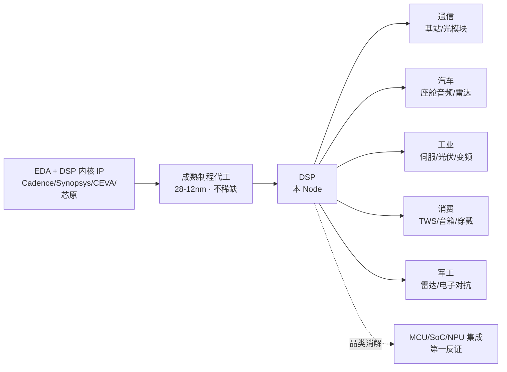
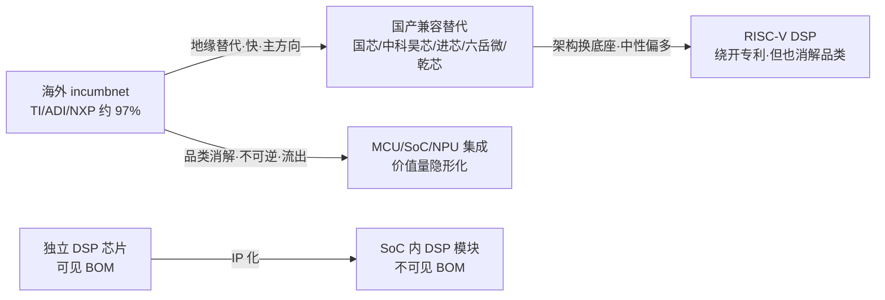

# NODE-008 DSP（数字信号处理器）

> [!info] Node 档案
> **编号**：NODE-008 ｜ **状态**：active ｜ **登记日期**：2026-09-14
> **路由方式**：宫主点名「可以登记单独的Node DSP」= 批准（第 7 次复用）
> **来源**：宫主问答「DSP 与 oDSP 什么关系」→ 判定技术大类不构成 Node → 宫主指示单独立 Node
> **与 NODE-005 的关系**：DSP 为技术大类，oDSP（光互连 DSP）为其子类之一。**二者 Supply Chain 七问六项答案不同 → 各自独立成 Node**，oDSP 内容不并入本 Node（详见 NODE-005 Step 1 Scope 边界）

## 术语表

| 术语 | 全称 / 英文 | 释义 |
| --- | --- | --- |
| DSP | Digital Signal Processor | 数字信号处理器：为实时信号处理（滤波、FFT、编解码、调制解调）优化的处理器 |
| oDSP | Optical DSP | 光互连用 DSP（NODE-005 专研），本 Node Scope 外 |
| C2000 | TI TMS320C2000 | TI 实时控制产品线，**TI 自己已改称 real-time MCU 不再叫 DSP** |
| CCS | Code Composer Studio | TI 的集成开发环境，构成 DSP 生态壁垒的核心 |
| SHARC | ADI SHARC 系列 | ADI 高端浮点 DSP，专业音频 / 医疗成像 / 国防 |
| P2P 兼容 | Pin-to-Pin | 管脚级兼容，替换时无需改 PCB——国产替代的关键门槛 |
| AEC-Q100 | — | 车规芯片可靠性认证标准 |
| RISC-V | — | 开源指令集架构，国产 DSP 绕开 TI/ADI 专利的路径 |
| 内核 IP | DSP Core IP | 以授权方式嵌入 SoC 的 DSP 模块（CEVA / 芯原 / Synopsys） |
| 魂芯 | 中国电科 38 所 | 国产军工 DSP 系列，对标 TI TMS320C6678 |

## Node 档案

| 项 | 内容 |
| --- | --- |
| 中文名 | DSP（数字信号处理器） |
| 英文名 | Digital Signal Processor |
| 别名 | 数字信号处理芯片、通用 DSP、嵌入式 DSP IP |
| 所属层级 | 电子系统的实时信号处理单元（**横跨 5 条互不相关的价值链**） |
| 登记依据 | 宫主点名批准（第 7 次复用） |
| 关联 Node | NODE-005（oDSP，子类·Scope 外）、NODE-001（HBM）、NODE-006（AI 芯片） |
| 证据条数 | 15（EVD-110 ~ EVD-124） |
| 首次特性 | **本宫第一个"研究结论为不可投"的 Node**；首个以「软壁垒（生态/认证）」为稀缺层的 Node |

## Step 0 路由记录

2026-09-14 宫主提问「DSP 和 oDSP 什么关系？DSP 相关内容应该放到 Node005 里吗？」→ 判定：**DSP 是技术大类，Node 是价值链位置，二者不同；技术大类不构成 Node**。同日宫主指示「可以登记单独的 Node DSP」→ 部分命中 → 宫主批准 → 登记 NODE-008。

**本 Node 的先天特征（登记时就已知）**：DSP 横跨通信、汽车、工业、消费、军工五条互不相关的价值链，因此它的 Supply Chain 七问中「下游是谁」有五个答案，「出问题传导到哪里」不会跨链——**这与 NODE-005（单一链条、一缺货就卡 AI 算力）截然相反**。这个特征将直接决定 Step 12 的失败条件。

## 十三步（原九问扩展）

### Step 1 范围与市场规模（口径冲突八 Node 之最）

市场：全球通用 DSP 芯片（**不含光互连 oDSP**，见 NODE-005 Step 1 Scope 边界）。

| 口径 | 2026 全球规模 | TI 份额 | 中国国产化率 | 来源 | 等级 |
| --- | --- | --- | --- | --- | --- |
| 中研普华 | 349 亿元（约 52 亿美元） | 37% | 25% | 中研网 | C |
| 柒一全球网 | 142.6 亿美元 | 31.2%（前五 78.4%） | — | ami.net.cn | **D（存疑）** |
| IIM 信息 | 412.7 亿美元 | — | 中低端 41.2% | iim.net.cn | **D（存疑）** |
| 头条口径 | 中国 255.8 亿元（+17.6%） | 60%（海外合计 97%） | **3%** | 今日头条 | C |
| 出货量口径 | 48.7 亿颗 / 68.2 亿颗（两套） | — | — | 同上两组 | D |

**处理原则**：全球规模三套口径**相差 8 倍**（52 亿 vs 412.7 亿美元）。采信 **52-142.6 亿美元区间**，412.7 亿美元标注 D 级。国产化率 3% vs 25% vs 41.2%——按既有惯例**取保守值 3-10%**（高端领域更低）。

> **暗线 4 新形态（首次记录）**：本 Node 首次出现「信源本身可疑」——ami.net.cn 与 iim.net.cn 两个站点的"行业研究报告摘要"数据互相矛盾、无原始机构署名、数值精确到小数点后一位（142.6 亿美元、412.7 亿美元、46.2%、34.7%），具备典型 AI 批量生成特征。**判定为 D 级，不予采信**。研究框架此前只区分"口径不同"，本 Node 起需增加一层：**先验证信源是否真实存在，再比较口径**。

**Scope 边界（与 NODE-005 的对偶关系）**：

| 检验项 | 通用 DSP（本 Node） | oDSP（NODE-005） |
| --- | --- | --- |
| 供应链位置 | 电子系统的实时信号处理单元（跨 5 条链） | 光模块电端核心芯片，BOM 25-40% |
| 它依赖谁 | EDA/IP 核、成熟制程（28-12nm） | 5/3nm 先进制程、高速 ADC/DAC + SerDes IP |
| 谁依赖它 | 通信 / 汽车 / 工业 / 消费 / 军工（分散，不跨链） | 光模块厂 + 云厂商（极窄，单一链） |
| 出问题传导 | 单条链停产，**不跨链传导** | 直接卡 AI 集群算力释放 |
| 瓶颈性质 | **软壁垒**：工具链生态 + 认证 | **硬壁垒**：制程 + 模拟前端 |
| 利润池 | 海外且正在萎缩 | 海外但高增长（AI 驱动） |
| 失败条件 | 品类被 MCU/SoC 吸收而消解 | 被 LPO/CPO 架构性移除 |

### Step 2 系统变化：三个方向不一致的变化

同时发生、方向不一致的三个变化，构成本 Node 的核心张力：

1. **地缘断供（利多·硬证据）**：2026 年 TI 启动短期内第二次全面涨价，工控相关产品涨幅最高 **85%**，部分热门料号交期超 **50 周**；实体清单 + 50% 穿透规则严格执行。国产替代从"可选项"变为"必选项"。
2. **架构换底座（中性偏多）**：RISC-V 让国产绕开 TI/ADI 专利——可在基础指令集上叠加自定义 DSP 扩展指令。2026Q1 RISC-V DSP IP 核授权量同比 **+44%**，有预测 2027 年 RISC-V 在工业实时控制 DSP 细分占比 >15%。
3. **品类消解（利空·内生）**：**TI 自己已不再把 C2000 叫 DSP**——官方定位改为 real-time MCU，C28x 内核被定义为"通用 MCU 与 DSP 的结合体"，2024-11 更推出带 NPU 的 TMS320F28P55x。 incumbnet 自己在给"实时控制"加 AI 加速，说明价值不在"DSP 之名"而在"实时控制之实"。

**暗线 3 检查点**：利多（1）与利空（3）**同源**——都来自"海外 incumbnet 主导的品类重构"。这不是简单的多空对冲，而是同一个正在发生的品类变革的两面。

### Step 3 Supply Chain（产业关系地图）

按框架第四节 Supply Chain 七问定位：

| 七问 | 答案 |
| --- | --- |
| 处于什么位置 | 电子系统的实时信号处理单元，**横跨 5 条互不相关的价值链**——通信、汽车、工业、消费、军工 |
| 它依赖谁（上游） | EDA 工具 + DSP 内核 IP（Cadence / Synopsys / CEVA / 芯原）→ 成熟制程代工（28-12nm，**不稀缺**）→ 封测 |
| 谁依赖它（下游） | 五条链并列：①通信基站 / 光模块 ②汽车座舱音频 + 雷达 ③工业伺服 + 光伏储能 + 变频器 ④消费 TWS / 音箱 / 可穿戴 ⑤军工雷达 / 电子对抗 |
| 出问题传导到哪里 | **单条链内传导，不跨链**：工控 DSP 缺货 → 光伏逆变器停产；军工 DSP 缺货 → 型号交付延迟。与 oDSP 一缺货就卡 AI 算力完全不同 |
| 它替代谁 | 本 Node 同时是**被吸收方**：MCU + 加速器、SoC 集成、NPU 都在吸收 DSP 功能 |
| 它属于谁 | 技术域归属"信号处理器件"；**价值链上分属 5 条不同的链**——这是它作为 Node 的先天缺陷（见 Step 12） |
| 下一步研究谁 | REL-023 车规 DSP、REL-024 RISC-V DSP IP、REL-025 军工特种 DSP |

**发散型供应链结论**：本 Node 的下游是**并列五条链**而非单一链条。这意味着——**没有一个下游的景气度能代表本 Node 的景气度**。恒玄科技 H1 营收 -30.29%（消费链衰退）与国芯科技 H1 营收 +83.66%（车规链爆发）同时成立，两者不构成矛盾，但也不能相互印证。这是研究本 Node 时最容易犯的错误（用单一标的业绩推断整个 Node）。

### Step 4 BOM（产品构成与价值量地图）

DSP 的特殊性：**它不是单一产品的 BOM，而是"被集成的部件"**。四种存在形态：

| 形态 | BOM 位置 | 价值量可见性 | 代表 |
| --- | --- | --- | --- |
| 独立 DSP 芯片 | 主控器件，独立 BOM 行 | **可见**（单颗 1-30 美元） | TI C2000、ADI SHARC、国芯 CCD 系列 |
| 嵌入式 DSP 内核 IP | SoC 内部，无独立 BOM 行 | **半可见**（授权费 + 版税） | CEVA、Synopsys、芯原股份 |
| SoC 内集成 DSP | 隐藏在 SoC 里，不单独计价 | **不可见** | 恒玄 BES 系列、中科蓝讯、瑞芯微、全志 |
| 光互连 oDSP | 光模块独立芯片，BOM 25-40% | 可见 | NODE-005（本 Node Scope 外） |

**价值量变化（动态视角）**：

- **隐形化**：DSP 正从"独立芯片"变成"SoC 里的一个模块"，BOM 上逐步消失。这是品类消解的财务表现——不是价值消失，是**价值被合并进 SoC 报价，无法单独计量**
- **车规化**：车规 DSP 单价显著高于工控/消费级（认证成本摊销），国芯 12nm 车规 CCD 系列是国产向高价值量迁移的案例
- **IP 化**：授权模式（CEVA / 芯原）让 DSP 的价值量从"芯片售价"转为"版税"，2026Q1 RISC-V DSP IP 授权量 +44% 说明这一形态在扩张

### Step 5 Value Chain（价值创造与获取地图）

- **价值创造**：提供确定性延迟的实时信号处理能力——在电机控制、主动降噪、雷达波束成形等场景中，决定性的不是算力峰值，而是**延迟确定性与功耗效率**
- **价值获取**：TI / ADI / NXP 三家合计 52.6%-78.4%（口径分歧），海外合计约 97%（头条口径）。获取手段是**型号覆盖宽度**（TI 车规 + 工控产品线覆盖 4000+ 型号）而非单点性能
- **议价权（与 NODE-005 相反）**：对上游（成熟制程代工）**议价权强**——28nm 产能遍地、不受挤占；对下游（客户）**议价权强**——生态锁定，迁移需重新开发与重新认证
- **结论**：通用 DSP 的价值 **不在芯片本身，而在工具链与生态**。芯片可以复制（国产已做到 P2P 兼容甚至参数超越），生态不可复制（TI CCS + 4000+ 型号 + 数十年算法库积累）
- **跨 Node 对照（关键）**：
  - NODE-005 oDSP：壁垒在**制程与模拟前端**（硬壁垒）——烧钱 + 时间可以攻克
  - NODE-008 通用 DSP：壁垒在**生态与认证**（软壁垒）——更黏，但可被地缘政治强行打破（交期 50 周会逼客户迁移）
  - NODE-007 InP：壁垒在**资源与提纯工艺**（自然壁垒 + 工艺）

### Step 6 Bottleneck / Scarce Layer（价值控制点）

按"供应商数量 + 认证壁垒 + 复制难度 + 时间不可压缩性"排序：

| 层级 | 稀缺约束 | 壁垒强度 | 说明 |
| --- | --- | --- | --- |
| 1 | 工具链与生态（TI CCS + 算法库 + 4000+ 型号覆盖） | ★★★★★ | 最难复制——国产只能"兼容"不能"替代"，六岳微做到零修改迁移已是极限 |
| 2 | 车规 / 军工资质认证（AEC-Q100、国军标） | ★★★★ | 时间不可压缩（2-3 年），且需客户侧重新验证 |
| 3 | 迁移成本（寄存器级兼容、源代码改动比例） | ★★★★ | 六岳微零修改 > 中科昊芯改 10-20% > 芯弦半导体大幅修改 |
| 4 | 制程 | ★ | **不稀缺**——28-12nm 成熟制程遍地，与 NODE-005/006 完全相反 |

**本 Node 最重要的判断**：这是本宫**第一个以"软壁垒"为稀缺层的 Node**。前七个 Node 的稀缺层都是硬壁垒（制程、材料、工艺、产能）。软壁垒的特点是：**不会随技术进步而缓解，但会随外部冲击（断供、涨价、政策）而骤然失效**。因此本 Node 的稀缺性不是"技术性稀缺"，而是"信任性稀缺"——客户不是造不出来，是不敢换。

### Step 7 Profit Pool（利润集中区域）

| 环节 | 当前利润集中度 | 代表 | 是否可投 |
| --- | --- | --- | --- |
| 独立 DSP（海外） | 极高（TI 31.2-60% / ADI 19.7% / NXP） | TI、ADI、NXP、ST | **不在 A 股** |
| DSP 内核 IP 授权 | 高（CEVA / Synopsys / Cadence） | 芯原股份（PB 32.22） | 在 A 股但极贵 |
| 车规 DSP 国产 | 极低（刚起步） | 国芯科技（12nm 车规 CCD 已量产） | 最接近纯标的，但亏损 |
| 军工特种 DSP | 中（国家队垄断） | 中国电科 38 所魂芯（非上市）、紫光国微 | 紫光国微纯度低 |
| 音频 SoC（DSP 内含） | 中但在**萎缩** | 恒玄、中科蓝讯、炬芯 | 名义相关，实际在下滑 |

**关键判断（与 NODE-005 的关键差异）**：NODE-005 的利润池虽在海外，但 A 股买的是"**进入池的期权**"（国产化率 <5% 有明确替代空间）。本 Node 的利润池同样在海外，但 A 股**连期权都不清晰**——因为国产厂商主打"P2P 兼容替代"而非"技术超越"，替代带来的是**存量份额转移**，不创造新价值增量；且品类本身在消解，池子在缩小。

### Step 8 Profit Migration（利润迁移方向）

三条迁移路径：

1. **地缘驱动替代（主方向·快）**：海外 → 国产。触发：交期 50 周 + 涨价 85% + 实体清单。**速率快于 NODE-005 的国产替代**——因为不需要 5-8 年算法积累，只需做到 P2P 兼容与低迁移成本。湖南毂梁微已累计交付超 280 万颗、实现 10 余系列 P2P 兼容。
2. **品类消解（反方向·不可逆·流出）**：独立 DSP → MCU / SoC / NPU 集成。这是利润**流出本 Node** 的主道，且不可逆——TI 自己带头改名，说明 incumbnet 已认定这条路。
3. **架构换底座（中性偏多）**：封闭架构（TI C28x / ADI SHARC）→ RISC-V 开源。让国产绕开专利，**但双刃**：RISC-V 让 DSP 变成"指令集扩展"，进一步消解独立品类的存在意义。

**净判断**：迁移 1 把利润搬进国产厂商（快），迁移 2 同时把整个池子缩小（不可逆）。**关键不等式**：若替代速率 > 品类消解速率，本 Node 成立；反之则本 Node 会逐渐失去研究价值。当前无法判定，需跟踪 TI 交期与 RISC-V DSP IP 授权量两个指标。

### Step 9 Company（公司宇宙，13 家 + 4 家非上市）

**按"DSP 纯度"分层（本 Node 的核心分类维度）**：

| 分层 | 公司 | 代码 | DSP 业务实质 | 2026 H1 营收 | YoY | 2026 H1 归母净利 | YoY | PE | PB | YTD |
| --- | --- | --- | --- | --- | --- | --- | --- | --- | --- | --- |
| **独立 DSP（真）** | 国芯科技 | 688262 | 12nm 车规音频 DSP 量产，军工/工控布局 | 3.133 亿 | **+83.66%** | -0.819 亿 | 亏损收窄 | -35.78 | 4.66 | -12.42% |
| 特种 DSP | 紫光国微 | 002049 | 特种集成电路含 DSP | 34.43 亿 | +13.0% | 7.977 亿 | +15.29% | 32.44 | 3.69 | -24.39% |
| DSP IP | 芯原股份 | 688521 | DSP 内核 IP 授权 | 18.64 亿 | **+91.37%** | -6.121 亿 | 亏损扩大 | -114.94 | **32.22** | +30.86% |
| 音频 SoC（DSP 内含） | 恒玄科技 | 688608 | 蓝牙音频 SoC，DSP 内含 | 13.51 亿 | **-30.29%** | 1.711 亿 | **-43.87%** | 45.97 | 3.01 | **-44.56%** |
| 音频 SoC | 中科蓝讯 | 688332 | 无线音频 SoC（RISC-V） | 9.053 亿 | +11.52% | 4.796 亿 | +265.8%（**扣非 -7.95%**） | **8.63** | 2.67 | -2.44% |
| 音频 SoC | 炬芯科技 | 688049 | 低功耗音频 SoC + 端侧 AI | 5.764 亿 | +28.33% | 1.088 亿 | +19.07% | 30.96 | 3.24 | -25.39% |
| AP SoC | 瑞芯微 | 603893 | 智能应用处理器 | 28.77 亿 | +40.6% | 8.59 亿 | +61.73% | 55.30 | 15.36 | +1.11% |
| AP SoC | 全志科技 | 300458 | 智能应用处理器 SoC | 18.88 亿 | +41.23% | 4.902 亿 | +204.2% | 49.18 | 8.35 | -16.06% |
| AP SoC | 君正股份 | 300223 | 处理器 + 存储 | 39.57 亿 | +75.95% | 11.98 亿 | **+489.6%** | 47.46 | 4.78 | +19.29% |
| 信号链 | 纳芯微 | 688052 | 隔离与信号链 | — | — | — | — | -449.09 | 4.79 | +44.59% |
| 信号链 | 艾为电子 | 688798 | 音频功放 + 触觉驱动 | — | — | — | — | 47.97 | 2.92 | -30.58% |
| MCU | 复旦微电 | 688385 | FPGA + 特种芯片 | — | — | — | — | 48.38 | 6.15 | -29.18% |
| IoT | 乐鑫科技 | 688018 | Wi-Fi MCU | — | — | — | — | 42.21 | 5.12 | -15.09% |

**非上市但技术领先（本 Node 的真正主角都不在 A 股）**：

| 主体 | 技术路线 | 状态 |
| --- | --- | --- |
| 中国电科 38 所（魂芯） | 自研架构，魂芯二号 ADSP 对标 TI TMS320C6678，单核性能 1.7 倍、功耗降 1/3 | 军工龙头，国军标认证，**非上市** |
| 中科昊芯 | RISC-V DSP，H28x 内核、HX2000 系列，全球首家 RISC-V DSP 量产 | 中科院背景，红杉/比亚迪/创维入股，**未上市** |
| 湖南毂梁微 | 正向设计兼容 C2000，10 余系列 P2P 兼容，累计交付 >280 万颗 | 国防科大团队，**未上市** |
| 六岳微 / 乾芯 / 湖南进芯 | Pin-to-Pin 兼容，零修改迁移 / 车规 / 中低端工控 | **均未上市** |

### Step 10 证据分级

| 等级 | 条数 | 说明 |
| --- | --- | --- |
| A（官方/财报/一手） | 4 | 9 家公司 2026 中报财务数据、国芯车规 DSP 量产公告 |
| B（权威转引/产业媒体） | 4 | 与非网（中科昊芯 RISC-V 路线）、21ic（替代选型框架） |
| C（券商/研究机构/KOL） | 4 | 中研普华市场规模、头条口径国产化率、TI 交期与涨价 |
| **D（存疑，不予采信）** | 3 | ami.net.cn、iim.net.cn 两套互相矛盾的"报告摘要"，疑 AI 生成 |

**本 Node 证据特征**：D 级证据占比 20%，为八 Node 最高。原因是"DSP 市场规模"这一主题吸引大量 AI 生成内容站。**处理方式：凡无原始机构署名 + 数值精确到小数点后一位 + 与其他口径差 5 倍以上的，一律标 D 且不进入结论**。

### Step 11 排序（稀缺层排序 ≠ 公司排序，第五个实质案例）

**先排层级，再排公司。本 Node 的断裂程度为八 Node 之最**：

| 排序 | 对象 | 稀缺度 | 可投性 | 断裂说明 |
| --- | --- | --- | --- | --- |
| 1 | TI 的工具链生态 | ★★★★★ | **不可投**（海外） | 最稀缺的完全不可投 |
| 2 | 车规/军工资质 | ★★★★ | 弱（国芯刚起步） | 时间壁垒，非资本可加速 |
| 3 | 国产 P2P 兼容能力 | ★★★ | 中（但**多数未上市**） | 真正的技术主体（38所/昊芯/毂梁微）全在一级市场 |
| 4 | 制程 | ★ | — | 不稀缺，不构成排序依据 |

**公司排序与稀缺层排序完全错位**：

1. **最相关的国芯科技（唯一有真实 DSP 量产）= 亏损**（H1 -0.819 亿，2026 全年预测净利仅 250 万，刚盈亏平衡）
2. **最便宜的中科蓝讯（PE 8.63）= 名义相关 + 利润造假象**：H1 归母净利 4.796 亿（+265.8%），但**扣非仅 1.019 亿（-7.95%）**，Q1 更是亏损 586.9 万 → 净利大增来自非经常性损益（与 NODE-004 赛微 PE 16 同一陷阱）；且主业是音频 SoC 不是 DSP
3. **最景气的瑞芯微/全志/君正（+40%~+76%）= 纯度极低**：DSP 只是 AP SoC 里的一个模块，业绩由 AIoT / 存储驱动，与本 Node 无因果关系
4. **消费音频线在衰退**：恒玄 H1 营收 -30.29%、净利 -43.87%、YTD -44.56%——证明"消费音频 DSP"这条链正在恶化，而非受益 AI

**结论：本 Node 在 A 股没有可直接投资的标的。**

### Step 12 失败条件（本 Node 最重要的一问：DSP 品类是否正在消失）

这是本宫第一个**在登记时就已经观察到失败信号**的 Node：

1. **品类消解（第一反证，且已在发生）**：TI 已把 C2000 改称 real-time MCU 并加入 NPU。若 5 年内 DSP 完全演变为"SoC 里的一个 IP 模块"，则本 Node 作为一个价值链位置将**自然消失**——不是被竞争对手打败，而是被架构融合吸收。这与 NODE-005 的"被 LPO/CPO 移除"不同：005 是需求被架构性移除（钱还在别处），008 是**品类本身溶解**（钱分散进 SoC 无法计量）
2. **地缘缓和**：TI 交期恢复至常态、价格回落 → 国产替代窗口关闭，迁移 1 停滞而迁移 2 继续 → 本 Node 净效应转负
3. **RISC-V 生态不成气候**：若 RISC-V DSP 停留在"授权量增长但无量产落地"，国产替代停留在兼容层面，无法形成独立利润池
4. **口径证伪**：若全球真实规模接近下限（52 亿美元）且增速仅 12%，则本 Node 不构成产业级机会，仅为理解性知识
5. **传导证伪（本 Node 特有）**：由于下游五条链互不传导，**任何单一标的的业绩都不能用来验证或证伪本 Node**——若宫主发现某"DSP 概念股"大涨，需先确认是哪条链的驱动，不能归因于 DSP 品类

### Step 13 下一步研究动作

1. **验证点 A**：国芯科技 2026 全年能否扭亏（市场预测净利 250 万）——这是 A 股唯一有真实 DSP 量产的公司，其盈亏平衡是"车规 DSP 能否商业化"的第一个可观测信号
2. **验证点 B**：跟踪 TI 交期（当前 >50 周）与工控产品价格（当前涨幅最高 85%）——这是迁移 1 的驱动力，一旦回落则替代逻辑弱化
3. **验证点 C**：RISC-V DSP IP 授权量季度数据（2026Q1 +44%）——判断架构换底座是否真实发生
4. **验证点 D**：TI 是否进一步把 C2000 从 DSP 品类移出（财报口径 / 官网分类）——品类消解的最直接指标
5. **候选 REL**：REL-023 车规 DSP、REL-024 RISC-V DSP IP、REL-025 军工特种 DSP、REL-026（→NODE-005 oDSP 技术同源关系）

## 六暗线检查点汇总

1. **结构性 vs 周期性**：**双向结构性**——地缘替代是结构性机会，品类消解是结构性威胁，两者同时发生且同源（都源于 incumbnet 主导的品类重构）。净效应存疑，本 Node 不给出方向性结论
2. **需求真实性**：TI 交期 50 周 + 涨价 85% 是硬证据（C 级但可交叉验证）；但国产化率 3% vs 25% vs 41.2% 矛盾，取保守值
3. **速率与节奏**：替代速率（快，P2P 兼容无需算法积累）vs 品类消解速率（TI 已改名，进行中）——**关键不等式，当前无法判定**
4. **绝对化纠偏（本 Node 触发 8 项，八 Node 并列之最）**：①全球规模 52 亿 vs 142.6 亿 vs 412.7 亿美元（差 8 倍）②TI 份额 31.2% vs 37% vs 60% ③前五合计 52.6% vs 78.4% vs 97% ④国产化率 3% vs 25% vs 41.2% ⑤中国市场规模 93 亿 vs 255.8 亿元 vs 58.7 亿 vs 118.6 亿美元 ⑥出货量 48.7 亿 vs 68.2 亿颗 ⑦"DSP 是半导体最卡脖子赛道"（头条）vs "TI 自己已不叫它 DSP"（与非网）⑧中科蓝讯净利 +265.8% vs 扣非 -7.95%
5. **BOM 内价值分级**：DSP 价值量**隐形化**——从独立 BOM 行变为 SoC 内部模块，无法单独计量
6. **替代威胁内生性**：本 Node 的第一反证不是外部技术，而是**品类自身被吸收**——这是本宫首个"内生性消解"型失败条件

## Alpha 映射链

稀缺层（工具链生态 + 认证，软壁垒） → 价值池（海外约 97%，且正在萎缩） → A 股映射（13 家上市 + 4 家非上市，纯度极低） → Alpha：

- **Tier-1：无。** A 股不存在可直接投资本 Node 的标的——最稀缺的（TI 生态）不可投，最相关的（国芯）亏损，最便宜的（蓝讯）利润含水分，最景气的（瑞芯微/全志/君正）纯度极低
- **Tier-2（观察，不建议建仓）**：国芯科技（唯一真实 DSP 量产，2026 预测净利 250 万刚盈亏平衡，市值 89 亿）、紫光国微（特种 DSP，PE 32.44 相对合理，但 DSP 占比小）
- **排除名单**：恒玄科技（消费音频链衰退，H1 -30.29%）、中科蓝讯（PE 8.63 是扣非陷阱）、瑞芯微/全志/君正（AP SoC，与本 Node 无因果）
- **真正的机会在一级市场**：中国电科 38 所（魂芯）、中科昊芯、湖南毂梁微、六岳微——本 Node 的技术主体全部未上市。若未来有 IPO，届时重新评估

**Trading OS 交接**：**本 Node 不产生交易标的，只产生理解价值。** 它的作用是提供一个过滤器——当宫主在任何渠道看到"DSP 国产替代概念股"名单时，可用本 Node 的纯度表直接证伪：名单里的公司大多是音频/AP SoC 公司（DSP 内含、不单独计价），其业绩由各自链条驱动，与 DSP 品类无因果关系。

## 证据索引

| 编号 | Node | 等级 | 内容摘要 | 来源 |
| --- | --- | --- | --- | --- |
| EVD-110 | NODE-008 | C | 2026 全球 DSP 市场约 349 亿元；TI 份额 37%；国内国产化率 25% | 中研普华（中研网） |
| EVD-111 | NODE-008 | D | 2026 全球 412.7 亿美元（+9.3%），中国 118.6 亿美元 | iim.net.cn（**存疑，不采信**） |
| EVD-112 | NODE-008 | D | 2026 全球 142.6 亿美元（+11.1%），前五占 78.4% | ami.net.cn（**存疑，不采信**） |
| EVD-113 | NODE-008 | C | 国内 2026 年 DSP 市场 255.8 亿元（+17.6%），本土仅占 3% | 今日头条（KOL 口径） |
| EVD-114 | NODE-008 | B | TI C2000 交期 >50 周，2026-04 第二次全面涨价，工控涨幅最高 85% | 21ic（产业媒体） |
| EVD-115 | NODE-008 | B | TI 已将 C2000 定位改为 real-time MCU，2024-11 推出带 NPU 的 TMS320F28P55x | 与非网（eefocus） |
| EVD-116 | NODE-008 | B | 中科昊芯 RISC-V DSP 量产，HX2000 系列；2026Q1 RISC-V DSP IP 授权量 +44% | 与非网 + 中研普华 |
| EVD-117 | NODE-008 | A | 国芯科技 2026 H1 营收 3.133 亿（+83.66%），归母净利 -0.819 亿 | 2026 中报 |
| EVD-118 | NODE-008 | A | 紫光国微 2026 H1 营收 34.43 亿（+13.0%），归母净利 7.977 亿（+15.29%） | 2026 中报 |
| EVD-119 | NODE-008 | A | 恒玄科技 2026 H1 营收 13.51 亿（**-30.29%**），归母净利 1.711 亿（**-43.87%**） | 2026 中报 |
| EVD-120 | NODE-008 | A | 中科蓝讯 2026 H1 归母净利 4.796 亿（+265.8%），**扣非 1.019 亿（-7.95%）** | 2026 中报 |
| EVD-121 | NODE-008 | A | 芯原股份 2026 H1 营收 18.64 亿（+91.37%），归母净利 -6.121 亿（亏损扩大） | 2026 中报 |
| EVD-122 | NODE-008 | B | 湖南毂梁微 P2P 兼容 C2000 十系列，累计交付 >280 万颗，宽温 -55~125℃ | 国芯在线（chipsmate） |
| EVD-123 | NODE-008 | C | 中国电科 38 所魂芯二号 ADSP 对标 TI TMS320C6678，单核性能 1.7 倍、功耗降 1/3 | 今日头条（KOL，需二次核实） |
| EVD-124 | NODE-008 | C | 2026 国家高端芯片研发补贴 +23.5% 至 14.2 亿元，DSP 列为卡脖子重点 | 中研普华 |
| EVD-152 | NODE-008 | B | 国芯科技2026-09-17投资者关系活动记录表 | 2026-09-17 | DSP芯片出货13.61万颗；车规安全MCU出货超190万颗(+80%)；12条车规产品线中DSP等中高端已批量供货(比亚迪/奇瑞/吉利/上汽/广汽)；新一代RISC-V CCRC4XXX(国内首款兼具AI算力与抗量子安全的高端车规芯片)已送样；定制业务6月末合同负债11.43亿(+23.38%)、重点转向AI ASIC |
| EVD-153 | NODE-008 | C | 中科昊芯B轮融资(2026-09-03悦湖资本；超7日窗口补登记) | 2026-09-03 | RISC-V架构DSP厂商完成B轮，资金投向AI边缘端芯片研发；HX2000系列已规模化应用；2026慕尼黑上海电子展发布RISC-V DSP+双核异构AI边缘智能芯片 |
| EVD-193 | NODE-008 | A | 国芯科技 2026-09-17 投资者关系活动记录表（中国金融信息网/巨潮） | 2026-09-26 | 软壁垒 Node 首个 A 级出货绝对值：2026 年上半年汽车电子芯片收入 1.0247 亿元、同比 +108.47%，上半年出货超 800 万颗、累计出货超 3400 万颗；车规级安全 MCU 出货超 190 万颗 +80%；**DSP 芯片出货 13.61 万颗**；12 条车规级产品线中安全气囊、底盘、域控、DSP 等中高端产品已批量供货，客户覆盖比亚迪、奇瑞、吉利、上汽、广汽等头部整车厂。新一代基于 RISC-V 的 CCRC4XXX 系列（国内首款同时具备 AI 计算与抗量子安全能力的高端车规芯片）两款产品 CCRC4045S/CCRC4086S 已送样客户、正在模组开发与测试。定制业务：截至 2026 年 6 月末合同负债 11.43 亿元（较 2025 年末进一步提升），主要来自 AI ASIC 与高性能 CPU 定制服务预付款。→ 强化（国产车规 DSP 已越过认证门槛进入批量供货），但绝对量级仍小，不推翻 A 股不可投结论 |
| EVD-194 | NODE-008 | C | 21IC 电子网选型综述（2026-09）+ 腾讯搜一搜工控芯片稿（2026-09-23）+ 与非网匠芯创原创稿（2026-09-10） | 2026-09-26 | 软壁垒「迁移成本」被工程化破解的迹象：实时控制 DSP 国产替代已进入 pin-to-pin 原位替换阶段——SYSF377D/F379D（200MHz 双核）硬件寄存器、外设、封装 PIN 与 TI C2000 系列逐项对齐，配套自研卡姆派乐 IDE 支持 CCS 工程一键导入、存量代码改动量小，已有阳光电源、汇川、中国中车、燧原科技等客户验证与订单，常规型号交期 4 周。同类厂商形成阵营：中科昊芯（RISC-V DSP，主频达 280MHz，光伏/伺服落地）、毂梁微（正向浮点双核 DSP）、芯弦半导体 NS800RT（汽车与能源电控）、格见半导体（服务器电源 CRPS 参考方案）、方芯 FCP32C335（对标 TMS320F28335，pin-to-pin，150MHz，18 通道 ePWM、MEP 150ps）。另：匠芯创 M7000 系列 RISC-V 工业级 DSP（主频 552MHz，内置 DSP/FPU/Cordic/FFT/FIR/IIR）获 2026 年度硬核芯重大技术突破奖，软件兼容主流 DSP 指令集。→ 确认（软壁垒正被工具链与 pin-to-pin 逐条消解，方向与 Node 软壁垒假设一致，列为跟踪项） |

## 路由反馈（沉淀给路由表）

1. **「技术大类 → 单独立 Node」首次实战**：宫主问"DSP 与 oDSP 关系"→ 判定技术大类不构成 Node → 宫主指示"登记单独的 Node DSP"。**结果：形成对偶双 Node**——005（子类·单一链条·硬壁垒）与 008（大类·发散五链·软壁垒）。这是本宫第一次因"关系澄清"而新增 Node，而非因"新信息命中"而新增
2. **软壁垒稀缺层首次出现**：前七 Node 的稀缺层均为硬壁垒（制程/材料/工艺/产能），008 首次为软壁垒（生态/认证）。软壁垒的验证方式不同——不看扩产数据，看**迁移成本与认证周期**
3. **「研究结论为不可投」首次出现**：八 Node 中第一个明确给出"A 股无可投标的"结论的 Node。框架需要能容纳这种否定性结论——**研究的价值不总是产生 Alpha，有时是排除伪 Alpha**
4. **D 级证据新判定标准**：首次将"信源本身可疑（疑 AI 生成）"作为证据降级理由。标准：无原始机构署名 + 数值精确到小数点后一位 + 与主流口径差 5 倍以上
5. **发散型供应链的研究陷阱**：下游并列五条链时，**任一标的业绩都不能代表 Node 景气度**。这与 NODE-007（单一链条·五层传导）形成鲜明对比
6. **纯度成为核心分类维度**：当 Node 横跨多链时，公司分类的第一维度不是"规模"或"增速"，而是**"与本 Node 的业务纯度"**。本 Node 据此把 13 家公司分为四层，并直接排除三层

## 关系表

| 关系 | 对象 | 说明 |
| --- | --- | --- |
| 技术同源 | NODE-005（oDSP） | oDSP 是 DSP 技术的子类，但价值链位置不同 → 独立成 Node，互不并入 |
| 部分重叠 | NODE-006（AI 芯片） | 部分 AI 芯片内含 DSP 模块；NPU 正在吸收 DSP 功能（品类消解的一条路径） |
| 下游交叉 | NODE-001（HBM） | 无直接关系；仅在军工/高性能计算场景同为系统组件 |
| 候选 REL | REL-023 / REL-024 / REL-025 / REL-026 | 车规 DSP / RISC-V DSP IP / 军工特种 DSP / →NODE-005 技术同源 |

---

## 更新日志（Changelog）

> 每次信息更新在此登记一行（由每日行研扫描自动追加）。字段口径见 `行业地图更新记录.md`。
> 类型：新闻 / 研报 / 公告 / 数据 / 产品 / 技术 / 关系 / 证伪
> 影响判定：确认 / 强化 / 削弱 / 证伪 / 待观察 / 无实质影响

| 日期 | 类型 | 触发信息 | 变更位置 | 影响判定 | 证据 |
|---|---|---|---|---|---|
| 2026-09-23 | 机制 | 建立每日行研扫描机制（宫主指令），本节随之为 NODE-008 建立 | 新增本节 | — | — |
| 2026-09-23 | — | 近7日检索无实质命中（仅泛DSP产业综述，无新事实） | — | 无实质影响 | — |
| 2026-09-23 | 重估 | 首轮重估：否定性结论「A股不可投」本轮未被任何材料挑战，维持原判 | 无改动 | 无冲突 | — |
| 2026-09-24 | 公告 | 国芯科技 9/17 投关记录：DSP 出货 13.61 万颗、车规安全 MCU 超 190 万颗(+80%)、RISC-V CCRC4XXX 已送样、定制业务合同负债 11.43 亿(+23.38%) | 第五节证据索引 | 强化 | EVD-152 |
| 2026-09-24 | 融资 | 中科昊芯完成 B 轮（9/3，悦湖资本），RISC-V DSP HX2000 已规模化、慕尼黑上海电子展发布 AI 边缘芯片（超 7 日窗口补登记） | 第五节证据索引 | 确认 | EVD-153 |
| 2026-09-25 | — | 近 3 日无实质命中：妙想 API 配额触顶（code 113）后降级 WebSearch 复核，仅见泛 DSP/存算一体产业综述，无触及本 Node 结论的新事实 | — | 无实质影响 | — |
| 2026-09-26 | 公告 | 国芯科技：2026H1 汽车电子收入 1.02 亿 +108%、DSP 芯片出货 13.61 万颗、车规 DSP 已批量供货比亚迪/奇瑞/吉利等；合同负债 11.43 亿 | 第五节证据索引（软壁垒落地） | 强化 | EVD-193 |
| 2026-09-26 | 技术 | 实时控制 DSP 国产替代进入 pin-to-pin 原位替换阶段（对标 TI C2000，配套一键导入 IDE），中科昊芯/毂梁微/芯弦/格见/方芯形成阵营 | 第五节证据索引（迁移成本） | 确认 | EVD-194 |
