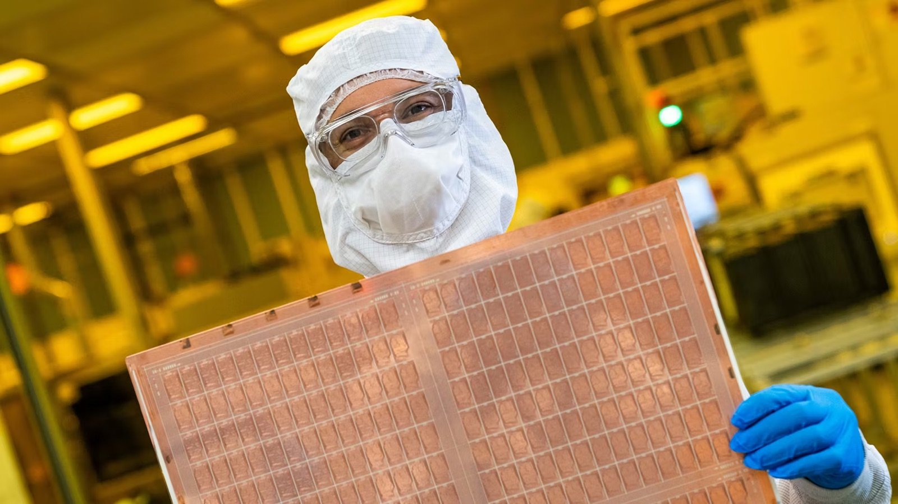
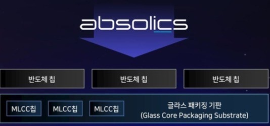
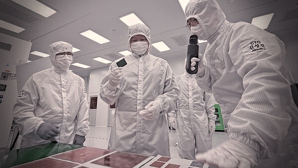
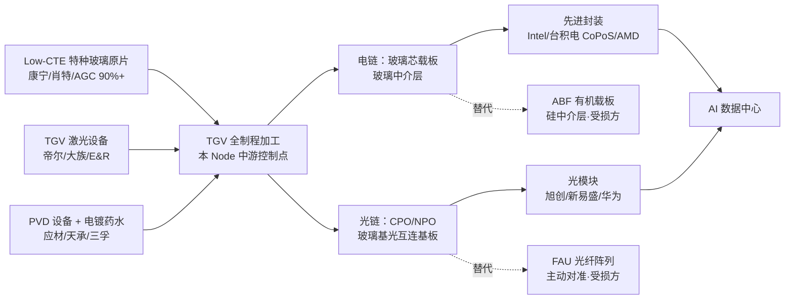
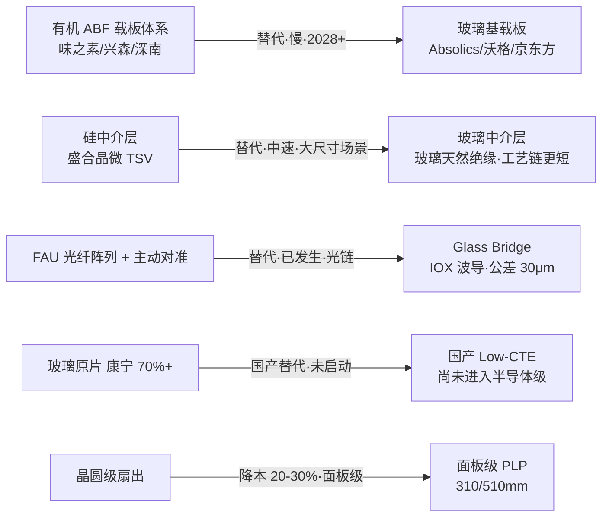

# NODE-009 玻璃基板（Glass Substrate）

> 研究日期：2026-09-26 ｜ 路由方式：宫主点名「新 Node：玻璃基板」= 批准（第 8 次复用）
> 父链：NODE-003（华为超节点）→ 先进封装层；与 NODE-001（HBM）为**替代/竞争**关系（REL-001 目标，本 Node 落地后 REL-001 由"未登记主题"转为已登记 Node）；与 NODE-004/005（光互联）为**供给关系**（玻璃基光互连基板）
> 定位：先进封装里**最后一个尚未被国产拿下的基板环节**——玻璃替代有机 ABF 载板与硅中介层的那个控制点，中游核心是 TGV（玻璃通孔）全制程。本宫第九个 Node，也是**第一个"产业方向已被全球巨头共同确认、但 A 股全部标的均无量产收入"的 Node**——研究价值不在当下 Alpha，而在**提前三年把验证点铺好**。

---

## 实物速览（配图）

> 本节为**直观认识**服务——看实物理解产品形态、结构与工作环境。图注均标注来源，仅作研究参考；技术关系与传导路径仍以正文 Mermaid 图与表格为准。

*图 1｜**产品本体与工作环境**：Intel 工程师在亚利桑那州 Chandler 先进封装厂的洁净室内手持玻璃芯基板（Glass Core Substrate）测试面板。面板上的铜色网格是数百个待切割单元（unit），整块为矩形面板级尺寸（非圆形晶圆）——这正是本 Node 说的"矩形大板替代圆形晶圆、面积利用率 57%→90%"的物理形态；黄光洁净室背景是玻璃钻孔/金属化制程的实际环境。来源：Intel Newsroom 官方新闻稿素材（2023-09-18，Credit: Intel Corporation）。*

*图 2｜**结构与构成**：Absolics「嵌入型（Embedding）」玻璃基板技术示意——上方三颗半导体芯片、下方三颗 MLCC 被动元件，直接嵌入"玻璃封装基板"（글라스 패키징 기판 / Glass Core Packaging Substrate）本体内，把原本由硅中介层承担的功能整合进基板。这正是 Step 4 BOM 中"嵌入型 vs 非嵌入型"两条产品线里更难的那条的物理结构（嵌入型用 TGV + 精细电路直接承担芯片间信号传输）。来源：Absolics 官方技术图（经 THE ELEC 转载，2026-07）。*

*图 3｜**产线与检验环节**：穿全包式无尘服的工程人员在产线上检验玻璃基板面板（桌面可见多片面板）。玻璃基板对微裂纹（SeWaRe）极度敏感，故成孔、电镀填孔、RDL 布线到单片化切割全流程都需在此类高洁净环境内完成——这是"良率 60-70% vs ABF 80-90%"这一底层瓶颈所对应的工作环境。来源：SK Group 官方照片（经 DigitalToday 转载，2026-09）。*

---

## 术语表

### 行业术语

| 术语 | 英文/全称 | 释义 |
| --- | --- | --- |
| 玻璃基板 | Glass Substrate / Glass Core Substrate（GCS） | 以特种玻璃为芯材的封装基板，替代有机 ABF 载板；CTE 与硅匹配、超高平整度、低介电损耗 |
| 玻璃中介层 | Glass Interposer | 替代硅中介层的多芯片互连载体；天然绝缘、金属化工艺链更短、可大尺寸化（**台积电已放弃此路线**） |
| TGV | Through Glass Via | 玻璃通孔：在玻璃上打孔并金属化填铜实现垂直互连——本 Node 的中游核心工艺 |
| 深径比 | Aspect Ratio | 孔深/孔径之比；沃格口径 100:1（另一口径 150:1），京东方量产 10:1、研发 15:1+ |
| 面板级封装 | PLP / FOPLP | 以矩形大板（310×310 / 510×515mm）替代圆形晶圆做扇出封装，面积利用率由 57% 提升至约 90% |
| CoPoS | — | 台积电玻璃基面板级封装路线，310×310mm，2027 试产 / 2028H2 量产 |
| EMIB | Embedded Multi-die Interconnect Bridge | 英特尔嵌入式多芯片互连桥；2026-01 首次与玻璃芯基板集成（10-2-10 堆叠） |
| SeWaRe | — | 英特尔提出的"零微裂纹"指标（No SeWaRe），玻璃钻孔脆裂是本 Node 第一工程难题 |
| IOX 波导 | Ion-Exchange Waveguide | 离子交换光波导：康宁 Glass Bridge 的核心工艺，在玻璃内预制纳米级光通道，损耗 0.034 dB/cm |
| Glass Bridge | — | 康宁 2026-06 发布的玻璃基光互连组件，替代 FAU 光纤阵列 + 主动对准，对准公差放宽至 30μm |
| Low-CTE 玻璃 | — | 低热膨胀系数特种玻璃（康宁 7059 等），配方与熔炼技术由康宁/肖特/AGC 垄断 90%+ |
| GCP | Glass Circuit Plate | 沃格提出的全玻璃堆叠结构方案（多层玻璃降低内部应力、进一步优化 CTE 匹配） |
| PVD 种子层 | — | 电镀前的金属种子层沉积（应材/矩阵科技为主流），玻璃与金属热循环应力裂损的关键界面 |
| ABF | Ajinomoto Build-up Film | 味之素积层膜，当前高端封装载板主流有机材料——**本 Node 的直接替代对象，也是最大受损方** |

### 技术指标

| 指标 | 数值/口径 | 说明 |
| --- | --- | --- |
| TGV 良率 | 玻璃芯封装 60-70% vs 有机 ABF 80-90% | 产业媒体/帝尔激光 8 月调研；**这是所有量产时间表右移的共同底层原因** |
| 成本溢价 | 玻璃比 ABF 高 30-50%，2030 年规模效应后有望降 40-60% | 华泰：2028 年前后为成本拐点年 |
| 性能增益 | 翘曲降 70%、互连密度 +10 倍、高频损耗 -40%、信号完整性 +40%、电源完整性 +50% | 玻璃基封装综合口径 |
| 面板级尺寸 | 台积电 310×310mm；沃格 510×515mm 面板级月产能 1 万片 | 面积利用率 57% → 约 90%；中介层可超光罩极限 9.5 倍 |
| 沃格 TGV 能力 | 最小孔径 5μm、深径比 100:1（另一口径 3μm / 150:1）；可加工厚度 0.05-1.1mm | 公司互动易；两个口径并列见 C-11 |
| 沃格产能 | 武汉一期 10 万平米/年（已小批量供货）、二期 20-30 万平米（2026Q3 搬入）、成都 8.6 代线 30 万平米（2026 底投产），全部达产 40 万平米/年 | 累计投入近 10 亿元；月产能 1 万片（面板级） |
| 原片格局 | 康宁/肖特/AGC 合计 90%+，康宁单一 70%+ | 国内 CPO/TGV 加工高度依赖康宁基材 |
| 康宁光通信 | 2026Q2 销售额 20.7 亿美元 +32%、净利 4.38 亿 +77%、净利率 21%（历史高位） | 与英伟达/亚马逊/Meta 签长期协议；美国光连接产能扩 10 倍 |

---

## Node 档案

| 字段 | 内容 |
| --- | --- |
| 资产编号 | NODE-009 |
| 名称 | 玻璃基板（Glass Substrate） |
| 别名 | 玻璃基载板; 玻璃芯基板; Glass Core Substrate; GCS; TGV 玻璃; 玻璃中介层; 玻璃基封装 |
| 状态 | active |
| 父节点 | NODE-003（华为超节点，经候选 REL-006/REL-015 先进封装层）；与 NODE-001（HBM）经 REL-001 替代/竞争 |
| 子节点 | 待定（候选 REL-029 玻璃基光互连 Glass Bridge / REL-030 Low-CTE 特种玻璃原片） |
| 关键词 | 玻璃基板, 玻璃基载板, 玻璃芯基板, Glass Substrate, GCS, TGV, 玻璃通孔, 深径比, 面板级封装, PLP, FOPLP, CoPoS, EMIB, Low-CTE, 微裂纹, SeWaRe, 康宁, 肖特, AGC, Absolics, SKC, 英特尔, 台积电, 三星电机, GlaSSEM, 沃格光电, 蓝思科技, 京东方, 帝尔激光, 天承科技, 凯盛科技, 三孚新科, ABF, 兴森科技, 深南电路 |
| 登记日期 | 2026-09-26 |
| 证据数 | 15（EVD-167 ~ EVD-181） |

## Step 0 路由记录

宫主点名「新 Node：玻璃基板」。查路由表：宫内已有 **Glass Bridge / TGV** 作为"未登记的部分命中种子"（REL-001 记"玻璃基板路线若成熟将挑战 HBM 封装体系"；NODE-001 术语表已收 TGV 并注明"宫内关联研究主题（玻璃基板替代路线）"；框架暗线六条第 5 条即 Glass Bridge 完整研究）。按分诊协议属**部分命中转正**（种子命中 → 宫主批准 → 登记），登记为 NODE-009。

**切分说明（第五种范式：种子转正 + 双链并列）**：
1. 宫内种子（Glass Bridge/TGV）此前只以"主题"形态存在于 REL-001 与暗线六条，从未展开十三步——本次转正，REL-001 目标由"未登记主题"升为已登记 Node。
2. **Node 粒度判定（关键）**：按本宫硬规矩，Node = 具体价值链位置，不得升格为技术大类。"玻璃"是技术大类，但本 Node 锁定的位置是**先进封装中的基板/载板环节**——上接 Low-CTE 特种玻璃原片、下接先进封装（载板/中介层）与光模块（CPO/NPO 基板），中游控制点是 **TGV 全制程加工能力**。Supply Chain 七问答案统一（见 Step 3），构成一个有效 Node。
3. **双链并列（本 Node 独有结构）**：同一中游加工能力向下分出两条应用链——
   - **电链（本 Node 主体）**：玻璃芯载板 / 玻璃中介层，替代 ABF 有机载板与硅中介层，客户为 Intel / 台积电 / 三星 / SKC，验证标准是热循环可靠性与良率；
   - **光链（姊妹候选）**：玻璃基光互连（康宁 Glass Bridge、CPO/NPO 玻璃基板），替代 FAU 光纤阵列与主动对准，客户为英伟达 / Meta / 亚马逊与光模块厂，验证标准是耦合损耗与插损。
   两条链**共享中游 TGV 加工**（沃格、京东方同时做两边），但下游客户、替代对象、验证标准均不同。本 Node 以电链为主体、光链作为同一稀缺层下的第二条应用链登记；**是否把光链切出为独立 Node（REL-029）待宫主确认**（参照 NODE-005/008 对偶双 Node 范式）。

---

## 十三步（原九问扩展）

### Step 1 范围与市场规模（口径差达一个数量级，多口径并存）

市场：全球玻璃基板（封装载板 + 中介层 + 光互连基板）及其上下游，A 股映射优先。

| 口径 | 2030 年市场 | 来源 | 等级 |
| --- | --- | --- | --- |
| 华泰（保守/基准/乐观） | 32.6 / 66.8 / 118.1 **亿美元** | 华泰证券（渗透率情景法） | B |
| Counterpoint（FOPLP+GSP） | 2024 年 6.5 亿美元 → 2030 年超 81 亿美元 | Counterpoint | B |
| Counterpoint（玻璃芯基板） | 2026 年 1.28 亿美元 → 2033 年 10.36 亿美元（CAGR 34.8%） | Counterpoint | B |
| 天风机械（渗透率法） | 2026/2030/2035 年 70 / 2000 / 7000 **亿元**（渗透率 <3% / 30% / 70%，CAGR 26%） | 天风机械调研 | C |
| 方正/九方 | 2026-2030 CAGR 70%；2030 年原片/TGV 设备/玻璃基板 342 / 400 / 600 亿元 | 方正证券 | C |
| 乐观派 | 2030 年全球突破 180 亿美元（半导体封装占比 >55%） | 媒体转引 | D |

> **口径提醒**：美元口径（几十亿至百亿美元级）与人民币口径（千亿至数千亿元级）相差约一个数量级，且"潜在替代空间"（把 PCB 电子布与树脂也算进去）不等于"玻璃基板市场"。本 Node 不换算、不取中值，按**并列存疑**处理（见《重估与并列存疑清单》C-12）。

**暗线 4 预埋**：市场规模是本 Node 叙事的第一放大器——天风口径已达"万亿潜在替代空间"，而 Counterpoint 口径 2030 年玻璃芯基板仅 1.28→10.36 亿美元。**同一年被引用最多的两个数字差 100 倍**，任何引用必须带口径与单位。

**暗线 3 检查点**：需求侧是**强结构性**（AI 大芯片尺寸/I-O 密度突破有机材料物理极限，英特尔称 2030 年前有机材料在硅封装上延展晶体管数将达极限）；供给侧是**长周期工程问题**（良率 60-70% vs 80-90%、成本高 30-50%、客户可靠性验证不可压缩）。结构性方向确定，但**兑现节奏由工程良率而非需求决定**——这是本 Node 与前面八个 Node 最大的不同：需求不是瓶颈，良率才是。

### Step 2 系统变化：四股力量，全在推、但全在等

1. **有机材料撞物理极限（需求侧·最硬）**：AI 大芯片向大尺寸 / 高 I/O / 多 HBM 堆叠迭代，ABF/BT 有机载板在焊接中翘曲、平整度不足；硅中介层受晶圆尺寸限制、成本高昂。玻璃 CTE 与硅匹配 + 超高平整度 + 低介电损耗，是物理层面的解法。
2. **四大海外玩家全押注（供给侧·已定局）**：Intel（最早、专利 1000+、Rio Rancho 投资超 200 亿元、良率 95%）、台积电（CoPoS）、SKC/Absolics（全球首座专用量产工厂）、三星电机（GlaSSEM，与住友化学合资）——**方向无争议，争的是谁先跑通量产**。
3. **量产时间表集体右移（节奏侧·本 Node 最大特征）**：三星电机三度推迟（2025-12 → 2026-03 → 2027H2 → 2028 后，原因是客户样品热循环未过、设备采购已停）；Absolics 从 2026H1 调整到 2026 完成可靠性测试、2027 全面量产；台积电玻璃芯规模量产排到 2030 后；英特尔目标 2030 前全面商用。**"2026 是 TGV 商业化元年"的口号与"无人量产"的事实并存（C-11 同源矛盾）**。
4. **康宁同时握住两道门（格局侧）**：上游原片 70%+ 垄断，同时用 Glass Bridge 直接定义光链方案；2026-05 与京东方签三年独家合作（开放 7059 配方与 IOX 专利），**国内加工厂的原料与光链专利都从康宁出来**；2026Q4 显示用玻璃基板涨价 >15%。

**暗线 1（受损方）**：①**有机 ABF 载板体系**（味之素膜、兴森/深南/南亚/欣兴/Ibiden——NODE-001 已记"味之素砍单是前兆"）；②**硅中介层**（盛合晶微 TSV 硅中介层国内唯一量产——NODE-003 把它列为稀缺层卡点，玻璃中介层替代是它的失败条件之一）；③**FAU 光纤阵列与精密主动对准设备厂**（Glass Bridge 直接替代，框架暗线六条第 5 条已记）；④远期：PCB 电子布与树脂体系（"分流非替代"，2027-2030+）。

### Step 3 Supply Chain（产业关系地图）

按框架第四节 Supply Chain 七问定位本 Node：

| 七问 | 答案 |
| --- | --- |
| 处于什么位置 | 先进封装的**基板/载板制造环节**——介于「Low-CTE 特种玻璃原片 / TGV 设备与材料」与「先进封装（载板·中介层）·光模块 CPO/NPO」之间 |
| 它依赖谁（上游） | ① Low-CTE 特种玻璃原片（康宁/肖特/AGC 90%+，康宁 70%+）；② TGV 激光设备（帝尔/大族/德龙/E&R）；③ PVD 设备与电镀药水（应材/矩阵科技/天承/三孚） |
| 谁依赖它（下游） | 电链：先进封装厂与 IDM（Intel / 台积电 CoPoS / 三星 / AMD·AWS）；光链：CPO·NPO 光模块（旭创/新易盛/华为）；终端：AI 数据中心 |
| 出问题传导到哪里 | 良率/成本不收敛 → 玻璃基板无法替代 ABF → 大尺寸 Chiplet 与多 HBM 堆叠的封装继续受翘曲与面积限制 → AI 大芯片封装产能受限（与 NODE-001 HBM、NODE-003 超节点同终点不同路径） |
| 它替代谁 | 电链替代 **ABF 有机载板**与**硅中介层**；光链替代 **FAU 光纤阵列 + 主动对准**；远期分流 PCB 电子布与树脂 |
| 它属于谁 | 先进封装价值链的中游加工层；同时是光互联（NODE-004/005）的基板供给方 |
| 下一步研究谁 | REL-029 玻璃基光互连（Glass Bridge）、REL-030 Low-CTE 特种玻璃原片（国产替代） |

**双链并列结构（本 Node 独有）**：中游 TGV 加工是两条链**共用的稀缺能力**——这也是沃格、京东方能同时给电链送样、给光链做玻璃基载板的原因。判定两条链是否切分为两个 Node 的检验法（Step 12 失败条件能否一击杀死整个 Node）：若台积电 CoPoS 与 Intel 玻璃芯双双失败，光链（Glass Bridge）仍可独立成立 → **说明两条链可被不同事件分别证伪，具备切分条件**，故登记 REL-029 待宫主确认。

### Step 4 BOM（产品构成与价值量地图）

玻璃基板加工的价值分级（以一片面板级玻璃基载板为对象）：

| 层级 | 环节 | 价值量/占比 | 分级 | 说明 |
| --- | --- | --- | --- | --- |
| 1 | Low-CTE 玻璃原片 | 华泰口径约**占玻璃基板的 20%**（2030 年 6.6-23.6 亿美元） | **卡脖子级** | 康宁 70%+；国产尚未进入半导体级供应链（凯盛/彩虹在 UTG 与显示玻璃，非半导体 Low-CTE） |
| 2 | TGV 激光打孔 | 2030 年设备市场约 400 亿元（方正口径） | **重要** | 帝尔（贝塞尔光束最优、不良率 <10PPM）、大族同属一梯队；单环节价值量明确且**当下即可兑现设备订单** |
| 3 | 孔壁金属化（PVD 种子层 + 电镀填铜） | 工艺成本中心 | **瓶颈级** | 帝尔 8 月调研：产业瓶颈在金属化、膜层、材料复合良率与微裂纹；沃格核心专利即孔壁金属化材料结构 + PVD 结合层 |
| 4 | 增层布线（RDL） | 层数决定价值量（英特尔 10-2-10、京东方 20 层样品） | 重要 | 面板厂（京东方）的黄光/镀膜能力可直接迁移 |
| 5 | 检测与可靠性验证 | — | **门槛级** | 客户规范决定周期，不可压缩——三星三度推迟的直接原因 |

**价值量变化（动态视角）**：
- 面板级（310×310 / 510×515mm）替代晶圆级，面积利用率 57%→约 90%，**单位面积成本下降是玻璃基板降本的第一杠杆**；
- 面板级封装较扇出晶圆级可降本 20-30%（Yole / STATS ChipPAC）；
- 良率 60-70% → 90% 是第二杠杆（沃格自称 75%+ / 90%+ 两个口径，见 C-11）；
- 成本高于 ABF 30-50% → 规模效应后 2030 年降 40-60%，华泰判断**2028 年前后是成本拐点年**。

**BOM 判断**：本 Node 的价值量重心不在"玻璃本身"（原片只占 20% 且被康宁拿走），而在**加工与金属化**——这与 NODE-007（InP 衬底：原片即卡点）形成鲜明对照：玻璃基板是"**材料不稀缺、工艺稀缺**"，InP 是"**材料即卡点**"。

### Step 5 Value Chain（价值创造与获取地图）

- **价值创造**：玻璃基板创造的是"大尺寸 + 高密度 + 低翘曲"的封装物理可能性——是"能不能把更大的芯片封起来"的环节
- **价值获取（当下）**：上游康宁拿走原片定价权（2026Q4 显示玻璃涨价 >15%）；中游加工端**尚未有任何人拿到规模利润**（全球无一家量产盈利）
- **议价权**：下游（Intel/台积电/英伟达）定义规格与验证标准，**中游加工厂是"被认证方"而非定价方**——沃格需在美国硅谷设团队参与客户前期定制设计，正是议价权在下游的证据
- **中国的双向位置**：中游加工端与国际基本同步（沃格/京东方/蓝思均在送样验证，无一代差），但**上游原片 100% 依赖康宁体系（京东方是康宁独家授权而非自研）**——与 NODE-007（InP：中国握原料牌、制造被卡）恰好相反：本 Node 是**加工不错、原料被卡**
- **跨 Node 对照**：NODE-008（DSP 软壁垒：生态+认证）与本 Node 的验证方式同构——**看的不是扩产数据，是客户认证周期**（12-24 个月，与 InP 客户认证同量级）

### Step 6 稀缺层排序（先排层，再排公司）

| 层级 | 稀缺约束 | 壁垒强度 | 说明 | A 股可投性 |
| --- | --- | --- | --- | --- |
| 1 | Low-CTE 特种玻璃原片（配方+熔炼） | ★★★★★ | 康宁/肖特/AGC 90%+，康宁 70%+；国产未进入半导体级 | **不可投**（凯盛/彩虹在显示级，非半导体级） |
| 2 | TGV 全制程加工能力（孔径/深径比/金属化/微裂纹） | ★★★★ | 全球能打通"薄化→镀膜→TGV→精密镀铜→多层线路"全制程者极少；沃格称全球少数、京东方全流程拉通 | **可投**：沃格（最纯·亏损）、京东方（占比≈0）、蓝思（跨界·待投产） |
| 3 | TGV 激光设备（贝塞尔光束/等离子干法） | ★★★ | 帝尔最优、大族一梯队；E&R 面板级 30-40 倍速度优势、2027Q2 大规模交付 | **可投**：帝尔激光（但光伏激光主业下滑） |
| 4 | 电镀药水与介电材料 | ★★★ | 天承 SOD 旋涂介电材料、三孚电镀化学品；国产在 PCB 化学品已有基础 | **可投**：天承（PE 139.9）、三孚新科（PE 负） |
| 5 | 面板级大尺寸加工与增层布线 | ★★ | 面板厂（京东方/TCL华星/深天马/友达/群创）天然具备，是"跨界者"的入场券 | 可投但纯度低 |

**暗线 4 纠偏（口径冲突清单）**：

1. **沃格 TGV 良率三口径**：2026-07 合肥玻璃基板大会"量产线综合良率稳定在 90% 以上" ⟷ 2026-09-16 互动易"产品良率提升至 75% 以上" ⟷ 第三方口径"TGV 玻璃芯封装良率 60-70%"（见 C-11，不裁决）；
2. **沃格孔径/深径比两口径**：5μm / 100:1（公司互动易 + EET）⟷ 3μm / 150:1（媒体口径）——同为"国际领先"，参数差异未说明（C-11）；
3. **市场规模差一个数量级**：美元口径 2030 年 32.6-118 亿美元 ⟷ 人民币口径 2030 年 2000 亿元（约 280 亿美元）（C-12）；
4. **"2026 TGV 商业化元年" ⟷ "全球无人量产"**：口号与企业自述（沃格/美迪凯/旗滨/兴森均公告澄清无量产收入）直接冲突（C-11）；
5. **蓝思与英特尔合作性质**：MOU 备忘录 ≠ 订单，英特尔仅提供架构信息与验证方法、无采购承诺——**"英特尔供应商"叙事由此而来但缺乏商业实质**；
6. **京东方"康宁独家授权"**：产业媒体称"国内无第二家企业拿到同等授权"，未经双方公告确认（C 级）；
7. **产能单位混用**：沃格"10 万平方米/年"与"月产能 1 万片（510×515）"是两套单位，不可直接比较。

### Step 7 Profit Pool（利润集中区域）

| 环节 | 当前利润集中度 | 代表 | 是否可投 |
| --- | --- | --- | --- |
| 玻璃原片 | 极高（康宁 70%+，光通信净利率 21% 历史高位） | 康宁、肖特、AGC | **不在 A 股** |
| TGV 加工（本 Node 中游） | **当前为负**（全行业投入期，无一家量产盈利） | Absolics、沃格、京东方、蓝思 | 沃格可投但亏损；京东方占比≈0 |
| TGV 设备 | 中（设备先行于产能，2027 交付大年） | 帝尔、大族、E&R（钛昇，非 A 股） | 帝尔可投（主业拖累） |
| 电镀/介电材料 | 中 | 天承、三孚新科 | 可投，体量小 |
| 下游先进封装/光模块 | 高但非本 Node | Intel、台积电、旭创 | 属 NODE-003/004/005 |

**关键判断**：本 Node 的利润池**当前在康宁手里，未来才可能移到中游加工**——这是本宫第九个 Node 里唯一一个"**目标环节当前不赚钱**"的 Node。A 股买的是**两段期权**：中游加工份额期权（沃格/京东方）+ 设备材料先行兑现（帝尔/天承）。

### Step 8 Profit Migration（利润迁移方向）

1. **替代 ABF（主方向·慢）**：载板体系从有机转向玻璃，前提是良率与成本收敛，**2028 年前后为成本拐点**——这是最慢但空间最大的迁移；
2. **替代硅中介层（中速·部分场景）**：玻璃天然绝缘、金属化工艺链更短、可大尺寸——但**台积电已放弃玻璃中介层路线**（只保留 CoPoS 玻璃芯底层载板），迁移速度被最大客户下调；
3. **替代 FAU（已发生·光链）**：康宁 Glass Bridge 已发布并签长期协议，是**四条迁移里唯一已经开始的一条**——但利润归康宁，A 股只拿到加工费；
4. **国产原片（未启动）**：肖特/康宁成分仍在调试定型，产业判断"成分定型后国产厂商会快速跟进"——**国产替代机会在量产落地阶段而非当下**。

**净判断**：四条迁移中，唯一已启动的第 3 条利润归海外；A 股真正能吃到的是第 1 条（2028+）与设备材料的先行订单（2027）。**跟踪指标**：Absolics 是否通过 AMD/AWS 可靠性测试（2026 内）、沃格/京东方是否出现首个"量产订单"（非送样）、帝尔 TGV 设备订单是否落地、康宁原片是否对华收紧配额。

### Step 9 公司宇宙（14 家）

| 公司 | 代码 | 定位 | 稀缺层距离 |
| --- | --- | --- | --- |
| 沃格光电 | 603773 | TGV 全制程（薄化/镀膜/TGV/精密镀铜/多层线路），国内唯一专注半导体封装玻璃精密加工；1.6T/3.2T 玻璃基载板送样；TGV 团体标准起草单位 | **中游本体（最纯，但亏损）** |
| 京东方 A | 000725 | 试验线全自动化通线、20 层样品送客户；康宁三年独家合作（7059 原片 + IOX 专利）；自有 PLP 产线 + 华灿光电光源 | 中游（进度最快的大厂，但玻璃基占营收≈0） |
| 蓝思科技 | 300433 | 消费电子玻璃盖板龙头跨界；3 万平米 TGV 专用厂房 2026 底投产、2027 小规模量产；与英特尔签 MOU | 中游（跨界，设备待投产） |
| 帝尔激光 | 300776 | TGV 激光设备（贝塞尔光束最优，不良率 <10PPM） | **设备层（当下唯一有业绩的环节）** |
| 大族激光 | 002008 | 激光设备一梯队 | 设备层 |
| 天承科技 | 688603 | SOD 旋涂介电材料 + 电镀化学品，导入玻璃基 | 材料层 |
| 三孚新科 | 688359 | 电镀化学品（填铜药水） | 材料层 |
| 凯盛科技 | 600552 | UTG 超薄玻璃（显示级，非半导体 Low-CTE） | 原片候选（未进入半导体级） |
| TCL 科技 / 深天马 | 000100 / 000050 | 面板厂组建团队推进玻璃基封装工艺验证 | 中游（技术论证阶段） |
| 彩虹股份 / 旗滨集团 | 600707 / 601636 | 基板玻璃（旗滨已公告澄清无玻璃基板量产产线） | 原片候选（旗滨已澄清） |
| 兴森科技 | 002436 | **ABF 载板厂——受损方**（已澄清无玻璃基板量产线） | **受损层**（被市场当受益方炒） |
| 深南电路 | 002916 | **封装基板/PCB——受损方** | **受损层** |
| 康宁 | GLW（美股） | 原片 70%+ + Glass Bridge 定义者 | **稀缺层本体（不可投·非 A 股）** |
| Absolics（SKC 70.05% + AMAT 29.95%） | 韩股 | 全球首座玻璃基板专用量产工厂 | 中游本体（不可投） |

### Step 10 证据分级

见文末证据索引（EVD-167~181，15 条）。本 Node 证据结构特点：**公司口径密度高、第三方权威数据少**——产能与良率几乎全部来自公司互动易/专访（A 级形式、B 级实质，因未经审计且带融资语境）；市场规模多口径且差一个数量级（华泰/天风/Counterpoint 三方不可调和）；海外节奏依赖产业媒体转引（B/C 级）。**与 NODE-007 的"叙事浓度五 Node 之最"并列，本 Node 是本宫"叙事浓度第二高"**——且叙事的核心是"空间"而非"业绩"，更需要暗线 4 纠偏。唯一硬数据是**财报**（A 级）：全组标的 2026H1 没有一家有玻璃基板收入。

### Step 11 排序（稀缺层排序 ≠ 公司排序，第五案例·新形态）

**稀缺层排序**：Low-CTE 原片（不可投）> TGV 全制程加工 > TGV 激光设备 > 电镀/介电材料 > 面板级大尺寸加工。

**公司排序（"纯度—财务—估值"三重倒挂）**：

| 排名 | 公司 | 排序理由 | 主要风险 |
| --- | --- | --- | --- |
| 1 | 帝尔激光 | 全组**唯一当下有利润、且设备端能先于产能兑现**的标的：H1 营收 10.29 亿、归母 3.06 亿，PE 74.38；贝塞尔光束 TGV 产品为产业公认最优 | 光伏激光主业下滑（H1 营收 -12.02%）；TGV 设备订单尚未落地，与 E&R 2027Q2 交付节奏赛跑；YTD +109.2% 已计入预期 |
| 2 | 天承科技 | 材料端弹性最直接：H1 营收 3.06 亿 +43.74%、归母 6161 万 +67.72%（扣非 +81.7%），是**全组增速与质量最好**的；SOD 旋涂介电材料已导入玻璃基 | PE 139.9 / PB 12.56；玻璃基占营收比例未披露，弹性被 PCB 主业稀释 |
| 3 | 京东方 A | **全组最便宜**（PE 27.58 / PB 1.628）+ H1 归母 52.48 亿 +61.62%（Q2 +116.8%）+ 康宁独家授权 + 试验线进度最快（20 层样品） | 玻璃基占营收≈0，是**期权而非业绩**；面板主业周期性主导市值；2167 亿市值下玻璃基弹性有限 |
| 4 | 沃格光电 | **纯度第一**：国内唯一专注 TGV 半导体封装加工，全制程自主、武汉产线已小批量供货、月产能 1 万片（面板级）、8 层全玻璃互联载板量产化 | **H1 归母 -1.235 亿（亏损扩大）**、PE 为负、PB 21.59 全组最贵、YTD +176.1% 涨幅最大；原片 100% 外购不掌握配方；良率三口径未收敛（C-11） |
| 5 | 蓝思科技 | 与英特尔签 MOU + 3 万平米厂房 2026 底投产；PE 50.26 / PB 3.288，YTD 仅 +8.59%（**全组涨幅最小，预期尚未打满**） | MOU ≠ 订单；消费电子主业下滑（H1 营收 -12.42%、归母 -49.52%）；跨界者的半导体资质从零开始 |
| 6 | 凯盛科技 / 三孚新科 | UTG 玻璃与电镀化学品，各有单点能力 | 凯盛 PE 122.5 且非半导体级原片；三孚 PE 为负、体量小 |
| — | 兴森科技 / 深南电路 | **不列入本 Node 多头**——它们是玻璃替代的**受损方**；当前高估值（兴森 PE 339.8 / 深南 PB 14.9）来自 AI 载板景气而非玻璃替代 | **被市场错当玻璃基受益方**（暗线 4 第 4 条）；兴森已公告澄清无玻璃基板量产线 |

**与前面 Node 的第五次形态对照**：赛微/烽火（技术稀缺财务差）→ 中芯（稀缺本体纯度低）→ 寒武纪（兑现之王不稀缺）→ 株冶/云南锗业（筹码层便宜而制造层极贵）之后，本 Node 出现第五种形态——**"纯度与财务反向、涨幅与纯度同向"**：最纯的沃格亏损且最贵（PB 21.59 / YTD +176.1%），最便宜的京东方最不纯（占比≈0），唯一有利润的帝尔与天承纯度最低（设备/材料共用多条下游）。**四类形态之外新增"期权型"**：买的是 2028 年的份额，不是 2026 年的业绩。

**暗线 2（新旧龙头交替）**：全球——ABF 体系（味之素/欣兴/Ibiden）守存量 vs 玻璃新进入者（Intel/台积电/Absolics/沃格/京东方）抢增量；中国——面板厂（京东方/TCL华星/深天马）携大尺寸加工能力跨界，是**本 Node 最有可能的新龙头来源**（旧龙头兴森/深南反而是受损方）。

### Step 12 失败条件

1. **良率与成本不收敛（第一反证）**：TGV 良率 60-70% vs ABF 80-90%、成本高 30-50%，若 2028 年前后**成本拐点未出现**，玻璃基板将长期停留在"高端小众"而非"主流替代"——三星三度推迟已是前兆，若英特尔/Absolics 也右移，整个时间表崩塌。
2. **最大客户下调路线（已部分发生）**：台积电**放弃玻璃中介层**（仅保留 CoPoS 玻璃芯载板）；若台积电进一步推迟 CoPoS 或英伟达推迟 Rubin 玻璃基方案，需求侧锚点消失。
3. **有机体系自我改良**：ABF/改良树脂/新型有机载板若解决翘曲与损耗问题（成本更低、供应链现成），玻璃的"性能优势"被性价比抵消——**本 Node 的替代逻辑是性能的，不是成本的，成本一旦成为第一优先级就可能输**。
4. **原片被卡（地缘变量）**：康宁 70%+ 且已在 2026Q4 涨价 >15%；若对华半导体级 Low-CTE 原片收紧配额或提价，国内加工厂（沃格/京东方）的成本与交付被上游卡住——**这是本 Node 最像 NODE-007 的地方，只是中国这次是被卡的一方**。
5. **估值风险（当下最尖锐）**：沃格 PE 为负 / PB 21.59 / YTD +176.1%，帝尔 PE 74.38，天承 PE 139.9——**股价已计入 2028-2030 兑现，而 2026 全行业零量产收入**。宫主"主线主升高潮期 FOMO/贪婪"的教训在本 Node 直接适用：这是**主题投资而非业绩投资**，任何"送样→订单"的节奏不及预期都是杀估值导火索。
6. **需求证伪**：AI 大芯片若放缓尺寸/I-O 密度迭代（或转向其他封装方案如嵌入式桥接、3D 堆叠无基板），玻璃基板的物理必要性下降。
7. **双链切分风险**：若光链（Glass Bridge）独立成 Node（REL-029），本 Node 的市场空间与标的池需重算——**本条是结构性失败条件，不是产业失败条件**。

### Step 13 下一步研究动作

1. **跟踪信号清单（按时间排）**：① **2026 内**：Absolics 是否通过 AMD/AWS 可靠性测试（最硬的全球验证点）；② **2026Q4-2027Q1**：成都沃格 8.6 代线投产与武汉二期爬坡；蓝思 3 万平米厂房投产；③ **2027**：台积电 CoPoS 试产是否如期；帝尔/E&R 的 TGV 设备大单是否落地（设备订单先于产能 6-12 个月，是最佳前瞻指标）；④ **2028**：成本拐点年验证（华泰口径）；⑤ 康宁原片对华政策与价格（2026Q4 已涨价 >15%，需持续跟踪）。
2. **首个"量产订单"是唯一硬拐点**：本 Node 目前所有 A 股进展都是"送样/验证/小批量供货"，**必须等到一个非关联方的量产订单公告**（沃格或京东方），才算从期权变为订单。在此之前任何涨幅都是预期定价。
3. **关联 Node 候选**：REL-029 玻璃基光互连（Glass Bridge，是否切出独立 Node 待宫主确认）；REL-030 Low-CTE 特种玻璃原片（国产替代，是"成分定型后跟进"逻辑，非当下）。
4. **与 NODE-003 的冲突登记**：NODE-003 把盛合晶微列为"TSV 硅中介层国内唯一量产"的稀缺层卡点，而玻璃中介层替代硅中介层是它的潜在失败条件——**本宫内部两 Node 的结论在此处直接对冲**，需在每日扫描中同步观察（不自动改任一 Node 结论）。
5. **反向问题（给宫主）**：本 Node 是"方向确定但兑现未至"的典型。按 Trading OS 纪律，这类资产的正确动作是**建观察池 + 等验证点**，而不是提前建仓。是否需要把本 Node 单列为"期权池"而非 Alpha 池，请宫主裁定。

---

## 六暗线检查点汇总

| 暗线 | 触发 | 结论 |
| --- | --- | --- |
| 1 受损方 | 触发 | 有机 ABF 体系（味之素/兴森/深南/欣兴/Ibiden）、硅中介层（盛合晶微）、FAU 光纤阵列与主动对准设备（Glass Bridge 直接替代）、远期 PCB 电子布与树脂 |
| 2 新旧龙头 | 触发 | 面板厂（京东方/TCL华星/深天马）携大尺寸加工能力跨界，最可能成为新龙头；旧龙头兴森/深南是受损方——**本 Node 新旧龙头方向与前八 Node 相反（旧的是受害者）** |
| 3 周期 vs 结构 | 触发 | 需求侧强结构（有机材料撞物理极限），供给侧纯工程问题（良率/成本）——**方向是结构性的，节奏是工程性的**，这是本 Node 与需求驱动型 Node 的根本差异 |
| 4 绝对化纠偏 | 触发 | 7 项纠偏：沃格良率三口径（90%/75%/60-70%）、孔径深径比两口径（5μm-100:1 vs 3μm-150:1）、市场规模差一个数量级、"2026 商业化元年"vs 无人量产、蓝思英特尔 MOU ≠ 订单、"康宁独家授权"未经公告、产能单位混用（万平方米 vs 万片） |
| 5 BOM 分级 | 触发 | 与 NODE-007 对照定型：**InP 是"材料即卡点"，玻璃基板是"材料不稀缺、工艺稀缺"**；原片仅占价值量约 20%，加工与金属化才是重心 |
| 6 研究路由 | 触发 | 第五种新增范式：**宫内既有种子（Glass Bridge/TGV）转正 + 双链并列**；REL-001 目标由未登记主题升为已登记 Node；双链是否切分（REL-029）按 Step 12 分别证伪检验法判定 |

## Alpha 映射链

稀缺层（Low-CTE 原片【不可投】> TGV 全制程加工 > TGV 激光设备 > 电镀/介电材料 > 面板级加工） → 价值池（当前在康宁，2028 后向中游加工迁移；2030 年 32.6-118 亿美元 / 2000 亿元——两口径并列不换算） → A 股映射（14 家：中游本体 / 设备材料 / 受损方三类） → Alpha：

- **Tier-1（当下可有业绩的）**：帝尔激光（设备端唯一有利润、贝塞尔光束产品最优，但光伏主业拖累）、天承科技（增速与质量全组最好：+43.74%/+67.72%，但 PE 139.9）
- **Tier-2（期权型·便宜的）**：京东方 A（PE 27.58 / PB 1.628 全组最低 + 康宁独家授权 + 进度最快，但玻璃基占营收≈0）、蓝思科技（YTD 仅 +8.59%，预期未打满，但 MOU ≠ 订单）
- **纯度型（不建议当下重仓）**：沃格光电（纯度第一但亏损、PB 21.59、YTD +176.1%——**主题高潮期特征最明显**）
- **排除项**：兴森科技 / 深南电路（受损方被误当受益方，两者高估值来自 AI 载板景气而非玻璃替代）
- **Trading OS 交接**：本 Node **不产生当下 Alpha**——全行业 2026 年零量产收入，任何仓位都是买 2028 年的份额期权。建议动作：建观察池，等两个验证点之一落地再谈仓位——① Absolics 通过 AMD/AWS 可靠性测试（2026 内）；② 沃格/京东方公告首个非关联方量产订单。在此之前，宫主"主线主升高潮期 FOMO/贪婪"的教训以最强形态适用：**这是本宫第九个 Node 里叙事最宏大、业绩最空白的一个**。

## 证据索引

| 编号 | Node | 等级 | 来源 | 日期 | 内容 |
| --- | --- | --- | --- | --- | --- |
| EVD-167 | NODE-009 | A | 沃格光电董事长张芙嘉专访（光纤在线 2026-09-10 / 搜狐财经 2026-09-23） | 2026-09-26 | 累计投入近 10 亿元建设 TGV 产线；月产能 1 万片（510×515mm 面板级）；瞄准 NPO，预计 2027 年底量产出货，CPO 推至 2029-2030（先 NPO 后 CPO：NPO 光引擎独立可插拔、工艺要求可控，CPO 需承受更高温度压力）；核心专利在孔壁金属化材料结构 + PVD 结合层（解决玻璃与金属热循环应力裂损）；已在美国硅谷设团队对接美系 IC 设计与封装架构；下游两大阵营为 NVIDIA Rubin 与 Intel EMIB；显示领域 TGV 替代 FR4 PCB（Mini LED 背板/MIP）预计 2027 规模化量产 |
| EVD-168 | NODE-009 | A | 沃格光电互动易（2026-01-21 / 2026-09-16） | 2026-09-26 | TGV 最小孔径 5μm、最大深宽比 100:1、可加工玻璃厚度 0.05-1.1mm，掌握"薄化·镀膜·TGV·精密镀铜·多层线路"全制程；1.6T 光模块玻璃基载板已完成小批量送样；成都 8.6 代 AMOLED 玻璃精加工产线进入试生产、玻璃基板良率提升至 75% 以上（与 2026-07 公司"综合良率 90%+"口径并列，见 C-11） |
| EVD-169 | NODE-009 | A | 沃格光电 2026 中报 + 一致预期（东财） | 2026-09-26 | H1 营收 12.28 亿 +3.19%、归母 -1.235 亿（Q2 单季 -7239 万，亏损扩大）；光电玻璃精加工业务 4.20 亿 +19.12%（盈利压舱石）；2026E 一致预期净利 5150 万（+132.5%）；2026-09-24 市值 219.5 亿、PB 21.59、PE(TTM) 为负、YTD +176.1% |
| EVD-170 | NODE-009 | A/B | 京东方 2026-09-08 技术进展公布 + 产业媒体（今日头条 2026-09-20 / EET 2026-09） | 2026-09-26 | 玻璃基封装载板试验线实现全套自动化设备通线，完成 20 层高层数玻璃基样品研发加工并送客户测试；2024 年投 9.93 亿建板级试验线、设计月产能 1000 片；已拉通 TGV 开孔/深孔填铜/增层布线全流程；量产深宽比 10:1、研发 15:1+；规划 2026 底扩产中试、2027 量产线投决、2028 规模化商用交付 |
| EVD-171 | NODE-009 | A | 康宁 2026Q2 财报（2026-07-28，WitsView/腾讯网报道） | 2026-09-26 | 核心销售额 47.4 亿美元 +17%、核心运营利润率 20.9%；光通信业务销售额 20.7 亿 +32%、净利 4.38 亿 +77%、净利率首次达 21%（历史高位）；上半年与亚马逊签多年期数十亿美元协议、与英伟达战略合作（美国光连接制造产能扩 10 倍、光纤产能 +50%）；2026-05 与京东方签合作备忘录（光互连/玻璃基封装载板/可折叠玻璃/钙钛矿玻璃基板） |
| EVD-172 | NODE-009 | B | 康宁 Glass Bridge 发布（2026-06 首尔技术大会；EET-China 2026-07-03） | 2026-09-26 | 晶圆级 IOX 离子交换波导，玻璃内预制纳米级光波导实现无源对准，对准公差放宽至 30μm（传统需微米级主动对准），单端面耦合损耗 ≤1.5dB，波导损耗 0.034 dB/cm；兼容 TMT 物理接触接口与 MPO 高密度光缆生态；已与英伟达/Meta/亚马逊签数十亿美元长期供货协议；新一代 CPO 结构在带 TGV 电极的玻璃基板上形成光波导并倒装连接光芯片 |
| EVD-173 | NODE-009 | B/C | 康宁—京东方三年战略合作备忘录（2026-05-20，产业媒体转引） | 2026-09-26 | 康宁独家开放特种 7059 玻璃原片配方与 IOX 离子交换光波导底层专利，京东方承接国内玻璃桥基材加工订单；媒体称"国内无第二家企业拿到同等授权"（未经双方公告确认，C 级）；京东方配套：控股华灿光电 6 吋 Micro LED 光芯片产线 + 自有 PLP 面板级封装产线 |
| EVD-174 | NODE-009 | B | 海外四家量产节奏（EET-China 2026-09 / M8 核验 / 今日头条 2026-09） | 2026-09-26 | Intel：2026-01 NEPCON 展首款 EMIB+玻璃芯基板样品（78×77mm、10-2-10 堆叠、总厚 800μm、凸点间距 45μm、No SeWaRe 零微裂纹），推出首款搭载玻璃芯载板的商用 Xeon 6+ Clearwater Forest，Rio Rancho 投资超 200 亿元、良率 95%、目标 2030 前全面商用，专利 1000+；台积电 CoPoS：310×310mm、2026 验证期/2027 试产/2028H2 量产、**玻璃中介层路线已放弃**、玻璃芯规模量产 2030 后；SKC Absolics（SKC 70.05%+AMAT 29.95%，佐治亚州 6 亿美元全球首座专用工厂、4011 亿韩元增资、获美国芯片法案补贴）向 AMD/AWS 送样、2026 完成可靠性测试/2027 全面量产，称封装厚度降 25%、功耗降 30%+；三星电机 GlaSSEM（与住友化学东友精细化工合资、持股 66%、约 4800 亿韩元）三度推迟至 2028 后，原因为客户样品热循环可靠性未过、设备采购时间表已停 |
| EVD-175 | NODE-009 | B/C | 产业媒体（今日头条 2026-09）+ 帝尔激光 2026-08 机构调研 | 2026-09-26 | TGV 玻璃芯封装良率约 60-70%，远低于有机 ABF 的 80-90%；成本比 ABF 高 30-50%（2030 年规模效应下有望降 40-60%）；帝尔激光称产业化瓶颈主要在后续金属化、膜层及材料复合的工艺良率与微裂纹；客户可靠性验证周期由客户规范决定、不可通过投入加速 |
| EVD-176 | NODE-009 | B/C/D | 华泰证券（新浪财经 2026-07-10）/ Counterpoint / 天风机械（2026-06-29 调研纪要）/ 方正证券 | 2026-09-26 | 市场规模多口径：华泰 2030 年 32.6/66.8/118.1 亿美元（保守/基准/乐观，玻璃芯载板贡献约 93%）、原片端 6.6-23.6 亿美元（价值量占比 20%）；Counterpoint：FOPLP+GSP 2024 年约 6.5 亿→2030 年超 81 亿美元（AI/HPC 占 45.6%）、玻璃芯基板 2026 年 1.28 亿→2033 年 10.36 亿美元（CAGR 34.8%）；Prismark：IC 封装渗透率 3 年 30%、5 年 >50%；天风：2026/2030/2035 年 70/2000/7000 亿元（渗透 <3%/30%/70%，CAGR 26%）；方正：2026-30 CAGR 70%、2030 年原片/TGV 设备/玻璃基板 342/400/600 亿元。华泰判断 2028 年前后为成本拐点年。**口径差达一个数量级，见 C-12** |
| EVD-177 | NODE-009 | A/B | 蓝思科技公开信息（EET-China 2026-09 / 新浪财经 2026-09） | 2026-09-26 | 2026-07 与英特尔签署合作备忘录，联合攻坚 TGV 核心工艺（**备忘录 ≠ 订单，英特尔仅提供架构信息与验证方法、无采购承诺**）；规划 3 万平米 TGV 玻璃基板专用厂房及配套产线，2026 年底投产、2027 年小规模量产；称产品已通过多轮测试并完成最优参数敲定、进入量产前全面准备 |
| EVD-178 | NODE-009 | A | 蓝思科技 2026 中报 + 行情（东财） | 2026-09-26 | H1 营收 288.7 亿 -12.42%、归母 5.77 亿 -49.52%（Q1 归母 -1.496 亿）；2026-09-24 市值 1735 亿、PE(TTM) 50.26、PB 3.288、YTD +8.59%（全组涨幅最小） |
| EVD-179 | NODE-009 | A | 8 家 A 股行情快照（东财，2026-09-24 收盘） | 2026-09-26 | 沃格光电 219.5 亿/PB 21.59/PE 负/YTD +176.1%；京东方 A 2167 亿/PE 27.58/PB 1.628/YTD +38.95%；帝尔激光 370.7 亿/PE 74.38/PB 7.513/YTD +109.2%；天承科技 156.1 亿/PE 139.9/PB 12.56/YTD +66.92%；凯盛科技 171.9 亿/PE 122.5/YTD +46.77%；三孚新科 110.7 亿/PE 负/PB 15.37/YTD +66.73%；兴森科技 736.1 亿/PE 339.8/PB 13.06/YTD +104.6%；深南电路 2687 亿/PE 64.48/PB 14.9/YTD +69.83% |
| EVD-180 | NODE-009 | A | 6 家公司 2026 中报 + 2026E 一致预期（东财） | 2026-09-26 | 京东方 H1 营收 1031 亿 +1.83%、归母 52.48 亿 +61.62%（Q2 +116.8%）、2026E 86.05 亿（+44.39%）；帝尔激光 H1 营收 10.29 亿 -12.02%、归母 3.06 亿 -6.38%、2026E 6.4 亿（+24.76%）；天承科技 H1 营收 3.06 亿 +43.74%、归母 6161 万 +67.72%（扣非 +81.7%）、2026E 1.61 亿（+86.67%）；凯盛科技 H1 营收 31.11 亿 +12.54%、归母 6320 万 +22.71%；三孚新科 H1 营收 3.41 亿 +50.09%、归母 1161 万 +152%；兴森科技 H1 营收 40.38 亿 +17.86%、归母 1.105 亿 +283.3%、2026E 4.36 亿（+210.4%） |
| EVD-181 | NODE-009 | B/C | 康宁涨价公告转引（今日头条 2026-09-20）+ Yole/STATS ChipPAC（华泰转引）+ 产业媒体性能口径 | 2026-09-26 | 康宁宣布 2026Q4 起显示用玻璃基板（日元结算）涨价 >15%，直接推高面板厂与封装企业原材料成本；面板级封装较扇出晶圆级可降本 20-30%；310×310 / 510×515mm 面板级使面积利用率由 57% 提升至约 90%，可容纳超光罩极限 9.5 倍的超大中介层；玻璃基封装性能口径：翘曲降 70%、互连密度 +10 倍、高频信号损耗 -40%、信号完整性 +40%、电源完整性 +50% |
| EVD-195 | NODE-009 | B | 京东方全球创新伙伴大会（2026-09-22）+ 投关披露（TechTimes 2026-09-23 报道） | 2026-09-26 | 玻璃芯基板由「试验线通线」推进到「客户芯片级电测」——Node 跟踪指标的前置环节出现实质进展：试验线已实现全流程拉通（TGV 开孔→深孔填铜→ABF 压合→后段全部按序验证通过），内部可靠性测试已通过；基板尺寸 >100×100mm 多层结构；累计投入 13.8 亿元（2022 年 3.9 亿研发平台 + 2024 年 9.93 亿中试线）。样品已交客户做真实 CPU/GPU 上板并在服务器内运行的系统级电性能与热循环测试——行业公认进入量产合同前的最后一道闸门。量产投资决策目标 2027H1，若达成机构预计最早 2028 年规模量产。→ **强化/进度**（仍为零量产收入，不推翻 Node 结论；但 Node 第五节跟踪指标「沃格/京东方是否出现首个量产订单」的前置验证环节已由送样推进到系统级电测） |
| EVD-196 | NODE-009 | C/D | 产业媒体（市值风云个股综述 2026-09 / 科技区角 2026-09 / 百度百科 TGV 词条 2026-09） | 2026-09-26 | 设备与原片侧新增节点（多为新实体·候选种子）：捷佳伟创自研 TGV 单片清洗装备取得国内 TGV 头部企业量产订单，首次将成熟半导体单片清洗技术用于超薄玻璃基板；海目星超快激光设备在玻璃通孔方向获订单；中国宏光等宣布设合资公司拟在武汉建半导体 TGV 玻璃基材料产业化基地（研发/中试/生产）；蓝思科技 TGV 专用厂房 3 万平米预计 2026 年底投产；华工科技 TGV 激光加工智能装备整机定型、核心部件 100% 国产化并完成初步中试验证。原片侧：彩虹股份 8 英寸 TGV 超薄原片送样良率突破 80%——**与 Node 现有「彩虹属显示级、非半导体级原片，不可投」定性存在张力**，且信源为聚合站，标待观察，未获二级信源核实不采信、不改结论 |
| EVD-197 | NODE-009 | D | 今日头条（企业家日报社产业媒体讯，2026-09-21） | 2026-09-26 | 【信源存疑·仅留痕】日本 KL 株式会社宣布自研 TGV 玻璃基板完成全流程工艺验证、良率稳定达标，全面进入商业化批量供应，并称已完成台积电、电气硝子等头部客户批量送样导入，与京都大学半导体研究所、北海道大学开展产学研合作。【D 级判定依据】无原始机构署名与官网链接、核心技术人员为中文名（日企稿件署名惯例不符）、无任何二次信源可交叉验证，符合 Node 既有 D 级信源特征（无机构署名 + 与主流口径缺乏关联）。**真实性未获核实，暂不采信，仅留痕待核**——若属实将意味日系原片/加工端新增玩家，对 Node 上游康宁体系的判断有影响，故登记 |

## 路由反馈（沉淀给路由表）

1. **第五种新增范式：宫内既有种子转正 + 双链并列**。前四种为候选 REL 子环节切出（004/005/007）、系统级 BOM 分层切出（006）、沿价值链向上游材料层切出（007）、关系澄清型（008）。本 Node 是宫里**长期以"主题"形态存在**（REL-001、暗线六条第 5 条、NODE-001 术语表）的种子首次转正——提示：**路由表里的"未登记主题"应定期回看，它们是 Node 的储备池**。
2. **双链并列的判定方法**：当一个中游能力向两条下游链供货时，用**"Step 12 失败条件能否一击杀死整个 Node"**做切分检验——本 Node 电链（CoPoS/Intel 玻璃芯）与光链（Glass Bridge）可被不同事件分别证伪，具备切分条件，故登记 REL-029 待宫主确认（而非擅自并入或擅自拆分）。
3. **"材料不稀缺、工艺稀缺" vs "材料即卡点"**：与 NODE-007（InP）对照定型——同样是"卡住下游的材料类 Node"，玻璃基板的原片只占价值量约 20% 且被康宁拿走，价值重心在加工与金属化；InP 则是衬底本身即卡点。**BOM 分级需先判断"卡点在哪一层"，不能默认材料层即卡点**。
4. **本宫第二个"叙事浓度极高、业绩浓度为零"的 Node**：与 NODE-007 并列（007 至少有鑫耀订单与源杰业绩，本 Node 全组 2026 年零玻璃基收入）。暗线 4 清单升级为 7 项，其中 4 项是公司自我口径冲突（良率 90% vs 75% vs 60-70%）——**公司互动易口径虽属 A 级形式，但带融资语境，实质按 B 级采信**。
5. **受损方被误当受益方（首次登记）**：兴森科技、深南电路是 ABF 载板体系成员，属玻璃替代的受损方，但市场按"玻璃基板概念"给到 PE 339.8 / PB 14.9。两者高估值的真实来源是 AI 载板景气而非玻璃替代——**概念池归属必须按"替代关系方向"而非"关键词共现"判断**。
6. **期权型 Node 的交接纪律**：本 Node 不产生当下 Alpha。路由表应新增一类交接标记——**"观察池（等验证点）"**，与"Alpha 池"区分，避免日更扫描把"送样进展"当成买入信号。验证点必须写成可证伪事件（Absolics 可靠性测试通过 / 首个非关联方量产订单），不能写成"进度顺利"。

## 关系表

| REL | 源 → 目标 | 类型 | 说明 | 状态 |
| --- | --- | --- | --- | --- |
| REL-001（**转正**） | NODE-001（HBM） → NODE-009（玻璃基板） | 替代/竞争 | 原登记目标为"Glass Bridge（宫内既有主题，未登记）"，本 Node 登记后目标转为已登记 Node：玻璃基板路线若成熟将挑战 HBM 封装体系（HBM 堆叠的载板与中介层环节） | 已生效（2026-09-26 转正） |
| REL-027（建议） | NODE-003（华为超节点） → NODE-009（玻璃基板） | 依赖 | 超节点先进封装（昇腾 950 TSV 中介层 + 类 CoWoS）是玻璃基板的下游应用场景；封装基板升级是超节点 BOM 演进的潜在变量 | 待宫主确认 |
| REL-028（建议） | NODE-009（玻璃基板） → NODE-004/NODE-005（光互联） | 供给 | 玻璃基光互连基板（Glass Bridge / CPO·NPO 玻璃基载板）供给光模块与 CPO 环节；沃格 1.6T/3.2T 玻璃基载板已送样光模块客户 | 待宫主确认 |
| REL-029（建议） | NODE-009（玻璃基板） → 玻璃基光互连 Glass Bridge（未登记） | 属于/切分候选 | 电链（载板/中介层）与光链（光互连基板）共享中游 TGV 加工但下游客户、替代对象、验证标准均不同，可被不同事件分别证伪 → **是否切出为独立 Node 待宫主确认**（按 005/008 对偶双 Node 范式） | 待宫主确认 |
| REL-030（建议） | NODE-009（玻璃基板） → Low-CTE 特种玻璃原片（未登记） | 依赖 | 上游原片康宁/肖特/AGC 90%+、康宁 70%+，国产未进入半导体级；凯盛/彩虹在显示级 UTG。是"成分定型后国产跟进"逻辑，非当下 | 待宫主确认 |
| REL-031（建议） | NODE-009（玻璃基板） → NODE-003 盛合晶微 TSV 硅中介层 | 替代/竞争（**宫内结论对冲**） | NODE-003 将盛合晶微列为稀缺层卡点（国内唯一量产 TSV 硅中介层），而玻璃中介层替代硅中介层是其潜在失败条件——两 Node 结论在此对冲，需在每日扫描中同步观察，不自动改任一 Node 结论 | 待宫主确认 |

---

## 更新日志（Changelog）

> 每次信息更新在此登记一行（由每日行研扫描自动追加）。字段口径见 `行业地图更新记录.md`。
> 类型：新闻 / 研报 / 公告 / 数据 / 产品 / 技术 / 关系 / 证伪
> 影响判定：确认 / 强化 / 削弱 / 证伪 / 待观察 / 无实质影响

| 日期 | 类型 | 触发信息 | 变更位置 | 影响判定 | 证据 |
|---|---|---|---|---|---|
| 2026-09-26 | 机制 | 宫主点名「新 Node：玻璃基板」→ 登记 NODE-009（宫内既有种子 Glass Bridge/TGV 转正；REL-001 目标由未登记主题升为已登记 Node）；本节随之建立 | 全文新建 | — | EVD-167~EVD-181 |
| 2026-09-26 | 关系 | 双链并列判定：电链（载板/中介层）与光链（Glass Bridge）共享中游 TGV 加工但可被不同事件分别证伪 → 登记 REL-029 切分候选，待宫主确认 | 关系表 / Step 0 | — | EVD-172 / EVD-174 |
| 2026-09-26 | 重估 | C-11 沃格口径三冲突（良率 90%+/75%+/60-70%；孔径深径比 5μm-100:1 vs 3μm-150:1；"2026 商业化元年" vs 全球无人量产） | 《重估与并列存疑清单》C-11 | 并列存疑 | EVD-168 / EVD-175 |
| 2026-09-26 | 重估 | C-12 市场规模量级冲突（华泰 2030 年 32.6-118 亿美元 ⟷ 天风 2030 年 2000 亿元，差约一个数量级） | 《重估与并列存疑清单》C-12 | 并列存疑 | EVD-176 |
| 2026-09-26 | 关系 | REL-031 宫内结论对冲登记：NODE-003 视盛合晶微 TSV 硅中介层为稀缺层卡点，本 Node 视玻璃中介层替代硅中介层为迁移方向——两 Node 结论对冲，同步观察不改结论 | 关系表 | 待观察 | EVD-174 |
| 2026-09-26 | 产品 | 京东方玻璃芯基板完成产线认证并进入客户芯片级电测（全流程拉通、累计投入 13.8 亿、量产投资决策 2027H1）——跟踪指标前置环节推进 | 第五节证据索引（量产进度） | 强化 | EVD-195 |
| 2026-09-26 | 数据 | 设备侧新订单：捷佳伟创 TGV 清洗装备、海目星超快激光；彩虹 8 英寸 TGV 原片送样良率 80%（与 Node 原片定性有张力，待观察）；KL 株式会社量产消息信源存疑仅留痕 | 第五节证据索引（设备与原片） | 待观察 | EVD-196 / EVD-197 |
