# NODE-010 玻璃基光互连（Glass Bridge / CPO·NPO 光互连基板）

> 研究日期：2026-09-27 ｜ 路由方式：宫主裁定 REL-029「按双 Node」→ 由 NODE-009 光链切出（第 9 次复用，第一例**宫主裁定的主动拆分**）
> 父链：NODE-009（玻璃基板·电链）→ 同源中游；与 NODE-004（OCS）、NODE-005（oDSP）同终端不同环节；与 NODE-009 构成**对偶双 Node 第二组**（第一组为 NODE-005/008 技术同源·价值链分离）
> 定位：光互连里**最后一个靠"精密机械装配"吃饭的环节**——光纤与光芯片之间的耦合对准。康宁用玻璃内预制的光波导（IOX）把次微米级主动对准变成晶圆级制造，对准公差从微米级放宽到 30μm。本宫第十个 Node，也是**第一个 A 股主体为"受损方"而非"受益方"的 Node**：技术本身已在海外签下数十亿美元长协，但 A 股映射到的主要是**被它替代的那一批公司**。研究价值不在"买什么"，而在**给已有的光器件仓位装一个 2028 年的警报器**——以及辨认出市场唯一一次定价它的时刻。

---

## 实物速览（配图）

> 本节为**直观认识**服务——看实物理解产品形态、结构与工作环境。图注均标注来源，仅作研究参考；技术关系与传导路径仍以正文 Mermaid 图与表格为准。

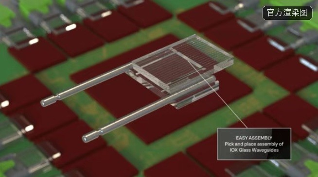

*图 1｜**产品本体**：康宁 GlassBridge 组件的官方渲染图——内嵌 IOX 离子交换玻璃波导的薄片，两端为 TMT 光纤物理接触接口，正以"拾取—贴装（Pick and place）"方式悬停在下方倒装的光子芯片阵列上方。这就是本 Node 说的"把光耦合从精密机械装配推进到半导体晶圆制造"的物理形态：波导位置由玻璃材料本身决定，不再靠逐根光纤对位。注意这是**官方渲染图而非实物照片**——迄今全球公开渠道只有康宁发布的渲染图，实物照未流出。来源：康宁官方发布素材（经 nanoplatform.cn 与 THE ELEC 转载，2026-06，Credit: Corning Incorporated）。*

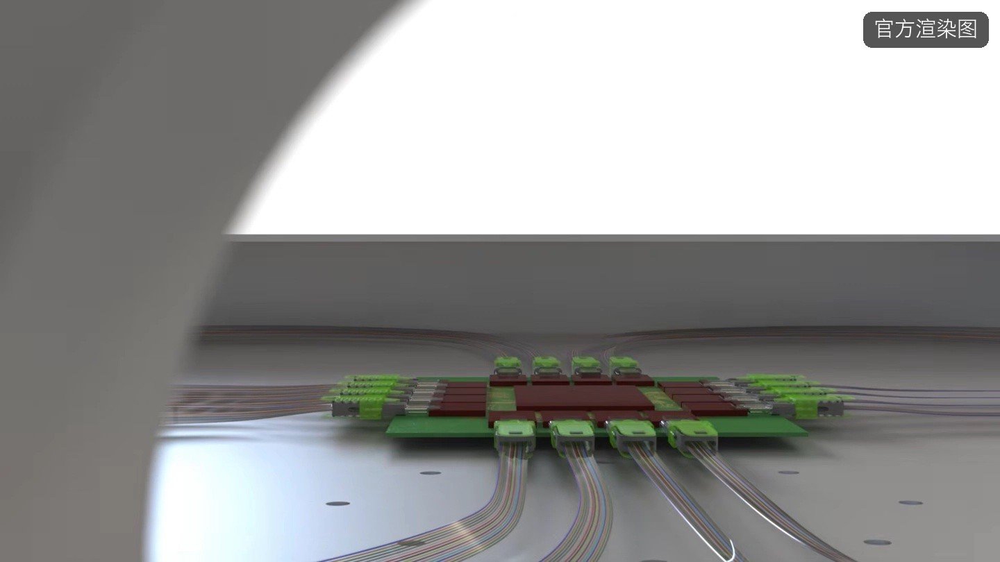

*图 2｜**工作环境（被替代工位）**：CPO 交换机托盘的系统级渲染图——中央 ASIC 封装四周密布光纤连接器，多组预组装光纤线束呈扇形汇入。这张图要反着看：**画面里这些光纤连接器与线束，正是 Glass Bridge 要消掉的那一堆东西**。传统 CPO 里每一根都要以次微米级精度主动对准，是人力与设备密集的工位；玻璃桥用一片带波导的玻璃把它们一次性替换。来源：康宁 GlassWorks AI/CPO 方案素材（经 IT之家报道，2026-06-25，Credit: Corning，官方渲染图）。*

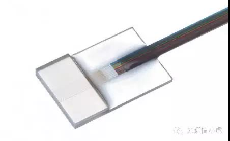

*图 3｜**被替代方本体**：传统 FAU（Fiber Array Unit，光纤阵列单元）实物——带状光纤被固定在石英/V 槽玻璃基座上，端面抛光后待与光芯片耦合。这就是本 Node 的替代对象，也是**A 股天孚通信、太辰光、仕佳光子等公司赖以吃饭的产品形态**。它的价值来自"把 N 根光纤按精确间距排好并对准"，而 Glass Bridge 用玻璃里的波导阵列把这件事变成了光刻能解决的活。来源：光通信百科（和弦产业研究中心）「FA 和 FAU」词条（Credit: 光通信百科 / 光通信小虎）。**注意：此图为转引，原图带水印（角标已注明），水印保留未抹。***

---

## 术语表

### 行业术语

| 术语 | 英文/全称 | 释义 |
| --- | --- | --- |
| 玻璃桥 | Glass Bridge | 康宁 2026-06 发布的玻璃基光互连组件：玻璃内预制 IOX 光波导，替代 FAU 光纤阵列 + 主动对准 |
| IOX 波导 | Ion-Exchange Waveguide | 离子交换光波导：通过银/钠离子交换在玻璃表层形成折射率梯度，构成纳米级光通道；康宁口径波导损耗 0.034 dB/cm |
| FAU | Fiber Array Unit | 光纤阵列单元：把多根光纤按精确间距固定在石英/硅基座上的器件——**本 Node 的直接替代对象，A 股光器件公司的核心产品** |
| 主动对准 | Active Alignment | 逐根光纤在通电状态下用六轴平台寻找最优耦合位置的工艺，次微米级精度、耗时且良率敏感——玻璃桥消掉的正是这一步 |
| 无源对准 | Passive Alignment | 靠结构精度（本 Node 靠玻璃波导位置）直接完成对准，无需逐根寻优；玻璃桥把公差放宽至 **30μm** |
| CPO | Co-Packaged Optics | 共封装光学：光引擎与交换 ASIC 封装在同一基板上 |
| NPO | Near-Packaged Optics | 近封装光学：光引擎独立可插拔、与 ASIC 同板但不同封装——沃格判断 NPO 先于 CPO 落地（工艺要求可控） |
| TMT 接口 | — | 物理接触型光纤接口标准；玻璃桥兼容 TMT 与 MPO 高密度光缆生态，是它能接入存量系统的关键 |
| COUPE | — | 台积电硅光子整合平台（COUPE），2026H2 量产、AMD 首发客户——CPO 商转的**制造端支柱**，与玻璃桥是材料端/制造端互补而非竞争 |
| 插损 | Insertion Loss | 光信号通过器件的功率损耗；玻璃桥口径由传统 1.5dB/通道降至 **<0.5dB/通道** |
| 离子迁移 | Ion Migration | 玻璃中离子在长期高温高湿下的迁移，可能改变折射率——**玻璃桥客户认证阶段的核心考察项，也是第一失败条件** |
| PLC 波导 | Planar Lightwave Circuit | 硅基平面光波导（传统分路器厂商路线），玻璃桥的竞争路线之一 |
| V 槽基座 | V-Groove | FAU 中固定光纤的核心结构件（石英/硅刻蚀 V 形槽），图 3 可见 |

### 技术指标

| 指标 | 数值/口径 | 说明 |
| --- | --- | --- |
| 对准公差 | 30μm（传统需次微米级主动对准） | 放宽约两个数量级——这是玻璃桥全部价值主张的源头 |
| 插损 | 1.5dB/通道 → **<0.5dB/通道** | 聚合站口径；康宁官方口径为单端面耦合损耗 ≤1.5dB |
| 波导损耗 | 0.034 dB/cm | 康宁口径（EVD-172） |
| 成本差距 | 较传统方案拉开 **>30%** | 聚合站口径，未经康宁确认 |
| 康宁 2026Q2 光通信 | 销售额 20.7 亿美元 +32%、净利 4.38 亿 +77%、净利率 21%（历史高位） | **利润当前全在康宁手里**（EVD-171） |
| 量产时间表 | 大摩：验证产线 2027Q4 小规模量产 → 2028 小规模实物落地验证 → **2028H2-2029 初大规模出货** | 摩根士丹利 2026-07 深度报告（EVD-198） |
| 康宁产能 | 约覆盖英伟达 2026 年需求的 70% | 行业报告口径，**非正式合同**，见 C-13 |
| 台积电 COUPE | 2026H2 量产、AMD 首发；二代整合进 CoWoS，2027 末-2028 初量产 | NVIDIA Vera Rubin / Rubin Ultra 瞄准 2026 底-2027 采用 |

---

## Node 档案

| 字段 | 内容 |
| --- | --- |
| 资产编号 | NODE-010 |
| 名称 | 玻璃基光互连（Glass Bridge / CPO·NPO 光互连基板） |
| 别名 | 玻璃桥; 玻璃基光互连; Glass Bridge; IOX 光波导; 玻璃光互连载板; CPO 玻璃基板; 光耦合替代 |
| 状态 | active |
| 父节点 | NODE-009（玻璃基板·电链，共享中游 TGV/玻璃加工） |
| 子节点 | 待定（候选 REL-032 台积电 COUPE 硅光子平台 / REL-033 FAU 厂商应对路线） |
| 关键词 | Glass Bridge, 玻璃桥, 玻璃基光互连, IOX, 离子交换波导, 光波导, FAU, 光纤阵列单元, 主动对准, 无源对准, CPO, NPO, 共封装光学, COUPE, 硅光子, 插损, 离子迁移, 康宁, Corning, TMT, MPO, 天孚通信, 太辰光, 仕佳光子, 光迅科技, 长芯博创, 杰普特, 华工科技, 京东方, 沃格光电 |
| 登记日期 | 2026-09-27 |
| 证据数 | 11（EVD-198 ~ EVD-206，另承继 EVD-172 / EVD-173） |

## Step 0 路由记录

宫主裁定 REL-029「**按双 Node**」，将 NODE-009 的双链结构拆分为电链（NODE-009 保留）与光链（本 Node）。这是本宫**第一例由宫主裁定而非研究发现的主动拆分**——前八次均为新实体登记或子环节切出。

**切分依据（沿用 NODE-009 已确立的检验法）**：Step 12 失败条件能否一击杀死整个 Node。

| 检验项 | 电链（NODE-009） | 光链（本 Node） | 是否可分 |
| --- | --- | --- | --- |
| 替代对象 | ABF 有机载板 / 硅中介层 | FAU 光纤阵列 + 主动对准 | ✓ 不同 |
| 客户 | Intel / 台积电 CoPoS / 三星 / AMD·AWS | 英伟达 / Meta / 亚马逊 + 光模块厂 | ✓ 不同 |
| 验证标准 | 热循环可靠性、良率、成本 | 耦合损耗、插损、离子迁移长期稳定性 | ✓ 不同 |
| 产业阶段 | **全行业零量产**（2026） | **唯一已签长协、已跨量产门槛**（小规模） | ✓ 不同 |
| 可证伪事件 | 台积电放弃玻璃中介层（**已发生**） | 康宁玻璃桥可靠性认证失败 / COUPE 走自有耦合方案 | ✓ **互不相干** |
| A 股方向 | 受益方（中游加工：沃格/京东方/帝尔） | **受损方（FAU 光器件：天孚/太辰光/仕佳）** | ✓ **方向相反** |

**最后一行是本次拆分最大的收获**：两条链共享同一中游加工能力，却对 A 股给出**方向相反**的结论。合在一个 Node 里时，"玻璃基板 = A 股机会"的叙事会把"玻璃基板 = A 股光器件威胁"这一半盖掉。**拆分不是为了切得更细，是为了不让一个正确的结论压掉另一个同样正确的结论。**

**与 NODE-005/008 对偶双 Node 的对照**：005（oDSP）/008（通用 DSP）是**技术同源、价值链分离**，两者都是 A 股机会，只是可投性不同；009/010 是**中游同源、下游分离**，且两者对 A 股的**方向相反**——这是本宫第一次出现"一对双 Node，一个是买、一个是卖"的结构。

---

## 十三步（原九问扩展）

### Step 1 范围与市场规模（口径不全，按"替代空间"而非"市场规模"登记）

市场：玻璃基光互连组件（Glass Bridge 及其衍生的 CPO/NPO 玻璃基光互连载板）与其替代对象（FAU 及主动对准工艺）。

| 口径 | 内容 | 来源 | 等级 |
| --- | --- | --- | --- |
| 康宁长协 | 与 Meta / 英伟达 / 亚马逊签**数十亿美元**长期供货协议 | 康宁公开口径 | B |
| Meta 单笔 | 至 2030 年 **60 亿美元**光纤电缆采购合约 | CMoney 2026-06-30 报道 | C |
| 康宁资本开支 | 2026-2028 年投入 **50 亿美元**，扩 AI 光纤与半导体玻璃产能（北卡、德州新厂） | 康宁 2026Q1 法说会 | B |
| 英伟达投资 | 2026-05 通过预付认股权证 + 额外认股权证对康宁战略投资 | 产业媒体转引 | C |
| 产能覆盖 | 康宁产能约覆盖英伟达 2026 年需求的 **70%** | 行业报告，**非正式合同** | C/D |

> **口径提醒**：本 Node **没有可靠的市场规模预测**——康宁未单独披露 Glass Bridge 收入，第三方（大摩/花旗）只给时间表不给规模。这是它与 NODE-009（有 4 套口径打架的市场规模）的反向差别：**009 是数字太多且不收敛，010 是根本没有数字**。因此本 Node 的市场侧结论只能用"替代空间"定性，不得引用任何未标注口径的规模数字。

**暗线 4 预埋**：市面上流传的"康宁产能覆盖英伟达 70% 需求"是**行业报告口径而非合同**，且出现在聚合站（pccentral.net，D 级）。这类"以产能承诺倒推需求"的表述是本 Node 叙事的第一放大器——实际约束力为零。**任何引用必须写明"行业报告口径，非正式合同"。**

**暗线 3 检查点**：需求侧是**强结构性**（AI 集群布线密度与功耗撞到铜互连极限，CPO 是唯一解法，三大云厂已用长协投票）；供给侧是**材料工程 + 标准缺位**（离子迁移长期数据未出、光纤阵列间距/波导结构/封装尺寸无统一标准 → 必须定制 → 难降本）。这与 NODE-009 同构（结构强、工程慢），但**本 Node 的瓶颈里多了一项 009 没有的东西：标准化**。

> 📊 **技术说明图解**（AI 生成示意信息图，非实物；以正文为准）——Scope 研究范围与资金口径对比
>
> 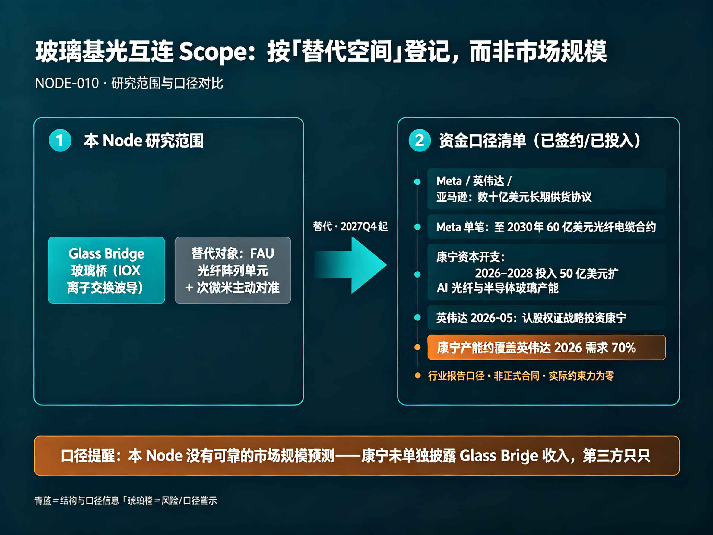

*图｜本 Node 研究范围（Glass Bridge 玻璃桥替代 FAU 光纤阵列 + 次微米主动对准）与已签约/已投入的资金口径清单（长协、Meta 60 亿美元、康宁 50 亿美元资本开支、英伟达战略投资），并用警示色标注「康宁产能覆盖英伟达 70% 需求为行业报告口径、非正式合同」。对应 Step 1 Scope。AI 生成示意信息图，非实物；以正文为准。*

### Step 2 系统变化：三股力量推，一股力量拖

1. **铜互连撞物理极限（需求侧·最硬）**：AI 集群规模扩张使交换机 ASIC 与光引擎之间的电互连在功耗与密度上不可持续，CPO/NPO 是唯一出路；台积电 COUPE 2026H2 量产、AMD 首发，NVIDIA Vera Rubin / Rubin Ultra 瞄准 2026 底-2027 采用——**制造端就位，只差光耦合这一环**。
2. **康宁把光学精度"内建"进玻璃（供给侧·已发生）**：ECTC 2026 论文披露，康宁从大量玻璃配方中筛出特定**银离子扩散特性**的材料，高温长期环境下折射率变化极低、弯曲损耗降至可忽略——**精度不再靠后段封装的对准，而靠材料本身**。这是本 Node 的技术内核。
3. **三大云厂用长协投票（格局侧·已定局）**：Meta / 英伟达 / 亚马逊均签数十亿美元长期协议，英伟达 2026-05 进一步以认股权证战略投资康宁；2026 年被定义为"CPO 商转元年"（材料端 GlassBridge + 制造端 COUPE 同期就位）。
4. **标准化缺位（拖累侧·本 Node 独有）**：不同厂商的光纤阵列间距、芯片波导结构、封装尺寸尚未统一，玻璃桥目前需**针对不同客户定制设计**——定制意味着难快速降本、高度依赖单一客户订单规模。**行业标准的形成时间决定玻璃桥的量产节奏**，这是它与 NODE-009（瓶颈是良率/成本）最本质的差别。

**暗线 1（受损方）**：① **FAU 光纤阵列单元厂商**——天孚通信、太辰光、仕佳光子、光迅科技、长芯博创（直接替代，本 Node 主体）；② **主动对准设备厂**（次微米级六轴对准平台，玻璃桥直接消掉该工序）；③ 远期：MPO 高密度光缆的部分组装价值（玻璃桥兼容 MPO 生态，故为"部分"而非"完全"）。**反向注意**：这些公司当前的业绩非常好（仕佳 H1 +50.66%、光迅 +56.34%、长芯博创 +91.08%），高估值来自 AI 光模块景气，**不是**来自玻璃桥——**受损逻辑是 2028+ 的，不是当下的**。

> 📊 **技术说明图解**（AI 生成示意信息图，非实物；以正文为准）——System Change 三推一拖传导链
>
> 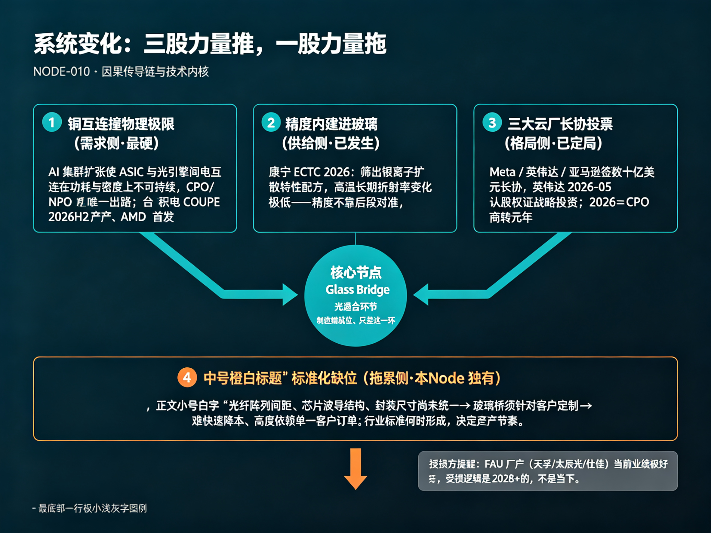

*图｜三股推动力量（铜互连撞物理极限、康宁把精度内建进玻璃、三大云厂长协投票）共同指向中央 Glass Bridge 光耦合环节，底部琥珀橙拖累条为「标准化缺位·本 Node 独有」，并备注受损方当前业绩极好、威胁在 2028+。对应 Step 2 System Change。AI 生成示意信息图，非实物；以正文为准。*

### Step 3 Supply Chain（产业关系地图）

| 七问 | 答案 |
| --- | --- |
| 处于什么位置 | 光互连的**「光纤—光芯片耦合」环节**——介于「光学级特种玻璃原片 / 晶圆级玻璃加工（IOX·TGV）」与「CPO·NPO 光引擎 / 光模块 / AI 交换机」之间 |
| 它依赖谁（上游） | ① 光学级特种玻璃原片（**康宁单一**，含银离子扩散配方）；② 晶圆级玻璃加工（IOX 离子交换、TGV 通孔、RDL 布线——与 NODE-009 **共享中游**）；③ 晶圆级光学测试与长期可靠性认证 |
| 谁依赖它（下游） | CPO/NPO 光引擎（台积电 COUPE + 光芯片）、光模块厂（中际旭创/新易盛/华为）、AI 交换机（英伟达 Spectrum / NVL72）、终端：Meta/亚马逊/英伟达 AI 数据中心 |
| 出问题传导到哪里 | 耦合损耗或离子迁移不达标 → CPO 仍须用 FAU 主动对准 → 光互连成本与密度瓶颈延续 → AI 集群布线密度与功耗受限（与 NODE-004 OCS、NODE-005 oDSP 同终点不同路径） |
| 它替代谁 | **FAU 光纤阵列单元 + 主动对准工艺**；竞争路线：硅基 PLC 波导、3D 打印聚合物波导、自由空间光学耦合 |
| 它属于谁 | 光互联价值链的光耦合层；与 NODE-004（OCS 组网层）、NODE-005（oDSP 信号处理层）**同终端、不同环节**，三者构成 AI 光互联的完整切面 |
| 下一步研究谁 | REL-032 台积电 COUPE 硅光子平台（制造端支柱，若走自有光耦合方案则本 Node 受挫）；REL-033 FAU 厂商应对路线（自研玻璃波导 / 转向其他器件） |

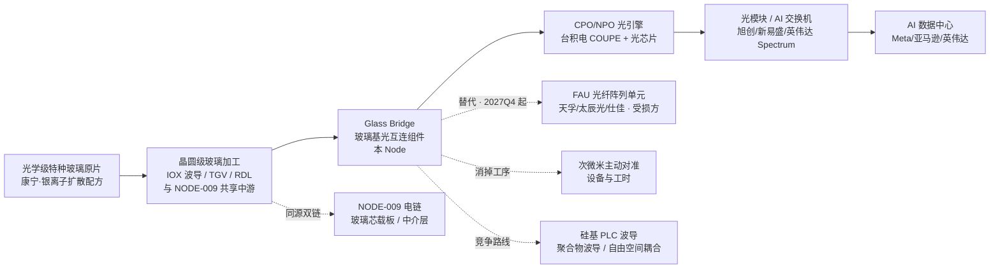

**与 NODE-009 的共享关系**：中游的晶圆级玻璃加工（IOX、TGV、RDL）是两条链**共用的稀缺能力**——这正是沃格、京东方能同时给电链送样、给光链做玻璃基载板的原因，也是当初把两条链放进一个 Node 的理由。但下游客户、替代对象、验证标准、A 股方向全部不同，**共享中游不等于同一个 Node**。

> 📊 **技术说明图解**（AI 生成示意信息图，非实物；以正文为准）——Supply Chain 产业链关系地图
>
> 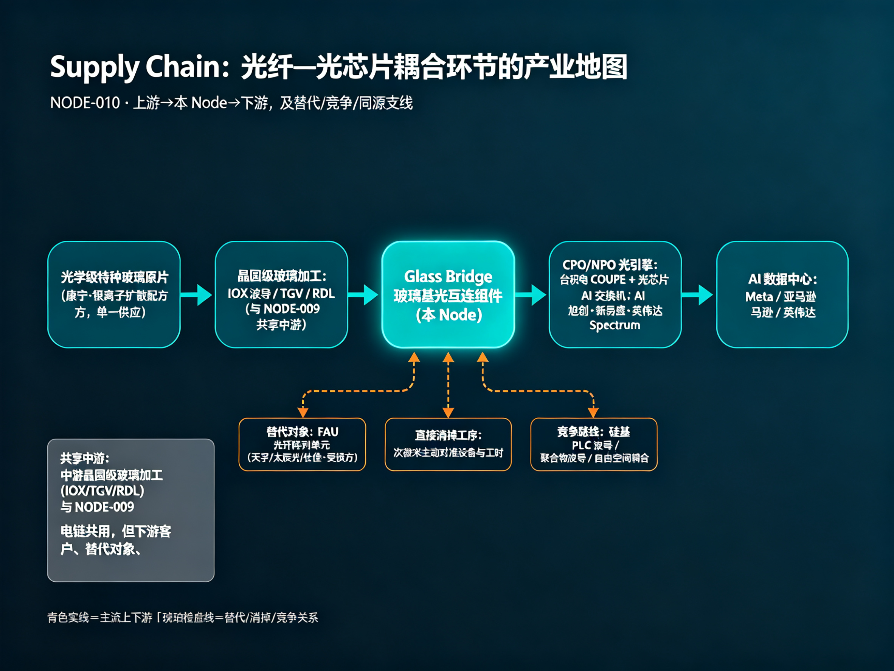

*图｜从左到右主流：特种玻璃原片（康宁）→ 晶圆级玻璃加工（IOX/TGV/RDL，与 NODE-009 共享中游）→ Glass Bridge（本 Node 核心）→ CPO/NPO 光引擎（台积电 COUPE）→ 光模块/AI 交换机 → AI 数据中心；核心节点向下引出琥珀橙虚线三支——替代 FAU 受损方、消掉主动对准工序、竞争路线（硅基 PLC/聚合物/自由空间）。对应 Step 3 Supply Chain。AI 生成示意信息图，非实物；以正文为准。*

### Step 4 BOM（产品构成与价值量地图）

以一片带波导的玻璃基光互连组件为对象：

| 层级 | 环节 | 价值量/占比 | 分级 | 说明 |
| --- | --- | --- | --- | --- |
| 1 | 光学级玻璃原片（银离子扩散配方） | 无公开拆分；康宁垂直整合，不外售配方 | **卡脖子级（绝对）** | 康宁从大量配方中筛选，**精度内建于材料**；A 股 0 参与；京东方仅获 7059 原片 + IOX 专利**授权加工**，不掌握配方 |
| 2 | IOX 离子交换波导加工 | 康宁自有 | **卡脖子级** | 波导损耗 0.034 dB/cm；**这一层决定对准公差能否放宽到 30μm**，是本 Node 全部价值的来源 |
| 3 | TGV 通孔 + RDL 布线（电互连协同） | 与 NODE-009 共用产能 | **重要（协同门槛）** | 玻璃桥只解决光耦合，CPO 封装内还需 TGV/RDL/芯片贴装协同——**这是三大挑战之一** |
| 4 | 光纤接口与封装（TMT / MPO 兼容） | — | **门槛级（生态壁垒）** | 兼容 TMT 物理接触接口与 MPO 高密度光缆生态，是玻璃桥能接入存量系统的关键——**也是本 Node 唯一的软壁垒** |
| 5 | 长期可靠性认证 | — | **门槛级** | 高温高湿离子迁移数据、客户规范决定周期，不可压缩 |

**价值量变化（动态视角）**：
- 传统方案的成本大头是**主动对准的工时与设备**（次微米级、逐根寻优、良率敏感）→ 玻璃桥把它变成光刻可解决的活，**成本差距 >30%**（聚合站口径）；
- 定制化的代价：标准未统一 → 难以快速降本 → **规模效应被标准缺位抵消**；
- 标准化一旦形成，成本曲线会陡降——这是本 Node 与 NODE-009（靠良率爬坡降本）的第二处差别。

**BOM 判断**：本 Node 的价值量几乎全部集中在**康宁垂直整合的前两层**（原片配方 + IOX 加工），A 股能触及的只有第 3 层（TGV/RDL 加工，与 009 共用）与第 5 层的**加工费**。这与 NODE-009（中游加工是价值重心）相反：**009 是"材料被卡、加工能吃肉"，010 是"材料与核心工艺一体、加工只能喝汤"。**

> 📊 **技术说明图解**（AI 生成示意信息图，非实物；以正文为准）——BOM 五层结构与价值分级
>
> 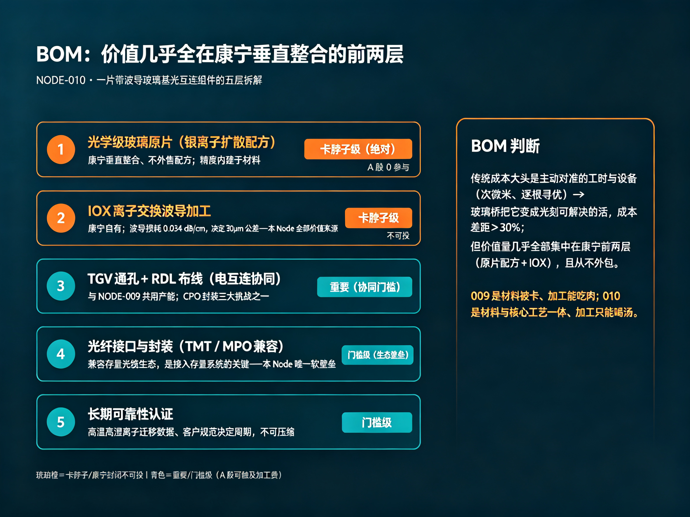

*图｜一片带波导玻璃基光互连组件的五层拆解：前两层（光学级玻璃原片配方、IOX 波导加工）为琥珀橙卡脖子级、康宁封闭不可投；后三层（TGV/RDL 协同、TMT/MPO 接口封装、长期可靠性认证）为重要/门槛级；右侧结论点明成本差距 >30%、价值集中康宁前两层，A股加工只能喝汤。对应 Step 4 BOM。AI 生成示意信息图，非实物；以正文为准。*

### Step 5 Value Chain（价值创造与获取地图）

- **价值创造**：玻璃桥创造的是"光耦合这一工序的可制造性"——把一个人力/设备密集、良率敏感的**装配问题**，变成一个**晶圆制造问题**。这是范式的改变，不是参数的改良。
- **价值获取（当下）**：**全在康宁**。2026Q2 光通信销售额 20.7 亿美元 +32%、净利 4.38 亿 +77%、净利率 21%（历史高位）。A 股**没有一家能分享这一层**。
- **议价权**：康宁同时握住**材料配方**与**生态接口标准**（TMT/MPO 兼容），是**定义方**而非"被认证方"——这与 NODE-009 中游加工厂（沃格需赴硅谷参与客户前期设计，属被认证方）**完全相反**。
- **中国的双向位置**：加工端有位置（京东方获康宁独家授权承接玻璃桥基材加工、沃格 1.6T/3.2T 玻璃基载板送样），但**配方与生态标准 100% 在康宁手里**——与 NODE-009（加工不错、原料被卡）同构，只是这次被卡的**不只是原料，还有工艺本身**。
- **跨 Node 对照**：本 Node 与 NODE-008（DSP 软壁垒：生态 + 认证）的壁垒类型一致——**靠生态兼容性（TMT/MPO）而非器件参数**建立护城河；但 NODE-008 的软壁垒在国内有替代路径（RISC-V + 国产工具链），本 Node 的生态标准**由海外单一公司定义，国内无对等的第二条路**。

> 📊 **技术说明图解**（AI 生成示意信息图，非实物；以正文为准）——Value Chain 价值创造与获取
>
> 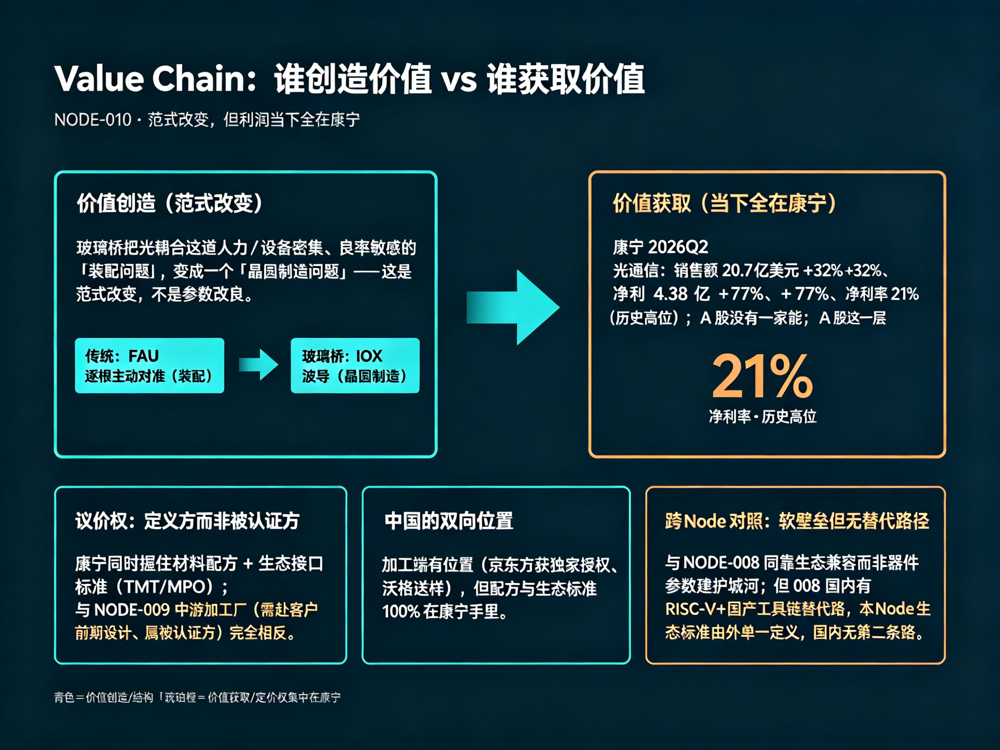

*图｜左侧「价值创造」是把光耦合从 FAU 逐根主动对准（装配）变成 IOX 波导（晶圆制造）的范式改变；右侧「价值获取」当下全在康宁（2026Q2 光通信净利率 21% 历史高位，A 股 0 家分享）；下方三张窄卡点明康宁是定义方、中国只在加工端有位置、软壁垒但国内无第二条路。对应 Step 5 Value Chain。AI 生成示意信息图，非实物；以正文为准。*

### Step 6 稀缺层排序（先排层，再排公司）

| 层级 | 稀缺约束 | 壁垒强度 | 说明 | A 股可投性 |
| --- | --- | --- | --- | --- |
| 1 | 光学级玻璃配方（银离子扩散、折射率长期稳定） | ★★★★★ | 康宁 ECTC 2026 论文、从大量配方筛选；精度内建于材料 | **不可投**（无 A 股对应） |
| 2 | IOX 波导加工工艺 | ★★★★★ | 康宁自有；决定 30μm 公差 | **不可投**（康宁不外包） |
| 3 | 生态标准定义权（TMT / MPO 兼容） | ★★★★ | 软壁垒，海外单一公司定义 | **不可投** |
| 4 | TGV 通孔 + RDL 协同加工 | ★★★ | 与 NODE-009 共用；京东方（独家授权）/沃格（送样） | **可投但纯度低**：京东方（占营收≈0）、沃格（亏损） |
| 5 | FAU 光纤阵列 + 主动对准工艺 | ★★（**稀缺性正在下降**） | 天孚/太辰光/仕佳的现有饭碗 | **可投但方向为负**：业绩来自 AI 光模块景气，本 Node 是它们 2028+ 的替代威胁 |

**暗线 4 纠偏（口径冲突清单）**：

1. **"康宁产能覆盖英伟达 2026 需求 70%"**：行业报告口径，**非正式合同**，源自聚合站（D 级）——不得当作订单证据；
2. **插损两个口径**：康宁官方"单端面耦合损耗 ≤1.5dB" ⟷ 聚合站"由 1.5dB 降至 <0.5dB/通道"——**分母不同（单端面 vs 每通道），不可直接比较**；
3. **"CPO 商转元年"**：2026 年只是**制造端（COUPE）就位**，材料端大摩口径 2027Q4 才小规模量产——"元年"是制造端的，不是玻璃桥的；
4. **大摩/花旗判断**：Glass Bridge 在**未来一至两年内产生实质性商业冲击的概率较低**，更多是技术路线补充与储备 ⟷ 康宁"已跨量产门槛"的聚合站表述——**卖方与产业媒体口径冲突**，见 C-13；
5. **"与格芯合作完成技术验证"**：格芯是晶圆代工厂而非光器件厂，合作性质与商业含义未披露，不得推演为订单。

> 📊 **技术说明图解**（AI 生成示意信息图，非实物；以正文为准）——Scarce Layer 稀缺层排序
>
> 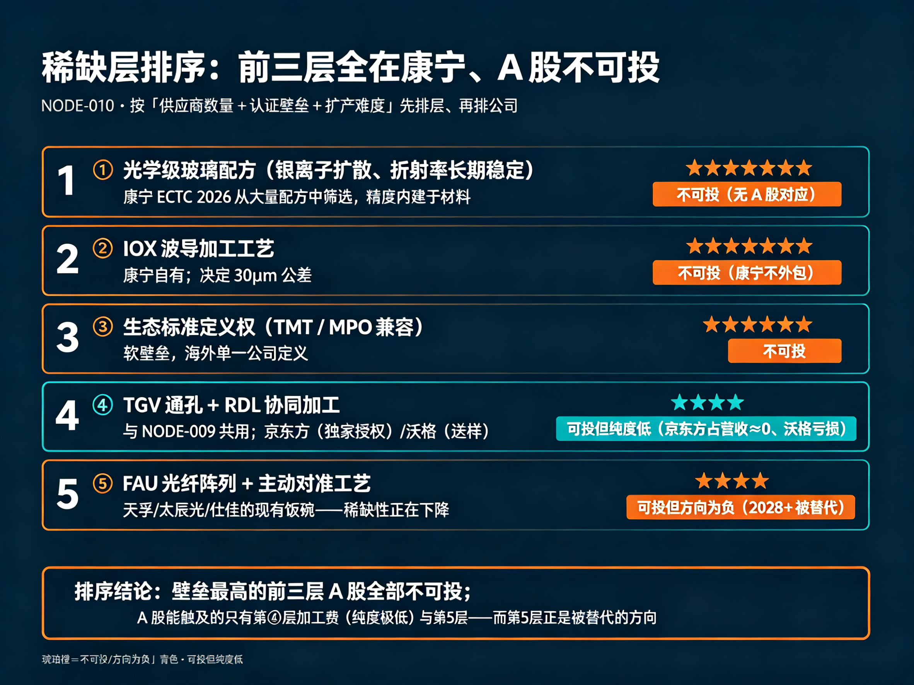

*图｜五层稀缺约束按壁垒强度排序：①光学级玻璃配方、②IOX 波导加工（均★★★★★）、③生态标准定义权（★★★★）三层均为琥珀橙、A 股不可投；④TGV/RDL 协同加工（★★★）可投但纯度低；⑤FAU+主动对准（★★，稀缺性下降）可投但方向为负。对应 Step 6 Scarce Layer。AI 生成示意信息图，非实物；以正文为准。*

### Step 7 Profit Pool（利润集中区域）

| 环节 | 当前利润集中度 | 代表 | 是否可投 |
| --- | --- | --- | --- |
| 光学级玻璃原片 + IOX 加工 | **极高且封闭**（康宁光通信净利率 21%，历史高位） | 康宁（GLW，美股） | **不在 A 股** |
| 生态接口与标准 | 高（非货币化，体现为定价权） | 康宁 | **不在 A 股** |
| TGV/RDL 协同加工 | 中（加工费） | 京东方（独家授权）、沃格（送样） | 可投但纯度低 |
| FAU + 主动对准 | **当前高，2028+ 结构性下降** | 天孚、太辰光、仕佳、光迅、长芯博创 | **可投但方向为负** |
| 下游光模块/CPO 引擎 | 高但非本 Node | 旭创、新易盛、台积电 | 属 NODE-004/005 |

**关键判断**：本 Node 的利润池**当前在康宁、未来大概率仍在康宁**——这是本宫第十个 Node 里**唯一一个利润池不发生向内迁移的 Node**：009 判断"2028 后利润从康宁向中游加工迁移"，而本 Node 的价值核心（配方 + IOX + 生态标准）康宁**从不外包**，A 股连 009 那种"加工份额期权"都拿不到，只剩**加工费**与**受损**两种角色。

> 📊 **技术说明图解**（AI 生成示意信息图，非实物；以正文为准）——Profit Pool 利润池集中区域
>
> 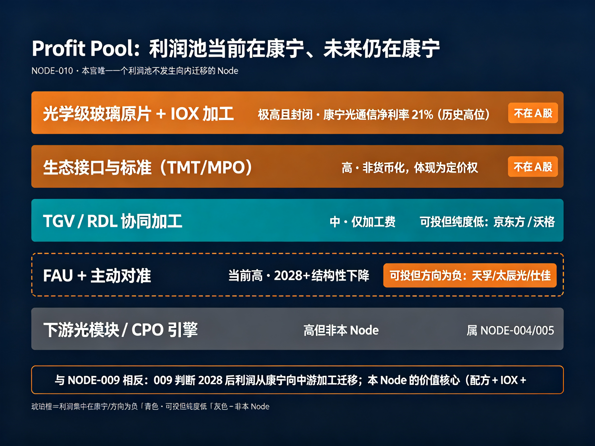

*图｜按利润集中度从大到小排列五个池子：前两池（原片+IOX 加工、生态接口标准）最宽且琥珀橙、不在 A 股；TGV/RDL 加工为中、仅加工费；FAU+主动对准当前高但 2028+ 下降、方向为负；下游光模块高但非本 Node。底部结论点明这是本宫唯一利润池不向内迁移的 Node。对应 Step 7 Profit Pool。AI 生成示意信息图，非实物；以正文为准。*

### Step 8 Profit Migration（利润迁移方向）

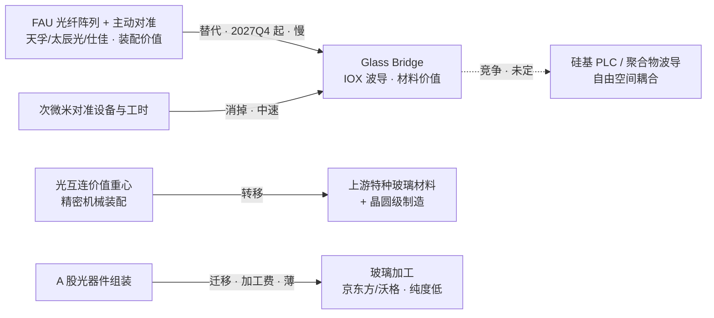

1. **替代 FAU（主方向·慢·2027Q4 起）**：大摩口径验证产线 2027Q4 小规模量产、2028H2-2029 初大规模出货；在标准统一前是**定制化替代**，速度受客户订单规模约束；
2. **消掉主动对准工序（中速）**：对准工时与设备价值直接消失，是替代中最先兑现的部分；
3. **价值重心上移**：从"精密机械装配"转向"上游特种玻璃材料 + 晶圆级制造"——**这对 A 股是结构性不利的**，因为 A 股光器件公司的能力恰恰长在装配端；
4. **竞争路线分流（未定）**：硅基 PLC 波导（传统分路器厂商）、3D 打印聚合物波导、自由空间光学耦合三条路线并存，玻璃桥的胜率是**概率而非定局**。

**净判断**：四条迁移中，前三条对 A 股**均为负向**。A 股真正能拿到的只有"加工费"（京东方/沃格），且纯度极低。**跟踪指标**：① 康宁 Glass Bridge 是否如期在 2027Q4 完成验证产线小规模量产；② 大摩口径的 2028H2-2029 大规模出货窗口是否右移；③ **FAU 厂商是否开始自研玻璃波导或公告应对路线**（这是替代威胁被消化的正面信号）；④ 行业标准（光纤阵列间距/波导结构/封装尺寸）是否形成。

> 📊 **技术说明图解**（AI 生成示意信息图，非实物；以正文为准）——Profit Migration 利润迁移方向
>
> 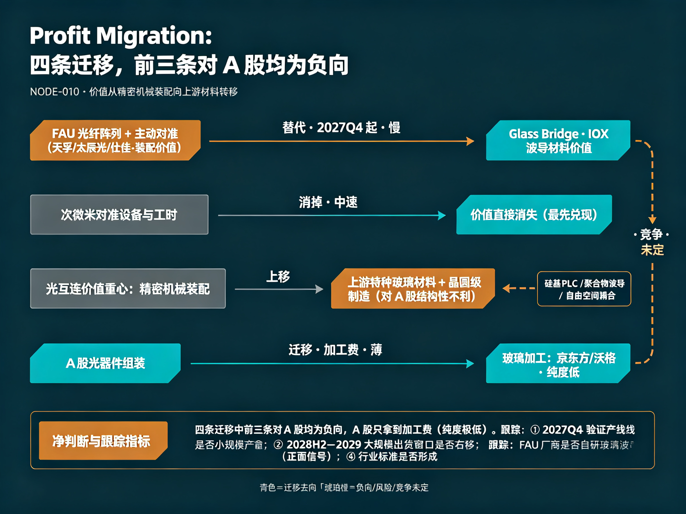

*图｜四条迁移流：FAU 装配价值→Glass Bridge 材料价值（替代·2027Q4 起·慢）、对准工时→价值消失（消掉·中速）、价值重心上移→上游材料+晶圆制造（对 A 股不利）、A 股组装→玻璃加工费（薄·纯度低）；右侧虚线为竞争路线分流（未定）；底部为净判断与四项跟踪指标。对应 Step 8 Profit Migration。AI 生成示意信息图，非实物；以正文为准。*

### Step 9 公司宇宙（11 家）

| 公司 | 代码 | 定位 | 稀缺层距离 | 本 Node 方向 |
| --- | --- | --- | --- | --- |
| 天孚通信 | 300394 | 光器件龙头，FAU/光引擎无源器件核心供应商 | 第 5 层（**被替代层**） | **受损**（PB 46.77 全组最贵） |
| 太辰光 | 300570 | 光纤连接器/光器件，FAU 相关 | 第 5 层（被替代层） | **受损**（H1 扣非已 -2.553%） |
| 仕佳光子 | 688313 | 光芯片 + 光纤阵列器件（PLC/FAU 相关） | 第 5 层（被替代层） | **受损**（H1 +50.66%/+45.3%，业绩最好的受损方） |
| 光迅科技 | 002281 | 光模块与光器件，含光耦合相关产品 | 第 5 层（被替代层） | **受损**（YTD +160.2%，涨幅最大） |
| 长芯博创 | 300548 | 光器件/有源器件 | 第 5 层（被替代层） | **受损**（H1 归母 +91.08%） |
| 杰普特 | 688025 | 激光/光学装备 | 第 5 层边缘 | **受损**（YTD +214%，全组涨幅最大） |
| 华工科技 | 000988 | 激光装备 + 光模块；TGV 激光加工装备整机定型、核心部件 100% 国产化 | 第 4 层（加工/设备） | **双向**（设备受益、光模块受损）——**本 Node 唯一一家两面对冲的公司** |
| 京东方 A | 000725 | 康宁三年独家合作：承接国内玻璃桥基材加工（7059 原片 + IOX 专利授权） | 第 4 层（加工·授权） | **受益**（但占营收≈0） |
| 沃格光电 | 603773 | 1.6T/3.2T 光模块玻璃基载板送样；判断**先 NPO（2027 底）后 CPO（2029-2030）** | 第 4 层（加工） | **受益**（纯度最高但亏损） |
| 帝尔激光 | 300776 | TGV 激光设备（与 009 共用） | 第 4 层（设备） | 受益（设备层，纯度低） |
| 康宁 | GLW（美股） | 原片配方 + IOX 加工 + 生态标准 —— **本 Node 本体** | 第 1-3 层 | **不可投**（非 A 股） |

### Step 10 证据分级

见文末证据索引（EVD-198~206，11 条；另承继 EVD-172/173）。本 Node 证据结构特点：**卖方研究（大摩/花旗）权重高于产业媒体**，且**完全没有 A 股公司口径**——因为 A 股没有一家公司公开披露 Glass Bridge 相关业务（京东方"独家授权"亦未经双方公告确认）。与 NODE-009（公司互动易口径密度高、第三方数据少）恰好相反：本 Node 的**信息源是海外卖方与康宁财报，主体等级更高但离 A 股更远**。

**结构性问题**：本 Node 缺少"公司层面的自证"——没有任何 A 股公司承认或否认自己受 Glass Bridge 影响。**这意味着"受损方"这个判断是本宫的推论，不是任何公司的披露**。必须显式标注（见 Step 11 与并列清单 C-14）。

### Step 11 排序（本宫第一个"风险排序"而非"机会排序"的 Node）

**稀缺层排序**：光学级玻璃配方（不可投）> IOX 波导加工（不可投）> 生态标准定义权（不可投）> TGV/RDL 协同加工（纯度低）> FAU + 主动对准（**方向为负**）。

**公司排序——按"风险暴露度"而非"机会"排序**：

| 排名 | 公司 | 暴露度理由 | 当前估值（2026-09-24） | 关键财务信号 |
| --- | --- | --- | --- | --- |
| 1 | **天孚通信** | FAU/光引擎无源器件纯度最高，**PB 46.77 为全组最贵**——受损方里定价最极端的一个 | 2923 亿 / PE 125.9 / PB 46.77 / YTD +31.97% | H1 营收 28.28 亿 +15.15%、归母 12.04 亿 +33.92%；**Q2 单季营收 -0.8993%**（**增长已失速**） |
| 2 | **太辰光** | FAU 相关；**H1 扣非已转负** | 497.7 亿 / PE 164.8 / PB 29.83 / YTD +89.62% | H1 营收 10.01 亿 +20.81%、归母 1.763 亿 **+1.706%**、扣非 **-2.553%** |
| 3 | 光迅科技 | 光耦合相关产品线；涨幅最大 | 1507 亿 / PE 130.3 / PB 10.43 / **YTD +160.2%** | H1 营收 66.1 亿 +26.07%、归母 5.822 亿 +56.34% |
| 4 | 长芯博创 | 光器件组装 | 681.1 亿 / PE 139.6 / PB 32.59 / YTD +62.69% | H1 营收 16.88 亿 +40.72%、归母 3.214 亿 +91.08% |
| 5 | 仕佳光子 | 光纤阵列器件；**业绩最好的受损方** | 711 亿 / PE 151.2 / PB 41.41 / YTD +77.18% | H1 营收 14.95 亿 +50.66%、归母 3.148 亿 +45.3%；2026E 净利 +107% |
| 6 | 杰普特 | 光学装备 | 422.6 亿 / PE 111.5 / PB 16.55 / **YTD +214%（全组最大）** | H1 营收 14.87 亿 +68.86%、归母 1.954 亿 +105.2% |

**受益侧（纯度极低，不构成独立机会）**：京东方 A（PE 27.58 / PB 1.628 全组最便宜 + 康宁独家授权，但玻璃基占营收≈0）、沃格光电（纯度最高但 H1 归母 -1.235 亿、PB 21.59、YTD +176.1%）、华工科技（PE 59.27 全组最低，TGV 装备整机定型 + 光模块受损，**双向对冲**）、**水晶光电（002273，PE 27.73 / PB 3.25 / YTD -5.06%，公司A级确认布局CPO用TGV玻璃基板+等离子交换波导，十五五后期量产，现阶段无收入；康宁Glass Bridge直接供应商身份未确认，EVD-220/221）**。

**与前面 Node 的第六次形态对照**：赛微/烽火（技术稀缺财务差）→ 中芯（稀缺本体纯度低）→ 寒武纪（兑现之王不稀缺）→ 株冶/云南锗业（筹码层便宜制造层极贵）→ 沃格/帝尔（期权型：纯度与财务反向）之后，本 Node 出现第六种——**"业绩很好、方向为负"**：仕佳 +50.66%、光迅 +56.34%、长芯博创 +91.08%、杰普特 +68.86%，全部在爆发式增长，而它们所在的那层正是被替代的对象。**这是本宫第一次遇到"用基本面选股会选到受损方"的 Node**——因为基本面反映的是当下的 AI 光模块景气，而不是 2028 年的替代威胁。

**暗线 2（新旧龙头交替）**：全球——康宁以材料 + 生态标准**从器件厂手里拿走光耦合价值**（不是"新公司替代旧公司"，而是"上游材料商替代下游装配商"，**价值链纵向改道**）；中国——京东方/沃格以加工费切入，但**拿不到定价权**；旧 FAU 厂商除非自研玻璃波导，否则是纯受损方。**本 Node 的新旧交替方向是"向上游转移"，与 NODE-009 的"面板厂跨界替代载板厂"（横向）不同。**

> 📊 **技术说明图解**（AI 生成示意信息图，非实物；以正文为准）——Ranking 风险暴露排序
>
> 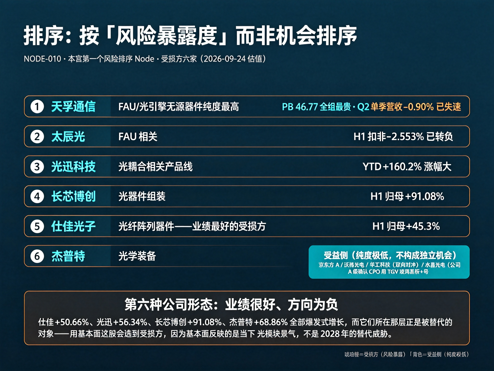

*图｜按风险暴露度（而非机会）排序的受损方六家：①天孚通信（PB 46.77 全组最贵、Q2 已失速）、②太辰光（扣非转负）、③光迅科技（YTD +160%）、④长芯博创（H1 归母 +91%）、⑤仕佳光子（业绩最好的受损方）、⑥杰普特（YTD +214%）；右侧受益侧纯度极低。底部点出"业绩很好、方向为负"的第六种形态。对应 Step 11 Ranking。AI 生成示意信息图，非实物；以正文为准。*

### Step 12 失败条件

1. **材料可靠性不达标（第一反证）**：玻璃在长期高温高湿下**离子迁移**是否影响折射率，需要更长周期数据——CPO 封装内芯片长期高功率、温度反复升降，这是客户认证阶段的核心考察项。若迁移数据不达标，整个路线停摆。
2. **标准化迟迟不形成（本 Node 第二反证，009 没有）**：光纤阵列间距、芯片波导结构、封装尺寸尚未统一 → 只能定制 → 难降本 → 高度依赖单一客户订单规模。**标准何时形成决定量产节奏**，若 2028 年前仍未形成，成本优势无法兑现。
3. **与电互连的协同集成失败**：玻璃桥只解决光耦合，CPO 封装内还需 TGV 通孔、RDL 布线、芯片贴装的协同设计；整体封装复杂度若失控，工程上不成立。
4. **竞争路线胜出**：硅基 PLC 波导（传统分路器厂商）、3D 打印聚合物波导、自由空间光学耦合三条路线在成本/精度/抗干扰上各有取舍——玻璃桥不是唯一解。
5. **台积电 COUPE 走自有光耦合方案（本 Node 最硬的外部反证）**：若 COUPE 平台集成自家或第三方的硅基耦合方案而不采用玻璃桥，本 Node 的最大下游锚点消失（**注意：COUPE 本身量产不构成反证，反证是它不用玻璃桥**）。
6. **时间窗风险（对 A 股最尖锐）**：大摩口径 2027Q4 小规模量产 / 2028H2-2029 初大规模出货。**若时间表右移，"FAU 被替代"的叙事会被证伪**——受损方（天孚/太辰光/仕佳）的估值压制解除，当前按"AI 光模块景气"定价的仓位反而受益。**本条是本 Node 唯一对 A 股多头有利的失败条件**，与其余五条方向相反，必须单独记住。
7. **受损方判断本身被证伪（元反证）**：本 Node 的"A 股主体为受损方"是本宫推论，**没有任何 A 股公司披露承认**。若 FAU 厂商公开说明其产品不在玻璃桥替代范围（或已自研玻璃波导），本 Node 的核心结论需重估（登记 C-14）。

> 📊 **技术说明图解**（AI 生成示意信息图，非实物；以正文为准）——Failure 证伪条件与受损方
>
> 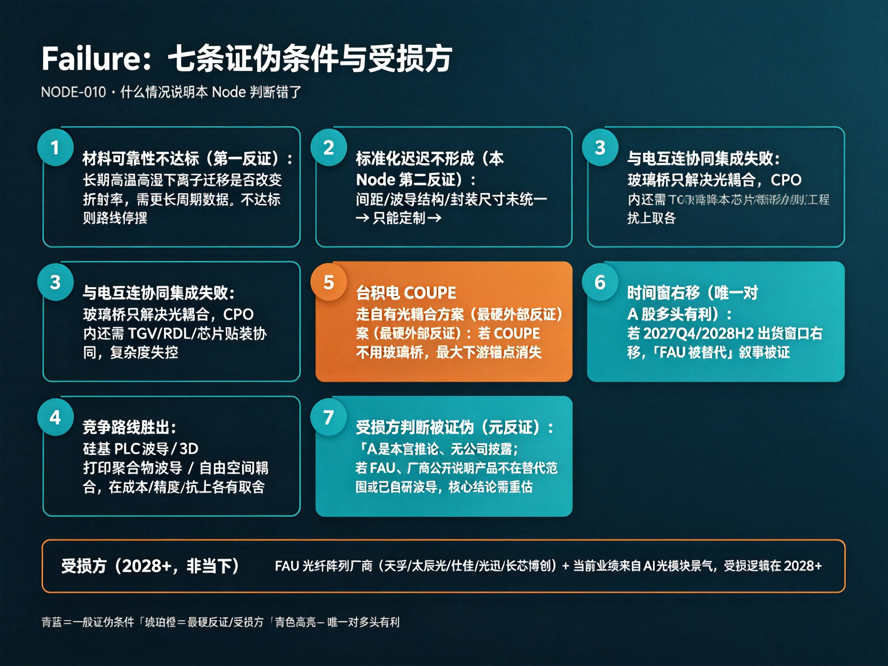

*图｜七条证伪条件卡片网格：材料可靠性（第一反证）、标准化缺位、电互连协同失败、竞争路线胜出为一般条件；台积电 COUPE 走自有光耦合方案为最硬外部反证（琥珀橙高亮）；时间窗右移是唯一对 A 股多头有利的失败条件；受损方被证伪为元反证；底部受损方条点明 FAU 厂商 + 主动对准设备厂、威胁在 2028+。对应 Step 12 Failure。AI 生成示意信息图，非实物；以正文为准。*

### Step 13 下一步研究动作

1. **跟踪信号清单（按时间排）**：① **2026H2**：台积电 COUPE 是否如期量产（AMD 首发）——制造端就位是玻璃桥放量的前提；② **2026 内**：康宁是否披露 Glass Bridge 的**独立收入或订单口径**（当前完全未拆分披露）；③ **2027Q4**：大摩口径的验证产线小规模量产是否兑现（**本 Node 最硬的单一验证点**）；④ **2028H2-2029**：大规模出货窗口；⑤ **持续**：FAU 厂商（天孚/太辰光/仕佳）是否公告自研玻璃波导或应对路线——这是替代威胁被消化的**正面信号**。
2. **本 Node 不产生买入信号，只产生两个动作**：① 对已持有的光器件仓位，把 2027Q4 / 2028H2 设为**减仓评估时点**；② 若时间表右移，视为**受损方压制解除**的利好（Step 12 第 6 条）。
3. **关联 Node 候选**：REL-032 台积电 COUPE 硅光子平台（制造端支柱，决定本 Node 下游锚点）；REL-033 FAU 厂商应对路线（决定受损方能否翻盘）。
4. **与 NODE-004/005 的切面关系**：OCS（组网层）+ oDSP（信号处理层）+ 本 Node（光耦合层）构成 AI 光互联的完整切面，三者共享"AI 数据中心"终端但互不重叠——日更分诊时不得把光耦合侧信息误路由到 004/005。
5. **反向问题（给宫主）**：本 Node 是本宫第一个"研究它不为买、而为**给已有仓位装警报器**"的 Node。按 Trading OS 纪律，它应单列为**风险池/观察池**而非 Alpha 池。是否如此归档，请宫主裁定。

---

## 六暗线检查点汇总

| 暗线 | 触发 | 结论 |
| --- | --- | --- |
| 1 受损方 | **强触发（本 Node 主体）** | FAU 光纤阵列单元厂商（天孚/太辰光/仕佳/光迅/长芯博创）、次微米主动对准设备厂；远期部分 MPO 组装价值。**反向注意：它们当前业绩极好，受损是 2028+ 的事** |
| 2 新旧龙头 | 触发（**纵向改道**） | 康宁以材料 + 生态标准**从下游装配商手里拿走价值**——不是新公司替代旧公司，是上游材料商替代下游装配商；中国京东方/沃格只能拿加工费。**与 NODE-009 的横向跨界不同** |
| 3 周期 vs 结构 | 触发 | 需求侧强结构（铜互连撞极限、三大云厂长协投票）；供给侧是**材料工程 + 标准缺位**——与 009 同构（结构强、工程慢），但多一个标准化瓶颈 |
| 4 绝对化纠偏 | 触发 | 5 项：康宁"覆盖英伟达 70% 需求"是行业报告而非合同（D 级聚合站）；插损两口径分母不同（单端面 vs 每通道）不可比；"CPO 商转元年"是制造端的、非玻璃桥的；大摩"1-2 年无实质冲击" ⟷ 聚合站"已跨量产门槛"（C-13）；"与格芯合作"含义未披露不得推演订单 |
| 5 BOM 分级 | 触发（**与 009 相反**） | 009 是"材料被卡、加工能吃肉"；010 是"**材料与核心工艺一体、加工只能喝汤**"——康宁垂直整合配方 + IOX，从不外包，A 股连加工份额期权都拿不全 |
| 6 研究路由 | 触发（**新范式：宫主裁定拆分**） | 本宫第一例由宫主裁定（REL-029「按双 Node」）而非研究发现的主动拆分；判别法沿用"Step 12 能否一击杀死整个 Node"，但本次决定性证据是**两条链对 A 股方向相反**——合在一处会用一个正确结论压掉另一个 |

## Alpha 映射链

稀缺层（光学级玻璃配方【不可投】> IOX 波导加工【不可投】> 生态标准【不可投】> TGV/RDL 协同加工【纯度低】> FAU + 主动对准【**方向为负**】） → 价值池（当前与未来都在康宁，**不发生向内迁移**——本宫唯一一例） → A 股映射（12 家：受损方 6 / 双向 1 / 受益加工 4 / 本体 1） → Alpha：

- **本 Node 不产生买入 Alpha。** 它产生的动作是**风险管理**：
  - **减仓评估时点**：2027Q4（康宁验证产线小规模量产）、2028H2-2029（大规模出货窗口）——对已持有的 FAU 类光器件仓位（天孚/太辰光/仕佳/光迅/长芯博创），到点须重估；
  - **压制解除信号**：若上述时间表右移，视为受损方利空出尽（Step 12 第 6 条，本 Node 唯一对多头有利的失败条件）；
  - **正面消化信号**：FAU 厂商公告自研玻璃波导 / 说明产品不在替代范围 → 受损判断需重估（C-14）。
- **受益侧不构成独立机会**：京东方 A（PE 27.58 / PB 1.628 最便宜，但玻璃基占营收≈0）、沃格光电（纯度最高但亏损、PB 21.59）、华工科技（PE 59.27 最低，TGV 装备受益但光模块受损，**双向对冲**）、**水晶光电（PE 27.73 / PB 3.25，公司A级确认CPO用TGV玻璃基板+波导布局，十五五后期量产，现阶段无收入；康宁直接供应关系未证实）**——四者均需回到 NODE-009 的框架下评估，不在本 Node 单独立 Alpha。
- **Trading OS 交接**：本 Node 建议归档为**风险池 / 观察池**，不是 Alpha 池。它的研究价值全部落在"**什么时候该重新看手里的光器件仓位**"，而不是"买什么"。**市场唯一一次对它定价是 2026-06-24 康宁发布当日，A 股 CPO 概念板块单日重挫超 6%**——那一次定价之后，市场再未系统性地把 Glass Bridge 当作光器件板块的估值因子。**这意味着：如果 2027-2028 时间表兑现，第二次定价可能会比第一次更剧烈，因为这一次是有业绩可参照的。**

## 证据索引

| 编号 | Node | 等级 | 来源 | 日期 | 内容 |
| --- | --- | --- | --- | --- | --- |
| EVD-172（承继） | NODE-010 | B | 康宁 Glass Bridge 发布（2026-06 首尔技术大会；EET-China 2026-07-03） | 2026-09-26 | 晶圆级 IOX 离子交换波导：玻璃内预制纳米级光波导实现无源对准，对准公差放宽至 30μm（传统需微米级主动对准），单端面耦合损耗 ≤1.5dB，波导损耗 0.034 dB/cm；兼容 TMT 物理接触接口与 MPO 高密度光缆生态；已与英伟达/Meta/亚马逊签数十亿美元长期供货协议；新一代 CPO 结构在带 TGV 电极的玻璃基板上形成光波导并倒装连接光芯片。**原登记于 NODE-009（双链未拆分时），REL-029 拆分后归本 Node** |
| EVD-173（承继） | NODE-010 | B/C | 康宁—京东方三年战略合作备忘录（2026-05-20，产业媒体转引） | 2026-09-26 | 康宁独家开放特种 7059 玻璃原片配方与 IOX 离子交换光波导底层专利，京东方承接**国内玻璃桥基材加工订单**；媒体称"国内无第二家企业拿到同等授权"（未经双方公告确认，C 级）。**原登记于 NODE-009，拆分后归本 Node（这是 A 股在光链上的唯一实质位置）** |
| EVD-198 | NODE-010 | B | 摩根士丹利 2026-07 深度报告（百度百科 Glass Bridge 词条转引） | 2026-09-27 | **本 Node 最硬的时间表**：康宁玻璃桥光波导技术验证产线预计 **2027Q4 实现小规模量产**，2028 年进入小规模实物落地验证阶段，**大规模出货窗口落在 2028H2-2029 年初**。大摩与花旗研究均认为 Glass Bridge 在未来一至两年内产生实质性商业冲击的概率较低，更多是对现有 FAU 光纤阵列单元方案的技术路线补充与潜在替代。成功商业化依赖资质认证、可靠性测试及良率爬坡，存在大量不确定性 |
| EVD-199 | NODE-010 | B/C | 康宁 2026Q1 法说会 + CMoney 2026-06-30 报道 + 产业媒体转引（Wistock 2026 分析文） | 2026-09-27 | 需求侧长协与资本开支：Meta 已签至 2030 年 **60 亿美元**光纤电缆采购合约，亚马逊订单规模据称超越 Meta；英伟达 2026-05 通过**预付认股权证 + 额外认股权证**对康宁进行战略投资（规模未披露，C 级）；康宁管理层在 2026Q1 法说会指出 **2026-2028 年投入 50 亿美元资本支出**，扩 AI 光纤与半导体玻璃产能（北卡、德州新建厂房）。2026Q2 光通信销售额 20.7 亿美元 +32%、净利 4.38 亿 +77%、净利率 21%（历史高位，见 EVD-171） |
| EVD-200 | NODE-010 | B/C | TechNews 科技新报 2026-05-14（Wistock 转引） | 2026-09-27 | **制造端支柱**：台积电 COUPE 硅光子整合平台预计 **2026H2 进入量产，AMD 为首发客户**；NVIDIA Vera Rubin 与 Rubin Ultra 瞄准 2026 底-2027 采用；第二代 COUPE 整合进 CoWoS 封装平台，预计 2027 末-2028 初量产。**制造端与材料端同期就位，是"2026 = CPO 商转元年"说法的来源**——但元年指制造端，非玻璃桥 |
| EVD-201 | NODE-010 | C/D | 聚合站 pccentral.net（2026） | 2026-09-27 | 【**信源存疑·仅留痕**】称康宁 Glass Bridge"已跨量产门槛"，插损由 1.5dB/通道降至 **<0.5dB/通道**，成本差距拉大 >30%，康宁产能约覆盖英伟达 2026 年需求的 **70%**。【D 级判定依据】聚合站无原始机构署名、无官网链接、"70% 需求覆盖"明确标注为行业报告而非正式合同。**与 EVD-198 大摩时间表方向相反（后者称 1-2 年内无实质冲击）**，登记为并列存疑 C-13；插损口径与康宁官方"单端面 ≤1.5dB"分母不同，不可比较 |
| EVD-202 | NODE-010 | B/C | 今日头条产业分析《康宁玻璃桥：用"传光"破解 CPO 耦合瓶颈?》（2026） | 2026-09-27 | **三大挑战（本 Node 失败条件 1-3 的直接来源）**：① 材料可靠性——玻璃在长期高温高湿下离子迁移是否影响光波导传输性能，需更长周期数据，CPO 封装内芯片长期高功率、温度反复升降下的光学稳定性是客户认证核心考察项；② 标准化——不同厂商光纤阵列间距、芯片波导结构、封装尺寸尚未统一，玻璃桥需针对不同客户定制，难以快速降本、高度依赖单一客户订单规模，**行业标准何时形成决定量产节奏**；③ 与电互连的协同集成——玻璃桥只解决光耦合，CPO 封装内还需 TGV 通孔、RDL 布线、芯片贴装协同，整体复杂度待工程验证。**竞争路线**：硅基 PLC 分路器厂商的硅基光波导方案、3D 打印聚合物波导、自由空间光学耦合，在成本/精度/抗干扰上各有取舍。另：三条玻璃路线（玻璃载板/玻璃芯封装载板/CPO 玻璃桥）**并非相互替代**——分别解决临时支撑、电互连刚性、光互连耦合三个不同问题 |
| EVD-203 | NODE-010 | B/C | 康宁 ECTC 2026 论文（Wistock 2026 分析文转引） | 2026-09-27 | **技术内核**：康宁团队从大量玻璃配方中筛选出特定**银离子扩散特性**的材料，高温长期环境下折射率变化极低、弯曲损耗大幅降低至可忽略水平——**光学等级的精密度被"内建"在玻璃材料本身，而非依赖后段封装的对准精度**。传统 FAU 需逐根光纤以次微米级精密对位，GlassBridge 通过波导阵列把对准精度需求转嫁至材料端，**从根本上改变了光纤耦合的制造逻辑** |
| EVD-204 | NODE-010 | A | 10 只 A 股行情快照（东财，2026-09-24 收盘） | 2026-09-27 | 受损方：天孚通信 2923 亿 / PE 125.9 / **PB 46.77** / YTD +31.97%；太辰光 497.7 亿 / PE 164.8 / PB 29.83 / YTD +89.62%；仕佳光子 711 亿 / PE 151.2 / PB 41.41 / YTD +77.18%；光迅科技 1507 亿 / PE 130.3 / PB 10.43 / **YTD +160.2%**；长芯博创 681.1 亿 / PE 139.6 / PB 32.59 / YTD +62.69%；杰普特 422.6 亿 / PE 111.5 / PB 16.55 / **YTD +214%**。受益/双向：华工科技 1035 亿 / PE 59.27 / PB 8.653 / YTD +29.71%；京东方 A 2167 亿 / PE 27.58 / PB 1.628 / YTD +38.95%；沃格光电 219.5 亿 / PB 21.59 / PE(TTM) -96.39 / YTD +176.1%；帝尔激光 370.7 亿 / PE 74.38 / PB 7.513 / YTD +109.2% |
| EVD-205 | NODE-010 | A | 7 只光链标的 2026 中报 + 2026E 一致预期（东财） | 2026-09-27 | 天孚通信 H1 营收 28.28 亿 +15.15%、归母 12.04 亿 +33.92%，**Q2 单季营收 14.98 亿 -0.8993%（增长失速）**；太辰光 H1 营收 10.01 亿 +20.81%、归母 1.763 亿 **+1.706%**、扣非 1.643 亿 **-2.553%（已转负）**；仕佳光子 H1 营收 14.95 亿 +50.66%、归母 3.148 亿 +45.3%；光迅科技 H1 营收 66.1 亿 +26.07%、归母 5.822 亿 +56.34%；长芯博创 H1 营收 16.88 亿 +40.72%、归母 3.214 亿 +91.08%；杰普特 H1 营收 14.87 亿 +68.86%、归母 1.954 亿 +105.2%；华工科技 H1 营收 78.22 亿 +2.527%、归母 11.86 亿 +30.17%（Q2 单季营收 -16.79%）。2026E 一致预期归母净利增速：天孚 +76.03%、太辰光 +75.03%、仕佳 +107%、光迅 +76.32%、华工 +57.64%、杰普特 +79.6%、长芯博创 +144.9%。**结论：受损方当前业绩普遍爆发，高估值来自 AI 光模块景气，不是玻璃替代** |
| EVD-206 | NODE-010 | B/C | 百度百科 Glass Bridge 词条（2026，媒体转引） | 2026-09-27 | **市场唯一一次定价事件**：2026-06-24 康宁在首尔发布 Glass Bridge 后，**A 股 CPO 相关概念板块出现短期波动、单日重挫超 6%**，同期美股康宁（GLW）股价上涨——市场当时已按"FAU/光器件被替代"给 A 股定价、按"康宁受益"给美股定价，两边方向相反且都被验证为即时反应。此后市场再未系统性把 Glass Bridge 当作光器件板块的估值因子。另：康宁已与格芯（GlobalFoundries）在 AI 数据中心光学互连技术领域展开合作并完成技术验证（合作性质与商业含义未披露，不得推演为订单） |
| EVD-219 | NODE-010 | B/C | The Elec / TrendForce（2026-09-26~28）中文转引：网易财闻海外、电子技术应用、深圳市电子商会 | 2026-09-28 | 【A 股映射新增主体·待裁决】水晶光电（002273）正在开发面向 CPO 的 TGV 玻璃基板，且是**康宁 Glass Bridge 光路所用波导元件的关键供应商**——本 Node 建立以来 EVD-204/205 只登记受损侧（天孚/太辰光/仕佳/光迅/长芯博创/杰普特），本条是第一条指向 **A 股公司在 Glass Bridge 供应链受益侧**位置的第三方口径。**信源为韩媒第三方转引，非公司公告，水晶光电未公开披露确认**，等级 B/C，按「新实体·候选种子 + 待裁决」处理：不并入 A 股映射表、不改结论句，也不消解 C-14（受损方判断系本宫推论、无公司披露）。同稿另确认沃格光电 TGV 二期初期应用明确包含 1.6T 光模块与 CPO 用 TGV 玻璃基板（与 NODE-009 EVD-216 同源；按 REL-034 光耦合侧信息归本 Node）。→ 待观察：若后续出现公司公告/互动易确认，将成为本 Node 第一个受益侧 A 股锚，并可能改写映射表结构 |
| EVD-220 | NODE-010 | A | 水晶光电2026年9月17日投资者关系活动记录表（公告编号2026008，2026-09-20披露，副总经理兼董秘韩莉） | 2026-09-28 | 【EVD-219部分升级·A级】公司确认光互联业务中长期差异化布局集中于未来CPO领域相关光学产品，例如TGV玻璃基板产品和等离子交换波导产品；CPO尚未到大规模应用关键时期，工程实现与量产可靠性仍存待解问题，相关产品预计'十五五'后期才有望量产落地；现阶段主要为传统可插拔光模块提供滤片/棱镜/透镜类通用元器件。→ EVD-219中'开发面向CPO的TGV玻璃基板'部分由B/C升级为A级确认；'康宁Glass Bridge波导元件关键供应商'部分公司未确认（互动易2026-07-13被直接问及时回复'以公开披露信息为准'，既不承认也不否认），保持B/C级候选，不并入A股映射表 |
| EVD-221 | NODE-010 | A | 宫主2026-09-29裁定（基于EVD-220公司A级确认） | 2026-09-29 | 【宫主裁定·映射新增】水晶光电（002273）正式纳入NODE-010受益侧A股映射表，为本宫第一个经公司A级确认布局CPO用TGV玻璃基板+等离子交换波导的受益侧标的。裁定依据：EVD-220（公司9月17日投关记录，副总经理兼董秘韩莉确认）。标注限制：①康宁Glass Bridge直接供应商身份未确认（互动易回复'以公开披露为准'）；②相关产品预计十五五后期量产，现阶段无收入贡献；③估值（2026-09-28）：331.67亿/PE 27.73/PB 3.25/YTD -5.06%。Step 11受益侧列表与Alpha映射链（11→12家）已同步更新；结论句未改动 |
| EVD-232 | NODE-010 | B | 电子工程专辑 2026-09-16（面板大厂切入英伟达、谷歌 CPO 供应链）；搜狐时间线 2026-09-16 | 2026-10-01 | 群创（Innolux）切入英伟达、谷歌 CPO 供应链：核心技术载体为与康宁联合开发的 Glass Bridge（玻璃桥）玻璃光通道技术——依托特种玻璃低热膨胀/高尺寸稳定/低介电损耗特性，激光精密加工在玻璃内部制备光波导通道，解决光纤与硅光子芯片高效耦合，是 CPO 架构中连接光引擎与交换芯片的关键组件；与康宁（光波导）、上游材料端共同构成'玻璃桥'产业链。→ NODE-010 受益侧新增面板厂主体（与既有康宁-水晶光电链并列），确认 Glass Bridge 商业化向'整机供应链'渗透；不改结论句 |

## 路由反馈（沉淀给路由表）

1. **第六种新增范式：宫主裁定的主动拆分**。前五种为候选 REL 子环节切出、系统级 BOM 分层、上游材料层切出、关系澄清型、宫内种子转正。本 Node 是第**六种**——**由宫主裁定（REL-029「按双 Node」）把一个已建成的 Node 拆成两个**。判别法沿用"Step 12 能否一击杀死整个 Node"，但本次决定性证据是**两条链对 A 股的方向相反**。
2. **拆分的最强信号：合在一起会让一个正确结论压掉另一个**。009 说"玻璃 = A 股机会"，010 说"玻璃 = A 股光器件威胁"——两者都对，但合在一处时前者会盖掉后者。**日后凡遇"同一技术对 A 股不同标的方向相反"，一律按方向切分，不按技术同源合并。** 这是比"能否分别证伪"更优先的判据。
3. **第一个"主体为受损方"的 Node**：前九个 Node 的公司宇宙都是"找谁受益"，本 Node 是"找谁受损"。**"受损方清单"应与"受益方清单"同等权重**——NODE-009 已登记兴森/深南（被误当受益方的受损方），本 Node 把它升级为主体。**建议路由表新增字段：Node 的 A 股方向（受益 / 受损 / 双向）。**
4. **"业绩很好但方向为负"的第六种公司形态**：仕佳 +50.66%、光迅 +56.34%、长芯博创 +91.08%、杰普特 +68.86% —— 全部爆发式增长，却正是被替代的那层。**用基本面选股会选到受损方**，因为基本面反映的是当下景气而非 2028 年的替代威胁。**凡"结构性替代"类 Node，基本面数据只用于判断当下估值合理性，不得用于判断长期方向。**
5. **利润池"不发生向内迁移"的首例**：009 判断利润 2028 后从康宁向中游加工迁移；本 Node 判断**当前与未来都在康宁**——因为配方 + IOX 加工 + 生态标准康宁从不外包。**凡"核心工艺与材料一体且被垂直整合"的环节，A 股连加工份额期权都拿不到，只能拿加工费。**
6. **风险池/观察池归档建议**：本 Node 不产生买入 Alpha，只产生"何时重估已有仓位"的时点。**路由表应为这类 Node 单列归档类型**，避免日更扫描把"康宁量产进展"误读成"A 股买入信号"——它的正确读法是"**A 股受损方的减仓提醒**"。

## 关系表

| REL | 源 → 目标 | 类型 | 说明 | 状态 |
| --- | --- | --- | --- | --- |
| REL-029（**宫主裁定·已执行**） | NODE-009（玻璃基板·电链） → NODE-010（玻璃基光互连·光链） | **拆分（同源双链）** | 宫主 2026-09-27 裁定「按双 Node」：两条链共享中游 TGV/玻璃加工，但下游客户、替代对象、验证标准、**A 股方向**均不同，可被不同事件分别证伪 → 拆分为两个独立 Node | **已执行**（2026-09-27） |
| REL-032（建议） | NODE-010（玻璃基光互连） → 台积电 COUPE 硅光子平台（未登记） | 依赖（**制造端支柱**） | COUPE 2026H2 量产、AMD 首发；NVIDIA Vera Rubin/Rubin Ultra 瞄准 2026 底-2027。**COUPE 量产本身不构成本 Node 反证，反证是它不采用玻璃桥**（见 Step 12 第 5 条） | 待宫主确认 |
| REL-033（建议） | NODE-010（玻璃基光互连） → FAU 厂商应对路线（未登记） | 替代/竞争（**反向观察**） | FAU 厂商（天孚/太辰光/仕佳）若自研玻璃波导或公告产品不在替代范围，本 Node 的受损方判断需重估——这是**唯一能让受损方翻盘的路径**，须持续观察 | 待宫主确认 |
| REL-034（建议） | NODE-010（玻璃基光互连） → NODE-004（OCS） / NODE-005（oDSP） | 同终端·不同环节 | 三者构成 AI 光互联完整切面：OCS 组网层 + oDSP 信号处理层 + 本 Node 光耦合层，终端同为 AI 数据中心但环节不重叠——**日更分诊不得把光耦合侧信息误路由到 004/005** | 待宫主确认 |
| REL-035（建议） | NODE-010（玻璃基光互连） → NODE-009（玻璃基板·电链） | 共享中游 | 晶圆级玻璃加工（IOX/TGV/RDL）为两链共用稀缺能力；沃格、京东方同时给两边送样。**共享中游不等于同一 Node**——按 REL-029 已拆分，本条仅登记共享事实，供日更扫描判断"同一事件是否同时命中两 Node" | 待宫主确认 |

---

## 更新日志（Changelog）

> 每次信息更新在此登记一行（由每日行研扫描自动追加）。字段口径见 `行业地图更新记录.md`。
> 类型：新闻 / 研报 / 公告 / 数据 / 产品 / 技术 / 关系 / 证伪
> 影响判定：确认 / 强化 / 削弱 / 证伪 / 待观察 / 无实质影响

| 日期 | 类型 | 触发信息 | 变更位置 | 影响判定 | 证据 |
|---|---|---|---|---|---|
| 2026-09-27 | 关系 | 宫主裁定 REL-029「按双 Node」→ 由 NODE-009 光链切出 NODE-010（本宫第一例宫主裁定的主动拆分）；EVD-172/173 承继归本 Node | 全文新建 | — | EVD-198~EVD-206 |
| 2026-09-27 | 重估 | C-13 量产阶段口径冲突：大摩「2027Q4 小规模量产、1-2 年内无实质商业冲击」⟷ 聚合站「已跨量产门槛、产能覆盖英伟达 2026 需求 70%」 | 《重估与并列存疑清单》C-13 | 并列存疑 | EVD-198 / EVD-201 |
| 2026-09-27 | 重估 | C-14 受损方判断的性质存疑：「A 股主体为受损方」系本宫推论，无任何 A 股公司披露承认或否认受 Glass Bridge 影响 | 《重估与并列存疑清单》C-14 | 并列存疑 | EVD-204 / EVD-205 |
| 2026-09-27 | 数据 | 光链 10 只 A 股行情与 7 家中报入库：受损方当前业绩普遍爆发（仕佳 +50.66% / 光迅 +56.34% / 长芯博创 +91.08%），天孚 Q2 单季营收 -0.8993%、太辰光扣非 -2.553% 已现失速 | Step 9 / Step 11 / 证据索引 | 确认（估值来自 AI 光模块景气而非玻璃替代） | EVD-204 / EVD-205 |
| 2026-09-27 | 数据 | 市场唯一一次定价事件登记：2026-06-24 康宁发布当日 A 股 CPO 概念板块单日重挫超 6%，同期美股康宁上涨 | Step 13 / Alpha 映射链 | 确认 | EVD-206 |
| 2026-09-27 | 技术 | 康宁 ECTC 2026 论文：银离子扩散特性玻璃配方，精度内建于材料而非后段对准——本 Node 技术内核 | Step 2 / Step 4 / 证据索引 | 强化 | EVD-203 |
| 2026-09-27 | 关系 | REL-031 宫内结论对冲（NODE-003 盛合晶微 TSV 硅中介层 vs 玻璃中介层）**归属 NODE-009 电链**，本 Node 不涉及硅中介层替代——拆分后对冲关系不再横跨两 Node | 关系表说明 | 待观察 | EVD-174 |
| 2026-09-28 | 关系 | 配图按宫主新口径打右上角角标：图 1（康宁 Glass Bridge）、图 2（CPO 光纤线束）标「官方渲染图」，图 3（传统 FAU 实物）标「原图带水印」并保留原水印；新不变式「有角标 = 非实拍，无角标 = 实拍」 | 《实物速览（配图）》、图 3 图注 | 无实质影响（图注口径） | — |
| 2026-09-28 | 关系 | 韩媒/TrendForce：水晶光电（002273）为康宁 Glass Bridge 光路波导元件关键供应商并开发 CPO 用 TGV 玻璃基板——本 Node 第一条指向受益侧 A 股的第三方口径（无公司披露） | 第五节证据索引（A 股映射·候选） | 待观察 | EVD-219（新实体·候选种子，进待裁决队列；不消解 C-14） |
| 2026-09-28 | 公告 | 水晶光电9月17日投关记录确认CPO用TGV玻璃基板与等离子交换波导产品布局（十五五后期量产）；互动易对康宁Glass Bridge供应商提问回复'以公开披露为准' | 第五节证据索引（A股映射·候选） | 强化 | EVD-220 |
| 2026-09-29 | 关系 | 宫主裁定水晶光电（002273）纳入受益侧A股映射表（基于EVD-220公司A级确认CPO用TGV玻璃基板+波导布局） | Step 11受益侧列表 + Alpha映射链（11→12家） | 确认 | EVD-221 |
| 2026-10-01 | 产品 | 全环节配 AI 技术说明信息图并就近插入：Step1 Scope / Step2 System Change / Step3 Supply Chain / Step4 BOM / Step5 Value Chain / Step6 Scarce Layer / Step7 Profit Pool / Step8 Profit Migration / Step11 Ranking / Step12 Failure；Step9 公司宇宙改 Markdown 表格（IMG-120~129，AI 生成示意图，非实物；以正文为准） | 各 Step 就近插入技术说明图解 | 确认 | IMG-120~129 |
| 2026-10-01 | 关系 | 群创切入英伟达/谷歌CPO供应链：与康宁联合开发Glass Bridge玻璃光通道技术 | 第五节证据索引（受益侧·新主体） | 强化 | EVD-232 |
| 2026-10-02 | 新闻 | 近3日无实质命中（WebSearch复核：群创CPO=EVD-232已覆盖，康宁Glass Bridge为旧闻） | 第五节证据索引 | 无实质影响 | 无 |
| 2026-10-04 | 新闻 | 降级复核：康宁 Glass Bridge 6 月发布旧闻，群创 CPO 切入已覆盖（EVD-232 族） | 更新日志 | 无实质影响 | - |
| 2026-10-05 | 新闻 | 降级复核：康宁 6 月发布旧闻；官方 7/1 声明（技术概念/未商业化）过窗口，提请宫主决定是否补记 A 级口径 | 更新日志 | 无实质影响 | - |
| 2026-10-06 | 新闻 | 降级复核：康宁 7/1 声明+6/24 发布+宇瞳 7/28 送样均旧闻；近 3 日无新事实 | 更新日志 | 无实质影响 | - |
